# 业余无线电台操作证书考试题库（B类）

v171031

## LK0001
### 我国现行法律体系中专门针对无线电管理的最高法律文件及其立法机关是：
1. 中华人民共和国无线电管理条例，国务院和中央军委
2. 中华人民共和国无线电管理办法，工业和信息化部
3. 中华人民共和国电信条例，国务院
4. 中华人民共和国业余无线电台管理办法，工业和信息化部

---

## LK0002
### 我国现行法律体系中专门针对业余无线电台管理的最高法律文件及其立法机关是：
1. 业余无线电台管理办法，工业和信息化部
2. 个人业余无线电台管理暂行办法，国家体委和国家无委
3. 业余无线电台管理暂行规定，国家体委和国家无委
4. 中华人民共和国电信条例，国务院

---

## LK0003
### 我国的无线电主管部门是：
1. 各级无线电管理机构
2. 各级体育管理机构
3. 各地业余无线电协会
4. 各地电信管理局

---

## LK0004
### 我国依法负责对业余无线电台实施监督管理的机构是：
1. 国家无线电管理机构和地方无线电管理机构
2. 在国家或地方民政部门注册的业余无线电协会
3. 国家体育管理机构和地方体育管理机构
4. 国家和地方公安部门

---

## LK0005
### 《业余无线电台管理办法》所说的“地方无线电管理机构”指的是：
1. 省、自治区、直辖市无线电管理机构
2. 地方业余无线电协会或者类似组织机构
3. 地市县（区）及以下各级无线电管理机构
4. 各地方与无线电设备生产销售和无线电应用有关的行政管理机构

---

## LK0007
### 我国对无线电管理术语“业余业务”、“卫星业余业务”和“业余无线电台”做出具体定义的法规文件是
1. 中华人民共和国无线电频率划分规定
2. 中华人民共和国无线电管理条例
3. 中华人民共和国电信条例
4. 无线电台执照管理规定

---

## LK0008
### 业余电台的法定用途为：
1. 供业余无线电爱好者进行自我训练、相互通信和技术研究
2. 供公民在业余时间进行与个人生活事务有关的通信
3. 供公民在业余时间进行休闲娱乐
4. 供私家车主或者相应组织作为行车安全保障和途中消遣工具

---

## LK0010
### 按照《业余电台管理办法》规定，申请设置使用配备有多台业余无线电发射设备的业余无线电台，应该：
1. 视为一个业余电台，指配一个电台呼号，但所有设备均应经过核定并将参数载入电台执照
2. 视为一个业余电台，指配一个电台呼号，其中只需有一台设备加以核定并将参数载入电台执照
3. 每台设备视为一个业余电台，各指配一个电台呼号，并都应经过核定并将参数载入电台执照
4. 视为一个业余电台，指配一个电台呼号，每个频段选择一台设备加以核定并将参数载入电台执照

---

## LK0011
### 国家鼓励和支持业余无线电台开展下列活动：
1. 无线电通信技术研究、普及活动以及突发重大自然灾害等紧急情况下的应急通信活动
2. 休闲娱乐性交谈
3. 机动车辆行车服务性通信活动
4. 作为日常公益活动的通信工具

---

## LK0012
### 关于业余电台管理的正确说法是：
1. 依法设置的业余无线电台受国家法律保护
2. 业余无线电爱好者的一切行为都受国家法律保护
3. 通过法律手段限制业余无线电台的设置
4. 在业余电台与其他业务电台遇到干扰纠纷时无条件优先保护其他业务电台

---

## LK0015
### B类业余无线电台允许发射的发射频率为：
1. 各业余业务和卫星业余业务频段
2. 各VHF和UHF频段
3. 限于HF范围内的各业余业务和卫星业余业务频段
4. 30-3000MHz范围外的各业余业务和卫星业余业务频段

---

## LK0018
### B类业余无线电台允许发射的最大发射功率为不大于：
1. 30MHz以下业余频段不大于100瓦，30MHz以上业余频段不大于25瓦
2. 100瓦
3. 25瓦
4. 30MHz以上业余频段不大于100瓦，30MHz以下业余频段不大于25瓦

---

## LK0020
### 负责组织A类和B类业余无线电台所需操作技术能力的验证的机构是：
1. 国家无线电管理机构和地方无线电管理机构（或其委托单位）
2. 地方无线电管理机构（或其委托单位）
3. 地方教育、体育机构及其相关民间组织
4. 地方业余无线电协会

---

## LK0024
### 业余无线电台专用无线电发射设备的重要特征是：
1. 发射频率不得超出业余频段
2. 发射频率必须覆盖所有业余频段
3. 发射方式必须包含调频
4. 必须具有数字对讲方式

---

## LK0025
### 业余无线电发射设备的下列指标必须符合国家的相关规定：
1. 频率容限和杂散域发射功率
2. 频率调制频偏和调制度
3. 频率容限和带外发射
4. 指配频带和必要带宽

---

## LK0026
### 个人申请设置具有发信功能的业余无线电台的年龄条件是：
1. 年满十八周岁
2. 年满十六周岁
3. 年满十四周岁
4. 具备《业余无线电台操作证书》者申请设置业余无线电台不受年龄限制

---

## LK0028
### 申请设置下列业余无线电台时应在《业余无线电台设置（变更）申请表》 的“台站种类”选择“特殊”类：
1. 中继台、信标台、空间台
2. 移动操作的车载台
3. 用于业余卫星通信的地面业余无线电台
4. 需要到外地移动操作的手持台

---

## LK0029
### 申请设置信标台、空间台和技术参数需要超出管理办法规定的特殊业余电台的办法为：
1. 在《业余无线电台设置（变更）申请表》 的“台站种类”选择“特殊”类，由地方无线电管理机构受理和初审后交国家无线电管理机构审批
2. 先按设置一般业余电台的办法申请，然后再到本地无线电管理机构办理变更执照核定内容
3. 按照设置一般业余电台的办法申请即可，然后根据需要操作就可以
4. 必须由地方业余无线电协会作为申请单位，经本地无线电管理机构办理批准设台

---

## LK0032
### 设置通信范围涉及两个以上的省、自治区、直辖市或者涉及境外的一般业余无线电台，审批机构是下列中：
1. 国家无线电管理机构或其委托的设台地的地方无线电管理机构
2. 设台地地方无线电管理机构
3. 国家无线电管理机构委托的设台地地方无线电民间组织
4. 设台地的地方无线电民间组织

---

## LK0033
### 按照在省、自治区、直辖市范围内通信所申请设置的业余无线电台，如想要将通信范围扩大至涉及两个以上的省、自治区、直辖市或者涉及境外，或者要到设台地以外进行异地发射操作，须办理下列手续：
1. 事先向核发执照的无线电管理机构申请办理变更手续，按相关流程经国家无线电管理机构或其委托的设台地的地方无线电管理机构批准后，换发业余无线电台执照
2. 反正已经有了电台执照，可先扩大操作起来，等执照有效期届满时再申请办理变更手续，换发业余无线电台执照
3. 只要不会被发现，可以不申请办理变更手续，悄悄越限操作
4. 反正已经有了电台执照，只需向核发执照的无线电管理机构通报变更情况即可，不必申请办理变更和换发执照

---

## LK0034
### 业余中继台的设置和技术参数等应满足下列关键条件：
1. 符合国家以及设台地的地方无线电管理机构的规定
2. 符合设台地的地方业余无线电民间组织的规划
3. 仅需符合设台地的地方无线电管理机构的规划及相关规定
4. 符合申请人关于设置中继台的客观需求和技术考虑

---

## LK0035
### 业余中继台必备的技术措施为：
1. 设专人负责监控和管理工作，配备有效的遥控手段，保证造成有害干扰时及时停止发射
2. 技术加密措施，防止未经设台人允许的业余无线电台启用中继
3. 尽量提高发射功率，以便压制覆盖区内的其他强信号干扰
4. 设热备份系统，保证不间断工作

---

## LK0036
### 某团体依法设置了一部业余中继台。其正确做法是：
1. 向其覆盖区域内的所有业余无线电台提供平等的服务，并将使用业余中继台所需的各项技术参数公开
2. 中继台是设台者出资建设和维护的，因此仅供经设置者允许的业余电台使用
3. 中继台是设台者出资建设和维护的，因此仅供本团体成员优先使用，空闲时方供其他业余电台使用
4. 为保证中继台正常运行，要求覆盖区内所有业余电台缴纳维护成本，否则不准使用

---

## LK0037
### 选择144MHz或430MHz业余模拟调频中继台同频段收发频差的原则是：
1. 采用业余无线电标准频差，即144MHz频段600kHz，430MHz频段5MHz
2. 尽量采用非标准频差以阻止一般业余无线电台占用
3. 采用经常变换频差的办法减少占用度
4. 可以在国家《无线电频率划分规定》所规定业余频率范围内任意选择

---

## LK0038
### 业余无线电台使用的发射设备必须符合下列条件：
1. 商品设备应当具备《无线电发射设备型号核准证》，自制、改装、拼装设备应通过国家相关技术标准的检测
2. 必须具备《无线电发射设备型号核准证》
3. 商品设备应当具备《无线电发射设备型号核准证》，自制、改装、拼装设备不受限制
4. 国产商品设备应当具备《无线电发射设备型号核准证》，国外商品设备符合国际流行技术标准即可

---

## LK0039
### 对业余无线电台专用无线电发射设备进行型号核准的依据为：
1. 国家《无线电频率划分规定》中有关无线电发射设备技术指标的规定
2. 地方无线电管理机构制订的技术标准
3. 经国家认证的检测单位所制订的技术标准
4. 国家关于专业无线电通信发射设备的技术标准

---

## LK0040
### 业余无线电台专用无线电发射设备的发射频率必须满足的条件是：
1. 发射频率不能超越业余业务或者卫星业余业务频段
2. 发射频率包含所有业余业务或者卫星业余业务频段
3. 发射频率包含至少一个业余业务或者卫星业余业务频段
4. 发射频率可以在业余频段和非业余频段之间选择

---

## LK0041
### 申请设置业余无线电台应当具备的条件有：
1. 熟悉无线电管理规定、具备国家规定的操作技术能力、发射设备符合国家技术标准、法律和行政法规规定的其他条件
2. 加入指定协会、具备当地无线电管理机构规定的操作技术能力、发射设备符合国家技术标准、法律和行政法规规定的其他条件
3. 熟悉无线电管理规定、具备国家规定的操作技术能力、发射设备符合国家技术标准、当地无线电管理机构委托的受理机构设置的其他条件
4. 熟悉无线电管理规定、具备当地无线电管理机构委托的考试机构设置的操作技术能力标准、发射设备符合国家技术标准、法律和行政法规规定的其他条件

---

## LK0042
### 使用业余无线电台应当具备的条件有：
1. 熟悉无线电管理规定、具备国家规定的操作技术能力并取得相应操作技术能力证明
2. 使用具有发信功能的业余无线电台的，应当年满十八周岁
3. 具备国家或地方无线电管理机构核发的业余无线电台执照
4. 熟悉无线电管理规定、实际上具备国家规定的操作技术能力但不必需取得相应的证明

---

## LK0044
### 业余无线电台执照有效期届满后需要继续使用的，应当在下列期限内向核发执照的无线电管理机构申请办理延续手续：
1. 有效期届满一个月前
2. 有效期届满二十天前
3. 有效期届满一个月之内
4. 有效期届满三个月之内

---

## LK0045
### 因改进或调整业余发射设备使业余无线电台的技术参数超出其业余无线电台执照所核定的范围时，应当办理下列手续：
1. 及时向核发执照的无线电管理机构申请办理变更手续，换发业余无线电台执照
2. 等执照有效期届满时向核发执照的无线电管理机构申请办理变更手续，换发业余无线电台执照
3. 只要设备型号和产品序列号没有改变，不必申请办理变更手续
4. 只需及时向核发执照的无线电管理机构通报变更情况，进行备案即可

---

## LK0046
### 终止使用业余无线电台的，应当向下列机构申请注销执照：
1. 核发业余无线电台执照的无线电管理机构
2. 国家无线电管理机构
3. 受国家无线电管理机构委托的地方业余无线电民间组织
4. 受国家无线电管理机构委托的全国性业余无线电民间组织

---

## LK0047
### 业余无线电台使用的频率应当符合下述规定：
1. 《中华人民共和国无线电频率划分规定》
2. ITU《无线电规则》第IV节“频率划分表”
3. IARU三区“频率规划”
4. 一般业余无线电书籍所叙述的频率

---

## LK0048
### 业余无线电台在业余业务、卫星业余业务作为次要业务使用的频率或者与其他主要业务共同使用的频率上发射操作时，应当注意：
1. 遵守无线电管理机构对该频率的使用规定
2. 首先守听频率是否已由其他业务电台占用，如听不到，即可按照先来先用的原则放心使用
3. 只要遵守了《中华人民共和国无线电频率划分规定》的有关规定即可放心使用
4. 可以任意使用，但在遇到其他业务电台使用时要主动避让

---

## LK0049
### 关于业余频率的使用，正确的叙述是：
1. 业余无线电台在无线电管理机构核准其使用的频段内，享有平等的频率使用权
2. 任何业余无线电台在任何频段都享有平等的频率使用权
3. 业余无线电台在无线电管理机构核准其使用的频段内，不同类别的业余电台享有不同优先程度的频率使用权
4. 依法成立的地方业余无线电民间组织的业余电台，在其常用的台网频率上享有比其他个人设置的业余电台优先的使用权

---

## LK0050
### 某俱乐部约定了一个成员业余电台之间交流技术的网络频率，当遇有其他业余电台按通信惯例要求参加通信时，处理原则应为：
1. 无条件欢迎加入，因为任何核准的业余电台对频率享有平等的频率使用权
2. 要求其他业余电台在任何时间都不得使用俱乐部自己约定的专用通信频率
3. 要求其他业余电台在俱乐部成员结束网络通信后再使用该频率
4. 由俱乐部网络控制台决定是其他业余电台是否可以加入

---

## LK0053
### 关于业余无线电台的应急通信，正确的叙述是：
1. 在突发重大自然灾害等紧急情况下，业余无线电台才可以和非业余无线电台进行规定内容的通信
2. 在日常应急通信训练中，业余无线电台可以和各种非业余无线电台进行通信
3. 在日常应急通信训练中，业余无线电台可以和地方公益性救援团体的非业余无线电台进行通信
4. 在日常应急通信训练中，业余无线电台可以和地方公益性救援团体的非业余无线电台进行通信，但须经当地业余无线电协会同意

---

## LK0054
### 业余无线电台允许与非业余无线电台通信的条件是：
1. 在突发重大自然灾害等紧急情况下，内容限于与抢险救灾直接相关的紧急事务或者应急救援相关部门交办的任务
2. 在当地政府或非盈利机构组织的公益活动中，内容限于与公益事务或者相关的活动组织机构交办的任务
3. 在青少年科技教育活动中，仅可与青少年非业余无线电台通信，内容限于与青少年科技教育直接有关的事务
4. 在无线电技术研究中，仅可与具备其他业务电台执照的对象通信，内容限于技术实验所需的信号

---

## LK0055
### 关于业余无线电台的应急通信，正确的叙述是：
1. 在突发重大自然灾害等紧急情况下，业余无线电台的通信内容可以涉及应急救援相关部门交办的任务
2. 在平时的任何时侯，业余无线电台的通信内容可以涉及任何政府组织和非盈利机构交办的任务
3. 平时在专门的应急通信训练活动中，业余无线电台的通信内容可以涉及应急救援相关部门和组织机构交办的任务
4. 在日常公益性社会活动中，业余无线电台的通信内容可以涉及各种公益机构交办的任务

---

## LK0056
### 某业余电台操作者听到业余专用频率上出现某种显然出自非业余电台的人为干扰发射，于是按下话筒向该发射者宣传无线电管理法规知识。对这种做法的评论应该是：
1. 错误；违反“业余无线电台的通信对象应当限于业余无线电台”规定。
2. 正确；但有点条乱，不予提倡
3. 正确；抓机遇宣传法规，应该提倡
4. 正确；但需注意态度耐心、用语文明

---

## LK0057
### 在业余无线电台中转发广播电台、互联网聊天、电话通话、其他电台的联络信号，这类行为的性质是：
1. 错误行为；违反“业余无线电台的通信对象应当限于业余无线电台”规定，因为通信中产生信息的一方不是通信业余无线电台本身
2. 正确行为；既然可以联络，不必要限制向话筒送什么内容
3. 如果转发的目的是进行技术调试、用转发信号作为测试信号的话，就是正常行为
4. 不算错误但也不值得提倡

---

## LK0058
### 业余电台在通信中为其他人或者单位、组织转达信息。对这种做法的评论应该是：
1. 违法行为；违反“业余无线电台的通信对象应当限于业余无线电台”的规定
2. 只要所转达的信息在内容上不违反《业余电台管理办法规》的禁止规定就是合法行为
3. 只要转达信息是无偿的，就是合法行为
4. 只要所转达的信息是有利于社会的公益信息，就是合法行为

---

## LK0059
### 某业余无线电协会在发射操作中向其会员播发公益性通知和技术训练讲座，但未得到相应无线电管理机构的批准。对这种做法的评论应该是：
1. 违法行为；违反“未经核发业余无线电台执照的无线电管理机构批准，业余无线电台不得以任何方式进行广播或者发射通播性质的信号”的规定
2. 只要所播发的通知或讲座有利于当地业余无线电爱好者技术水平的提高，不能算违法行为
3. 只要所播发的通知或讲座有利于当地业余无线电应急通信训练，不能算违法行为
4. 只要所播发的通知或讲座是涉及宣传业余电台管理知识的，不能算违法行为

---

## LK0060
### 关于业余无线电台在通信过程中使用的语言，正确的做法为：
1. 任何时候都应当使用明语及业余无线电领域公认的缩略语和简语
2. 可以使用虽然不是所有火腿通用、但在某些火腿圈子内部有一定可懂度的新编缩略语或暗语
3. 语言要创新，可以使用自创的特殊缩略语，虽开始时象是暗语，用多了就会变明语
4. 可提倡使用稀有语言或方言，尽量使特定通信对象以外的业余无线电台听不懂，以减少他台呼叫和插入的机会

---

## LK0061
### 业余无线电台实验新的编码、调制方式、数字通信协议或者交换尚未公开格式的数据文件，正确做法是：
1. 事先尽可能采取各种办法向信号可能覆盖范围内的业余无线电爱好者公开有关技术细节，并提交给核发其业余无线电台执照的地方无线电管理机构
2. 事先尽可能采取各种办法向信号可能覆盖范围内的业余无线电爱好者公开有关技术细节，但不必提交给核发其业余无线电台执照的地方无线电管理机构
3. 应事先提交给核发其业余无线电台执照的地方无线电管理机构，但不必向其他业余无线电爱好者公开有关技术细节
4. 不必事先公开或者提交给核发其业余无线电台执照的地方无线电管理机构，以后再说

---

## LK0062
### 由国家无线电管理机构审批的业余无线电台在设台地以外的地点进行异地发射操作时，应该注意：
1. 既要符合业余电台执照所核定的各项参数约束，又要遵守操作所在地的地方无线电管理机构的相关规定
2. 遵守的限制以业余电台执照所核定的各项参数和核发其业余电台执照的地方无线电管理机构的规定为准，与操作所在地的规定无关
3. 遵守的限制以操作所在地的地方无线电管理机构的相关规定为准，与核发电台执照的地方无线电管理机构的规定无关
4. 有了电台执照就是万事大吉，不必认真了解和遵守什么具体规定

---

## LK0063
### 具备国家无线电管理机构规定的操作技术能力并具有法律规定有效证明文件、但还没有获准设置自己的业余电台的人是否可以到业余电台进行发射操作？答案是：
1. 可以。使用所操作业余电台的呼号，由该业余电台的设台人对操作不妥而造成的有害干负责
2. 可以。因为自己没有呼号，只能在通信中使用临时自编的呼号，或用姓名代替呼号
3. 不可以
4. 青少年可以，成人不可以

---

## LK0064
### 尚未考得《业余电台操作证书》的人在接受业余电台培训中实习发射操作应遵守的条件是什么？
1. 必须已接受法规等基础培训、必须由电台负责人现场辅导、必须在执照核定范围以及国家规定的操作权限内、进行短时间体验性发射操作实习
2. 只要业余电台设置人或者其技术负责人能确认实际上已经具备操作技术能力，可以独立进行发射操作，并能为其操作不善造成的后果负责，可以独立发射操作
3. 尚未取得关于具备操作技术能力有效证明文件的人任何情况下都不可以进行发射操作
4. 尚未取得关于具备操作技术能力有效证明文件者如为青少年，可以在集体业余电台独立操作，如为成人则任何情况下都不可以进行发射操作

---

## LK0065
### 业余无线电台设置人应对其无线电发射设备担负的法定责任为：
1. 应当确保其无线电发射设备处于正常工作状态，避免对其他无线电业务造成有害干扰
2. 应当确保其无线电发射设备随最先进型号更新，为其他业余电台树立求新的榜样
3. 应当确保其无线电发射设备达到最大发射功率，以克服其他无线电业务的干扰
4. 应当确保其无线电发射设备经常处于工作状态，以提高业余频率的实际占用度

---

## LK0066
### 业余无线电爱好者使用业余无线电收信设备应遵守的规定为：
1. 不得接收与业余业务和卫星业余业务无关的信号
2. 只要不造成对其他业务的无线电干扰，接收无线电信号没有限制
3. 只要不被查出来，可以接收任何无线电信号
4. 只要出于个人对信息的兴趣而不涉及赢利，可以接收任何无线电信号

---

## LK0067
### 业余无线电爱好者无意接收到非业余业务和卫星业余业务的信息时，应遵守的规则为：
1. 不得传播、公布
2. 只可以在业余无线电台间共享，不得在其他场合公开
3. 只可以用非无线电方式在业余无线电爱好者之间交流，不得以无线电方式转发
4. 既然自己可以收到，别人也一定可以收到，当然可以传播、公布或者利用

---

## LK0068
### 业余无线电台是否可以发射从广播电台收到的信号、音像节目的录音，或者故意转送电台周围的声音？
1. 不可以，不得发送与业余业务和卫星业余业务无关的信号
2. 可以，因为该类信息没有保密性
3. 可以，用于显示自己发射设备的信号质量
4. 可以，用于提起其他有业余无线电台操作员精神，防止乏困

---

## LK0069
### 国家对于利用业余无线电台从事发布、传播违反法律或者公共道德的信息的行为的态度是；
1. 禁止
2. 不提倡
3. 容忍
4. 不可以发布传、播违法信息。但违反公共道德的信息属于水平问题，不鼓励就是了

---

## LK0070
### 出租车安装业余电台并用来传递有关载客的信息，这种行为的性质是：
1. 违法行为，违反了严禁利用业余无线电台从事从事商业或者其他营利活动的规定
2. 不太好，因为占用了其他业余电台通信的频率
3. 只要不影响其他业余电台的正常通信就可以
4. 只要管理部门不来查处就可以

---

## LK0071
### 利用业余无线电台通信来促销业余无线电产品或者推动与业余无线电活动有关的其他商业性活动，对这类行为的态度应该是：
1. 禁止
2. 不提倡但也不禁止，毕竟有利于业余无线电活动发展
3. 只要是业余无线电民间组织是获利方，即使从事商业或其他营利活动，应支持
4. 如果设台人或者设台单位本身是以这类经营为生的，应适当理解和容忍

---

## LK0072
### 利用自己的业余电台强信号故意压制其他业余电台的正常通信，或者在业余无线电频率上转播音乐或广播节目，这些行为的性质属于：
1. 违法行为，违反了严禁阻碍其他无线电台通信的规定
2. 不妥行为，没有考虑到他人的乐趣
3. 正常现象，社会上一些人素质就是如此，应该谅解
4. 不文明行为，对其他业余电台不够礼貌

---

## LK0073
### 业余无线电活动是否有序开展，会影响整个社会的无线电通信的安全和有效，使用不当甚至会导致生命财产损失。业余无线电爱好者在这方的法定责任是：
1. 业余无线电台设置、使用人应当加强自律
2. 个人没有责任，只能依靠管理部门的监督检查和违法查处
3. 个人没有责任，只能依靠业余无线电民间组织充当“协管”
4. 有了电台执照，日常一切言行当然可以带到电台通信中，无责任可言

---

## LK0074
### 业余无线电台设置、使用人应当接受下列机构对业余无线电台及其使用情况的监督检查：
1. 无线电管理机构或者其委托单位的监督检查
2. 业余无线电民间组织的独立监督检查
3. 单位或所在居委会、村民委员会、物主委员会的监督检查
4. 国家计量监督部门的监督检查

---

## LK0075
### 法规和国际业余无线电惯例要求业余电台日志记载的必要基本内容是：
1. 通信时间、通信频率、通信模式、对方呼号、双方信号报告
2. 通信对方姓名、对方所在国家或城市、通信模式、双方信号报告
3. 通信时间、通信频率、双方收发信设备和天线、对方台址
4. 通信时间、通信模式、对方信号报告、对方台址、对方天气

---

## LK0076
### 法规和国际业余无线电惯例要求业余电台日志记载的必要基本内容是：
1. DATE、TIME、FREQ、MODE、CALL（对方）、RST（双方）
2. DATE、FREQ、QTH（对方）、RIG（对方）、RST（双方）、WX（对方）
3. DATE、TIME、MODE、CALL（对方）、QTH（对方）、RST（双方）
4. CALL（通信对方）、T IME、FREQ、RIG（对方）、RST（双方）、PWR（双方）

---

## LK0077
### 《业余无线电台管理办法》规定业余无线电台设置、正确使用业余无线电台呼号的办法规是：
1. 业余无线电台应当在每次通信建立及结束时，主动报出本台呼号，在发射过程中至少每十分钟报出本台呼号一次；对于通信对方，也应使用对方电台的呼号加以标识
2. 业余电台在和熟悉的通信对象联络、已经从信号特征确认双方业余电台身份时，可以省略呼号的发送
3. 业余电台在通信中可以用姓名、代号、适当的别名或者法规定呼号的部分数字和字母代替完整的业余电台呼号作为电台的标识
4. 业余电台在通信中可以用自造的呼号作为无线电管理机构指配的业余电台呼号的补充，一起作为电台的标识

---

## LK0078
### 业余无线电台应当在每次通信建立及结束时，主动报出本台呼号，在发射过程中至少每十分钟报出本台呼号一次。这里的“呼号”是指：
1. 完整的电台呼号，如在设台地以外的地点进行异地发射操作，还应在前面加上字母B、操作地分区号和符号“/”
2. 可以是完整的电台呼号，也可以是完整电台呼号的任何一部分
3. 可以是完整的电台呼号，也可以是电台呼号的分区号加后缀
4. 一般指无线电管理机构指配的电台呼号，但也可以是对方能够理解的民间自创呼号、代号、代码等

---

## LK0079
### 由国家无线电管理机构批准设台的北京火腿的电台呼号为BH1AAA，把电台带到西安去使用，则本台呼号应该为：
1. B9/BH1AAA
2. BH1AAA/9
3. B1/BH9AAA
4. BH1AAA/B9

---

## LK0080
### 业余无线电台呼号的指配流程是：
1. 无线电管理机构核发业余无线电台执照时，同时指配业余无线电台呼号
2. 在向无线电管理机构委托的受理服务机构提交设台申请窗口后，由服务机构指配呼号
3. 无线电管理机构核发业余无线电台执照后，由申请人再向其申请指配呼号
4. 业余无线电台设台人在提交设台申请的同时提出所要求指配的呼号，经服务机构同意后，报无线电管理机构正式指配

---

## LK0081
### 业余无线电爱好者对业已指配给自己的电台呼号不满意，是否可以申请另行指配业余无线电台呼号？
1. 不可以。核发业余无线电台执照的无线电管理机构已经为申请人指配业余无线电台呼号的，不另行指配其他业余无线电台呼号
2. 更新所设置的业余无线电台类别时可以申请另行指配业余无线电台呼号
3. 可以申请另行指配业余无线电台呼号，但须缴纳额外的费用
4. 业余无线电台执照有效期届满、设台人向核发执照的无线电管理机构申请办理延续手续时可以申请另行指配业余无线电台呼号

---

## LK0082
### 各地业余无线电台呼号前缀字母和后缀字符的可用范围的确定方法是：
1. 由国家无线电管理机构编制和分配
2. 地方无线电管理机构根据当地呼号资源的使用情况自行分配
3. 地方无线电民间组织提出建议，当地无线电管理机构批准
4. 由业余无线电爱好者根据需求提出建议，当地无线电管理机构批准

---

## LK0083
### 业余无线电爱好者是否可要求设台地所在地方无线电管理机构给予指配超出业已分配给该地方的前缀字母和后缀字符可用范围的业余无线电台呼号？
1. 不能，特殊业余无线电台呼号只能由国家无线电管理机构指配
2. 可以，但只限于与在当地所举办的大型国际或国家级活动有关的特殊电台
3. 可以，但只限于与当地政府组织的大型科技活动有关的特殊电台
4. 可以，但只限于当地业余无线电台参加国际重要业余无线电活动的特殊情况

---

## LK0084
### 某业余无线电爱好者，自己所设置的业余无线电台呼号为BH1ZZZ。现该爱好者到业余无线电台BH9YYY做客并在该台进行发射操作。应当使用的呼号为：
1. BH9YYY或者B9/BH1ZZZ
2. BH1ZZZ或者B9/BH1ZZZ
3. BH1ZZZ/9或者BH1ZZZ/BH9
4. BH9/BH1ZZZ或者BH1ZZZ

---

## LK0086
### 某业余无线电爱好者，自己所设置的业余无线电台呼号为BH1ZZZ。现该爱好者将自己的业余无线电台带到湖南进行异地发射操作。应当使用的呼号为：
1. B7/BH1ZZZ
2. BH1ZZZ
3. BH1ZZZ/B7
4. BH7/BH1ZZZ

---

## LK0087
### 某业余无线电爱好者，自己所设置的业余无线电台呼号为BH1ZZZ。现该爱好者到业余无线电台BH3YYY做客并并在该台进行发射操作。这种发射操作在业余无线电台管理中称为：
1. 客席发射操作
2. 异地发射操作
3. 违章发射操作
4. 移动发射操作

---

## LK0088
### 某业余无线电爱好者，自己所设置的业余无线电台呼号为BH1ZZZ。现该爱好者将自己的业余无线电台带到广东进行发射操作。这种发射操作在业余无线电台管理中称为：
1. 异地发射操作
2. 客席发射操作
3. 违章发射操作
4. 临时发射操作

---

## LK0089
### 经地方无线电管理机构批准设置的业余无线电台，设台地迁入其他省、自治区或者直辖市时，应办理的手续为：
1. 先到原核发执照的无线电管理机构办理申请注销原业余无线电台，再到迁入地的地方无线电管理机构办理申请设置业余无线电台的手续
2. 持原电台执照直接到迁入地的地方无线电管理机构申请办理变更手续
3. 持原电台执照直接到原核发执照的无线电管理机构申请办理变更手续
4. 不需要办理任何手续

---

## LK0090
### 经国家无线电管理机构批准设置的业余无线电台，设台地迁入其他省、自治区或者直辖市时，应办理的手续为：
1. 先到原核发执照的无线电管理机构申请办理注销手续，缴回原电台执照，领取国家无线电管理机构已批准设台的证明，凭证明到迁入地的地方无线电管理机构完成申请变更手续，领取新电台执照
2. 持原电台执照直接到迁入地的地方无线电管理机构申请办理变更手续
3. 持原电台执照直接到原核发执照的无线电管理机构申请办理变更手续
4. 不需要办理任何手续

---

## LK0091
### 设台地迁入其他省、自治区或者直辖市时，业余电台呼号的指配方法为：
1. 由设台人选择：方法一，注销原电台呼号，指配迁入地的新电台呼号；方法二，申请在迁入地继续指配原来的电台呼号
2. 必须继续指配原来的电台呼号
3. 必须指配迁入地的新电台呼号
4. 可以在保留原电台呼号的同时申请指配迁入地的新电台呼号

---

## LK0092
### 设台地迁入其他省、自治区或者直辖市时，申请在迁入地继续指配原来的电台呼号的手续为：
1. 先到原核发执照的无线电管理机构申请办理注销手续，缴回原电台执照，取得由迁入地指配原业余无线电台呼号的书面同意，再到迁入地的地方无线电管理机构办理相应的手续、重新指配原电台呼号，领取新的电台执照
2. 不需办理任何手续即可把原电台呼号带到迁入地继续使用
3. 只需到原核发执照的无线电管理机构申请申请办理为迁移后的电台继续使用原电台呼号的全部手续
4. 只需到迁入地的地方无线电管理机构申请申请办理为迁移后的电台继续使用原电台呼号的全部手续

---

## LK0093
### BH1ZZZ由北京迁入河北省，并办妥了由河北无线电管理机构指配使用原电台呼号的全部手续，领取了新的业余无线电台执照。该台在日常通信时应使用呼号：
1. B3/BH1ZZZ
2. 固定台址发射操作用BH1ZZZ，移动发射操用B3/BH1ZZZ
3. 可任选使用呼号B3/BH1ZZZ或者BH1ZZZ
4. BH1ZZZ

---

## LK0103
### 违反国家规定，擅自设置、使用无线电台（站），或者擅自占用频率，经责令停止使用后拒不停止使用，干扰无线电通信正常进行，造成严重后果的的，可被判犯扰乱无线电通信管理秩序罪，处三年以下有期徒刑、拘役或者管制，并处或者单处罚金。这个规定出自于下列法规律：
1. 中华人民共和国刑法
2. 中华人民共和国民法通则
3. 中华人民共和国无线电管理条例
4. 中华人民共和国电信法

---

## LK0104
### 无线电频率的使用必须得到各级无线电管理机构的批准，基本依据是“无线电频谱资源属于国家所有”，出自于下列法律：
1. 中华人民共和国物权法
2. 中华人民共和国民法通则
3. 中华人民共和国刑法
4. 中华人民共和国电信法

---

## LK0105
### 无线电管制是指在下列范围内依法采取的对无线电波的发射、辐射和传播实施的强制性管理：
1. 在特定时间和特定区域内
2. 在全国范围、所有时间内
3. 在特定范围、所有时间内
4. 在例行范围和例行时间内

---

## LK0106
### 无线电管制是指在特定时间和特定区域内，依法采取的下列性质的管理：
1. 对无线电波的发射、辐射和传播实施的强制性管理
2. 对无线电波的发射、辐射实施的指导和行业自律性管理
3. 对无线电发射设备的生产、销售实施的强制性管理
4. 对无线电发射设备的生产、销售实施的指导和行业自律性管理

---

## LK0107
### 在特定时间和特定区域内实施无线电管制时，与业余无线电有关的管理措施包括：
1. 限制或者禁止业余无线电台（站）的使用，以及对特定的无线电频率实施技术阻断等
2. 限制或者禁止业余无线电台设备的生产和销售
3. 限制、但不会禁止业余无线电台（站）的使用
4. 依法设置的业余电台不在管制范围之内

---

## LK0108
### 决定实施无线电管制的机构为：
1. 在全国范围内或者跨省、自治区、直辖市实施，由国务院和中央军事委员会决定。在省、自治区、直辖市范围内实施，由省、自治区、直辖市人民政府和相关军区决定
2. 在全国范围内或者跨省、自治区、直辖市实施，由国家无线电管理机构决定。在省、自治区、直辖市范围内实施，由相关地方无线电管理机构决定
3. 在地、市、县实施，由地、市、县人民政府决定
4. 在单位、居民区实施，由单位上级业务主管机构和区人民政府共同决定

---

## LK0109
### 违反无线电管制命令和无线电管制指令的，由下列机构依法进行处罚：
1. 国家无线电管理机构或者省、自治区、直辖市无线电管理机构；违反治安管理规定者由公安机关处罚
2. 城管、工商、交通联合执法
3. 当地业余无线电协会
4. 所在军区派出的专门机构

---

## LK0110
### 业余电台违反无线电管制命令和无线电管制指令的，可以依法规受到下列处罚：
1.  责令改正；拒不改正的，关闭、查封、暂扣或者拆除相关设备；情节严重的，吊销电台执照；违反治安管理规定的，由公安机关处罚
2.  处警告或者三万元以下的罚款
3.  处警告或者一千元以上，五千元以下的罚款
4.  责令改正；并开除业余无线电协会会籍、罚没无线电通信设备

---

## LK0111
### 无线电业余业务是供业余无线电爱好者作下列用途的无线电通信业务：
1. 自我训练、相互通信和技术研究
2. 救灾抢险、车队联络和技术学习
3. 娱乐休闲、报告路况和公益服务
4. 技术教学、民兵训练和公益通信

---

## LK0113
### 在无线电管理中，由国家将某个特定的频带列入频率划分表，规定该频带可在指定的条件下供业余业余业务或者卫星业余业务使用，这个过程称为：
1. 划分
2. 分配
3. 指配
4. 授权

---

## LK0114
### 在无线电管理中，将无线电频率或频道规定由一个或多个部门，在指定的区域内供地面或空间无线电通信业务在指定条件下使用，这个过程称为：
1. 分配
2. 划分
3. 指配
4. 授权

---

## LK0115
### 在无线电管理中，将无线电频率或频道批准给具体的业余无线电台在规定条件下使用，这个过程称为：
1. 指配
2. 划分
3. 分配
4. 授权

---

## LK0116
### 业余电台的无线电发射设备应符国家规定的下列主要技术指标：
1. 符合频率容限、符合杂散发射最大允许功率电平
2. 杂散发射不低于最大允许功率电平、电源电压及频率符合国家电网标准、采用标准天线阻抗
3. 杂散发射不低于最大允许功率电平、频率漂移不低于频率容限、电源利用效率满足节能要求
4. 工作频率范围足够宽、杂散发射不低于最大允许功率电平、带宽大于允许最低值

---

## LK0117
### 频率容限是发射设备的重要指标，通常用下述单位来表示：
1. 百万分之几（或者赫兹）
2. dB
3. 瓦
4. 百分之几（或者兆赫）

---

## LK0118
### 杂散域发射功率是发射设备的重要指标，通常用下述单位来表示：
1. 绝对功率dBm、低于载波发射功率的分贝值dBc、低于PEP发射功率的相对值dB
2. 绝对功率（瓦）
3. 百分之几
4. 千赫（或者赫芝）

---

## LK0119
### 必要带宽（necessary bandwidth）是指：对给定的发射类别而言，其恰好足以保证在相应速率及在指定条件下具有所要求质量的信息传输的所需带宽。业余电台单边带话音通信SSB、低速莫尔斯电码通信CW、调频话音通信FM和业余电视ATV的必要带宽分别是：
1. 3000Hz、400Hz、12.5kHz、5MHz
2. 3000Hz、400Hz、5MHz、12.5kHz
3. 5MHz、3000Hz、400Hz、12.5kHz
4. 12.5kHz、5MHz、400Hz、2700Hz

---

## LK0127
### 发射类别（class of emission）是指用标准符号标示的某发射的一组特性，例如主载波调制方式，调制信号，被发送信息的类型以及其他适用的信号特性。表示CW报的发射类别是：
1. A1A
2. J3E
3. F2B
4. G2B

---

## LK0128
### 发射类别（class of emission）是指用标准符号标示的某发射的一组特性，例如主载波调制方式，调制信号，被发送信息的类型以及其他适用的信号特性。表示单边带话的发射类别是：
1. J3E
2. A1A
3. F2B
4. G2B

---

## LK0129
### 发射类别（class of emission）是指用标准符号标示的某发射的一组特性，例如主载波调制方式，调制信号，被发送信息的类型以及其他适用的信号特性。表示用单边带话传输的RTTY信号的发射类别是：
1. F2B
2. A1A
3. J3E
4. G2B

---

## LK0130
### 发射类别（class of emission）是指用标准符号标示的某发射的一组特性，例如主载波调制方式，调制信号，被发送信息的类型以及其他适用的信号特性。表示用单边带话传输的PSK31信号的发射类别是：
1. G2B
2. A1A
3. J3E
4. F2B

---

## LK0132
### 发射类别（class of emission）是指用标准符号标示的某发射的一组特性，例如主载波调制方式，调制信号，被发送信息的类型以及其他适用的信号特性。表示调频话的发射类别是：
1. F3E
2. F3F
3. J3E
4. F2B

---

## LK0137
### 杂散发射是指必要带宽之外的一个或多个频率的发射，其发射电平可降低而不致影响相应信息的传输。一台发射机，工作频率为145.000MHz，但在435.000MHz的频率上也有发射。这种发射属于：
1. 杂散发射
2. 带外发射
3. 谐波发射
4. 带内发射

---

## LK0139
### 业余无线电专用发射设备必须满足的主要技术指标要求包括：
1. 频率容限和杂散辐射不超过限值，发射频率不超出国家规定的业余频率
2. 频率容限不低于限值，杂散辐射不超过限值，发射频率不超出国家规定的业余频率
3. 频率容限和杂散辐射不超过限值，发射频率包括国家规定的业余频率
4. 发射功率不低于功率限额，输出阻抗符合工业标准

---

## LK0140
### 在频率划分表中，一个频带被标明划分给多种业务时，这些业务被分为下述类别：
1. 主要业务和次要业务
2. 业余业务和非业余业务
3. 民用业务和军用业务
4. 安全业务和一般业务

---

## LK0141
### 在频率划分表中，当一个频段划分给业余业务或卫星业余业务和多个其他业务，并且业余业务和卫星业余业务作为次要业务时，业余无线电台应该遵循的规则是：
1. 不得对主要业务电台产生有害干扰
2. 可要求保护不受来自主要业务电台的有害干扰
3. 不得对来自同一业务或其他次要业务电台的有害干扰提出保护要求
4. 容许因设备技术问题对主要业务电台产生短时间有害干扰

---

## LK0142
### 在频率划分表中，当一个频段划分给业余业务或卫星业余业务和多个其他业务，并且业余业务和卫星业余业务作为次要业务时，业余无线电台遵循的规则是：
1. 不得对来自主要业务电台的有害干扰提出保护要求
2. 可要求保护不受来自主要业务电台的有害干扰
3. 不得对来自同一业务或其他次要业务电台的有害干扰提出保护要求
4. 容许因设备技术问题对主要业务电台产生短时间有害干扰

---

## LK0143
### 在频率划分表中，当一个频段划分给业余业务或卫星业余业务和多个其他业务，并且业余业务和卫星业余业务作为次要业务时，业余无线电台遵循的规则是：
1. 可要求保护不受来自同一业务或其他次要业务电台的有害干扰
2. 可要求保护不受来自主要业务电台的有害干扰
3. 不得对来自同一业务或其他次要业务电台的有害干扰提出保护要求
4. 容许因设备技术问题对主要业务电台产生短时间有害干扰

---

## LK0144
### 我国分配给业余业务和卫星业余业务专用的频段有：
1. 7MHz、14MHz、21MHz、28MHz、47GHz频段
2. 7MHz、14MHz、21MHz、28MHz、144MHz频段
3. 3.5MHz、14MHz、21MHz、28MHz、10GHz频段
4. 7MHz、14MHz、28MHz、144MHz、430MHz频段

---

## LK0145
### 我国分配给业余业务和卫星业余业务与其他业务共用、并且业余业务和卫星业余业务作为主要业务之一的30MHz以下频段有：
1. 1.8MHz、3.5MHz、14.25MHz、18.068MHz、24.89MHz频段
2. 3.5MHz、7MHz、14.25MHz、21MHz、24.89MHz频段
3. 3.5MHz、10.1MHz、14.25MHz、18.068MHz、29.7MHz频段
4. 1.8MHz、10.1MHz、14.25MHz、18.068MHz、21.45MHz频段

---

## LK0146
### 我国分配给业余业务和卫星业余业务与其他业务共用、并且业余业务和卫星业余业务作为主要业务的VHF和UHF频段有：
1. 50MHz、144MHz
2. 144MHz、430MHz
3. 50MHz、430MHz
4. 220MHz、430MHz

---

## LK0147
### 我国分配给业余业务和卫星业余业务与其他业务共用、并且业余业务和卫星业余业务作为唯一主要业务的频段的个数以及在3GHz以下的该类频段分别为：
1. 3个，144-146MHz
2. 4个，7.0-7.2MHz
3. 5个，50-54MHz
4. 5个，28-29.7MHz

---

## LK0148
### 我国分配给业余业务和卫星业余业务与其他业务共用、并且业余业务和卫星业余业务作为次要业务的1200MHz以下频段有：
1. 135.7kHz、10.1MHz、430MHz
2. 3.5MHz、7MHz、50MHz
3. 3.5MHz、18.068MHz、144MHz
4. 10.1MHz、24.89MHz、430MHz

---

## LK0150
### 国际业余无线电界把WARC-76增加分配给业余业务和卫星业余业务的三个HF频段俗称为WARC频段，它们的频率范围是：
1. 10.1-10.15MHz、18.068-18.168MHz、24.89-24.99MHz
2. 10.068-10.168MHz、18.1-18.15MHz、24.89-24.99MHz
3. 10.1-10.15MHz、18.89-18.99MHz、24.068-24.168MHz
4. 10.89-10.88MHz、18.1-18.15MHz、24.068-24.168MHz

---

## LK0151
### 俗称的40米业余波段，其在ITU1、2、3区的频率范围以及业余业务和卫星业余业务的使用状态分别为：
1. 7.0-7.2MHz、7.0-7.3MHz、7.0-7.2MHz，专用
2. 7.0-7.3MHz、7.0-7.3MHz、7.0-7.3MHz，专用
3. 7.0-7.3MHz、7.0-7.3MHz、7.0-7.2MHz，专用
4. 7.0-7.1MHz、7.0-7.2MHz、7.0-7.3MHz，专用

---

## LK0152
### 俗称的160米业余波段的频率范围以及业余业务和卫星业余业务的使用状态分别为：
1. 1800-2000kHz，主要业务
2. 1800-1900kHz，次要业务
3. 1900-2000kHz，主要业务
4. 1700-1900kHz，专用业务

---

## LK0153
### 俗称的80米业余波段的频率范围以及业余业务和卫星业余业务的使用状态分别为：
1. 3.5-3.9MHz，主要业务
2. 3.5-3.9MHz，次要业务
3. 3.5-4.0MHz，主要业务
4. 3.5-3.6MHz，专用业务

---

## LK0154
### 俗称的20米业余波段的频率范围以及业余业务和卫星业余业务的使用状态分别为：
1. 14-14.25MHz为专用，14.25-14.35为主要业务
2. 14-14.15MHz为专用，14.15-14.25为主要业务
3. 14-14.35MHz为专用，14.35-14.45为主要业务
4. 14-14.35MHz，专用

---

## LK0155
### 俗称的15米业余波段的频率范围以及业余业务和卫星业余业务的使用状态分别为：
1. 21-21.45MHz，专用
2. 21-21.45MHz，主要业务
3. 21-21.35MHz，专用
4. 21-21.45MHz，次要业务

---

## LK0156
### 俗称的10米业余波段的频率范围以及业余业务和卫星业余业务的使用状态分别为：
1. 28-29.7MHz，专用
2. 28-29.7MHz，主要业务
3. 28-29.6MHz，专用
4. 28-30MHz，次要业务

---

## LK0157
### 俗称的6米业余波段的频率范围以及业余业务和卫星业余业务的使用状态分别为：
1. 50-54MHz，主要业务
2. 50-52MHz，次要业务
3. 51-54MHz，专用
4. 52-56MHz，次要业务

---

## LK0158
### 俗称的2米业余波段的频率范围以及我国业余业务和卫星业余业务的使用状态分别为：
1. 144-148MHz；其中144-146MHz为唯一主要业务，146-148MHz为与其他业务共同作为主要业务
2. 144-146MHz；专用
3. 144-148MHz；其中144-146MHz为专用，146-148MHz为次要业务
4. 144-148MHz；次要业务

---

## LK0159
### 俗称的0.7米业余波段的频率范围以及业余业务和卫星业余业务的使用状态分别为：
1. 430-440MHz，次要业务
2. 430-440MHz，主要业务
3. 430-440MHz，专用
4. 420-470MHz，次要业务

---

## LK0160
### 在我国和多数其他国家的频率分配中，业余业务在430-440MHz频段中作为次要业务与其他业务共用。这个频段中我国分配的主要业务是：
1. 无线电定位和航空无线电导航
2. 固定业务
3. 移动业务
4. 水上移动和航空移动

---

## LK0162
### 短波业余电台应避免在IARU信标工作频率±500Hz的范围内发射电波。这些频率是：
1. 14.100MHz、18.110MHz、21.150MHz、24.930MHz、28.200MHz
2. 7.100MHz、10.070MHz、14.100MHz、21.100MHz、28.200MHz
3. 7.150MHz、14.110MHz、18.150MHz、21.150MHz、28.150MHz
4. 14.150MHz、18.100MHz、21.200MHz、24.930MHz、28.200MHz

---

## LK0163
### 不能用于通话的HF业余频段为：
1. 10MHz业余频段
2. 18MHz业余频段
3. 14MHz业余频段
4. 1.8MHz业余频段

---

## LK0164
### 我国短波业余电台在7MHz频段进行LSB通话时可以实际占用的频率为：
1. 7.030-7.200MHz
2. 7.000-7.100MHz
3. 7.023-7.200MHz
4. 7.000-7.200MHz

---

## LK0165
### 短波业余电台在14MHz频段进行USB通话时可以实际占用的频率为：
1. 14.100-14.350MHz
2. 14.030-14.350MHz
3. 14.000-14.250MHz
4. 14.070-14.250MHz

---

## LK0166
### 短波业余电台在18MHz频段进行USB通话时可以实际占用的频率为：
1. 18.1105-18.168MHz
2. 18.110-18.170MHz
3. 18.068-18.186MHz
4. 18.1005-18.180MHz

---

## LK0167
### 短波业余电台在21MHz频段进行USB通话时可以实际占用的频率为：
1. 21.125-21.45MHz，除去21.1495-21.1505
2. 21.125-21.45MHz
3. 21-21.45MHz
4. 21-21.35MHz

---

## LK0168
### 短波业余电台在24MHz频段进行USB通话时可以实际占用的频率为：
1. 24.9305-24.99MHz
2. 24.928-24.988MHz
3. 24.890-24.98MHz
4. 24.9205-24.99MHz

---

## LK0169
### 短波业余电台在29MHz频段进行USB通话时可以实际占用的频率为：
1. 28.3-29.3MHz
2. 28-29.7MHz
3. 28.250-29.7MHz
4. 28.2-29.6MHz

---

## LK0170
### 短波业余电台在29MHz频段进行FM通话时可以实际占用的频率为：
1. 29.51-29.7MHz
2. 29.3-29.7MHz
3. 28.3-29.510MHz z
4. 28-29.7MHz

---

## LK0171
### VHF业余无线电台在144MHz频段进行本地联络时应避免占用的频率为：
1. 144-144.035MHz和145.8-146MHz
2. 144.035-145.8MHz
3. 144.050-144.053MHz和145.100-145.750MHz
4. 144.035-144.053MHz和145.550-145.750MHz

---

## LK0172
### UHF业余无线电台在430MHz频段进行本地联络时应避免占用的频率为：
1. 431.9-432.240MHz和435-438MHz
2. 430-431.9MHz和432.240-435MHz
3. 431-432MHz和438-440MHz
4. 430-431.2MHz和435-436MHz

---

## LK0173
### 分配给业余业务的某频段的频率下限为F1，业余电台实际可以工作的发信频率应为：
1. F1+信号下边带的频率宽度
2. F1
3. F1-信号下边带的频率宽度
4. F1-2×信号下边带的频率宽度

---

## LK0174
### 分配给业余业务的某频段的频率上限为F2，业余电台实际可以工作的发信频率应为：
1. F2-信号上边带的频率宽度
2. F2
3. F2+信号上边带的频率宽度
4. F2-2×信号上边带的频率宽度

---

## LK0177
### 负责协调国际无线电管理的政府间组织是：
1. 国际电信联盟
2. 国际业余无线电联盟
3. 联合国大会
4. 联合国科教文组织

---

## LK0181
### 国际电联规定的确定发射电台辐射功率的原则为：
1. 发射电台只应辐射为保证满意服务所必要的功率
2. 发射电台应辐射尽量大的功率以提供尽量好的信号质量
3. HF频段发射电台应辐射尽量大的功率，VHF频段发射电台应辐射尽量小的功率
4. VHF/UHF频段发射电台应辐射尽量大的功率，HF频段发射电台应辐射尽量小的功率

---

## LK0182
### 下述通信不属于电信（telecommunication）范畴：
1. 邮政通信
2. 有线通信
3. 无线电通信
4. 光通信

---

## LK0183
### 关于无线电通信的正确说法：
1. 无线电通信是指利用无线电波进行的符号、信号、文字、图像、声音或其他信息的传输、发射或接收。
2. 无线电通信包括利用光在内的所有电磁波所进行的各种通信
3. 利用无线电波进行的符号、信号、文字、图像、声音以外的信息传输不属于无线电通信
4. 产生无线电波并用其加热属于无线电通信的一种应用

---

## LK0186
### 下列情况会产生减幅波辐射：
1. 电路接触点打火
2. 对讲机按键发射
3. 电视机本振泄漏
4. 医用高频加热器泄漏

---

## LK0187
### 无线电波是指：
1. 频率为3,000GHz以下的在空间传播的电磁波
2. 频率为3,000GHz以下的所有电磁波
3. 频率为30 Hz至30GHz的在空间传播的电磁波
4. 频率为3,000 Hz至3,000 MHz的电磁波

---

## LK0189
### 为了便于计算时间，将地球划分为若干个时区，各理论时区的划分方法是：
1. 全球划分为24个时区，每个理论时区宽度为经度15度，本初子午线通过0区的中心
2. 全球划分为12个时区，每个理论时区宽度为经度30度，本初子午线通过0区的中心
3. 全球划分为24个时区，每个理论时区宽度为经度15度，其边界为东西经度为15的整倍数的子午线
4. 全球划分为12个时区，每个理论时区宽度为经度30度，其边界为东西经度为30的整倍数的子午线

---

## LK0190
### 为了便于计算时间，将地球划分为若干个时区，各理论时区的命名规则是：
1. 本初子午线通过其中心的为0区，向东依次为东1区、东2区…东12区，向西依次为西1区、西2区…西12区
2. 本初子午线通过中心的为0区，向东依次为1区、2区…24区
3. 本初子午线通过中心的为0区，向西依次为1区、2区…24区
4. 本初子午线通过中心的为0区，如向东数则依次称为东1区、东2区…东24区，如向西数则依次称为西1区、西2区…西24区

---

## LK0191
### 为了便于计算时间，将地球划分为若干个时区，北京的情况是：
1. 北京处于东8区，地方时间比0时区的时间早8小时
2. 北京处于东8区，地方时间比0时区的时间晚8小时
3. 北京处于西8区，地方时间比0时区的时间早8小时
4. 北京处于西8区，地方时间比0时区的时间晚8小时

---

## LK0192
### 为了便于计算时间，将地球划分为若干个时区，其理论分区为每区宽经度15度。北京、西安和乌鲁木齐实际所属的时区应为：
1. 世界上实际使用法定分区，北京、西安、乌鲁木齐都属于东8区
2. 根据所在经度推算，北京、西安、乌鲁木齐分别处于东8区、东7区和东6区
3. 根据所在经度推算，北京、西安、乌鲁木齐分别处于西8区、西7区和西6区
4. 根据所在经度推算，北京、西安、乌鲁木齐分别处于东6区、东7区和东8区

---

## LK0193
### 已知北京时间，相应的UTC时间应为：
1. 北京时间的小时数减8，如小时数小于0，则小时数加24，日期改为前一天。
2. 北京时间的小时数减8，如小时数小于0，则小时数加24，日期改为后一天。
3. 北京时间的小时数加8，如小时数大于24，则小时数减24，日期改为前一天。
4. 北京时间的小时数加8，如小时数大于24，则小时数减24，日期改为后一天。

---

## LK0194
### 已知UTC时间，相应的北京时间应为：
1. UTC时间的小时数加8，如小时数大于24，则小时数减24，日期改为后一天。
2. 北京时间的小时数减8，如小时数小于0，则小时数加24，日期改为后一天。
3. 北京时间的小时数加8，如小时数大于24，则小时数减24，日期改为前一天。
4. 北京时间的小时数减8，如小时数小于0，则小时数加24，日期改为前一天。

---

## LK0195
### 已知某业余电台处于西N时区（N为0-12间的整数），该台的当地时间应比北京时间：
1. 晚8+N小时
2. 晚8-N小时
3. 早8+N小时
4. 早8-N小时

---

## LK0196
### 已知某业余电台处于东N时区（N为0-12间的整数），该台的当地时间应比北京时间：
1. 晚8-N小时
2. 晚8+N小时
3. 早8-N小时
4. 早8+N小时

---

## LK0198
### 为划分无线电频率，国际电信联盟《无线电规则》进行了如下的区域划分：
1. 将世界划分为3个区域，中国位于第3区
2. 将世界划分为40个区域，中国位于第24、25区
3. 将世界划分为89个区域，中国位于第33、42、43、44、45、50区
4. 将世界划分为17个区域，中国位于第8区

---

## LK0199
### 在业余无线电通信中，经常用到把全球分为三个区域的分区办法。制定该分区的国际机构及其公布的文件分别为：
1. 国际电信联盟ITU，《无线电规则》
2. 美国业余无线电协会ARRL，《业余无线电手册》
3. 国际业余无线电协会IARU，《IARU新闻》
4. 美国《CQ》杂志，《WAZ奖状规则》

---

## LK0200
### ITU的区域划分有一套详细的规则，粗略地描述大体是：
1. 欧洲、俄罗斯亚洲部分、蒙古及部分西北亚国家为一区，南北美洲为二区，亚洲（除俄罗斯、蒙古和部分西北亚洲国家）和大洋洲为三区
2. 欧洲、俄罗斯亚洲部分、蒙古及部分西北亚国家为一区，亚洲（除俄罗斯、蒙古和部分西北亚洲国家）和大洋洲为二区，南北美洲为三区，
3. 南北美洲为一区，欧洲、俄罗斯亚洲部分、蒙古及部分西北亚国家为二区，亚洲（除俄罗斯、蒙古和部分西北亚洲国家）和大洋洲为三区
4. 南北美洲为一区，亚洲（除俄罗斯、蒙古和部分西北亚洲国家）和大洋洲为二区，欧洲、俄罗斯亚洲部分、蒙古及部分西北亚国家为三区

---

## LK0201
### 业余无线电通信计算成绩时，经常用到“CQ分区”。制定该分区的民间机构及其公布的文件分别为：
1. 美国《CQ》杂志，《WAZ奖状规则》
2. 美国业余无线电协会ARRL，《业余无线电手册》
3. 国际业余无线电协会ITU，《IARU新闻》
4. 英国业余无线电协会RSGB，《无线电通信》杂志

---

## LK0202
### 我国所属的“CQ分区”有：
1. 23、24、27
2. 42、43、44
3. 23、24
4. 42、43、44、50

---

## LK0203
### 我国黄岩岛、东沙岛、钓鱼岛分别属于“CQ分区”的：
1. 27、24、24
2. 24、24、25
3. 27、27、24
4. 44、44、50

---

## LK0204
### “ITU分区”是IARU的活动计算通信成绩的基础。我国所属的“ITU分区”有：
1. 33、42、43、44、50
2. 33、42、43、44
3. 23、24
4. 23、24、27

---

## LK0205
### “ITU分区”是IARU的活动计算通信成绩的基础。我国黄岩岛、东沙岛、钓鱼岛分别属于“ITU分区”的：
1. 50、44、44
2. 24、24、25
3. 44、44、44
4. 27、24、24

---

## LK0206
### 甲偶极天线的增益为6.15dBi，乙偶极天线的增益为1dBd。当两副天线按同样条件架设、用同样功率驱动时、在它们最大发射方向的同一远方地点接收时，两天线产生的信号功率的关系为：
1. 甲天线的信号功率为乙天线的两倍
2. 甲天线的信号功率为乙天线的1/2
3. 甲天线的信号功率为乙天线的5.15倍
4. 甲天线的信号功率为乙天线的6.15倍

---

## LK0207
### 甲天线的增益为0dBd，乙天线的增益为2dBi。当两副天线按同样条件架设、用同样功率驱动时、在它们最大发射方向的同一远方地点接收并比较收到的信号功率强度，正确的说法为：
1. 甲天线的效果与半波长偶极天线相当，乙天线比甲天线略差。
2. 甲天线效果为零，不能工作，乙天线效果比甲天线好2倍。
3. 甲天线的效果与半波长偶极天线相当，乙天线发射的信号强度比甲天线好2dB。
4. 甲、乙天线的效果实际相同

---

## LK0212
### 我国无线电频率划分表划分给业余业务使用的最低频带为135.7-137.8 kHz，属于无线电频谱的下列频带（波段）：
1. 低频（长波）
2. 甚低频（甚长波）
3. 特低频（特长波）
4. 超低频（超长波）

---

## LK0213
### 我国无线电频率划分表划分给业余业务使用的最低频带为135.7-137.8 kHz，属于无线电频谱的下列频带（波段）：
1. LF
2. VLF
3. ULF
4. SLF

---

## LK0214
### 我国无线电频率划分表划分给业余业务使用的1,800kHz-2,000kHz属于无线电频谱的下列频带（波段）：
1. 中频（中波）
2. 甚高频（米波）
3. 低频（长波）
4. 高频（短波）

---

## LK0215
### 我国无线电频率划分表划分给业余业务使用的1,800kHz-2,000kHz属于无线电频谱的下列频带（波段）：
1. MF
2. HF
3. VHF
4. LF

---

## LK0216
### 我国无线电频率划分表划分给业余业务使用的28MHz-29.7MHz属于无线电频谱的下列频带（波段）：
1. 高频（短波）
2. 中频（中波）
3. 甚高频（米波）
4. 低频（长波）

---

## LK0217
### 我国无线电频率划分表划分给业余业务使用的28MHz-29.7MHz属于无线电频谱的下列频带（波段）：
1. HF
2. MF
3. VHF
4. LF

---

## LK0218
### 我国无线电频率划分表划分给业余业务使用的50MHz-54MHz属于无线电频谱的下列频带（波段）：
1. 甚高频（米波）
2. 高频（短波）
3. 超高频（厘米波）
4. 特高频（分米波）

---

## LK0219
### 我国无线电频率划分表划分给业余业务使用的50MHz-54MHz属于无线电频谱的下列频带（波段）：
1. VHF
2. HF
3. SHF
4. UHF

---

## LK0220
### 我国无线电频率划分表划分给业余业务使用的最接近无线宽带WiFi频率的频带为2,300-2,450MHz，属于无线电频谱的下列频带（波段）：
1. 特高频（分米波）
2. 甚高频（米波）
3. 高频（短波）
4. 超高频（厘米波）

---

## LK0221
### 我国无线电频率划分表划分给业余业务使用的最接近无线宽带WiFi频率的频带为2,300-2,450MHz，属于无线电频谱的下列频带（波段）：
1. UHF
2. VHF
3. HF
4. SHF

---

## LK0222
### 我国无线电频率划分表划分给业余业务使用的最接近C波段卫星电视广播频率的频带是5.650-5.850GHz，属于无线电频谱的下列频带（波段）：
1. 超高频（厘米波）
2. 特高频（分米波）
3. 极高频（毫米波）
4. 甚高频（米波）

---

## LK0223
### 我国无线电频率划分表划分给业余业务使用的最接近C波段卫星电视广播频率的频带是5.650-5.850GHz，属于无线电频谱的下列频带（波段）：
1. SHF
2. UHF
3. EHF
4. VHF

---

## LK0224
### 我国无线电频率划分表划分给业余业务使用的最接近Ku波段卫星电视广播频率的频带10-10.5GHz，属于无线电频谱的下列频带（波段）：
1. 超高频（厘米波）
2. 特高频（分米波）
3. 极高频（毫米波）
4. 甚高频（米波）

---

## LK0225
### 我国无线电频率划分表划分给业余业务使用的最接近Ku波段卫星电视广播频率的频带10-10.5GHz，属于无线电频谱的下列频带（波段）：
1. SHF
2. UHF
3. EHF
4. VHF

---

## LK0226
### 我国无线电频率划分表划分给业余业务使用的最高频带为241GHz-250GHz，属于无线电频谱的下列频带（波段）：
1. 极高频（毫米波）
2. 超高频（厘米波）
3. 至高频（丝米波或亚毫米波）
4. 特高频（分米波）

---

## LK0227
### 我国无线电频率划分表划分给业余业务使用的最高频带为241GHz-250GHz，属于无线电频谱的下列频带（波段）：
1. EHF
2. SHF
3. THF
4. UHF

---

## LK0229
### 业余电台通信中常用到缩写“SASE”，其意义是：
1. 写好收信人地址的信封
2. 国际邮资券
3. 请尽快寄出QSL卡片
4. 请勿通过卡片管理局交换QSL卡

---

## LK0231
### 为了满足我国《无线电频率划分规定》“电台的技术特性”关于无线电通信“把带宽保持在技术状态和该项业务的性质所允许的最低值上”的要求，业余电台操作者应了解各种通信方式的必要带宽。决定必要带宽的因素是：
1. 所要传输的信息速率越高、整个通信系统的噪声干扰越大，必要带宽越宽
2. 发射设备的功率越大，必要带宽越宽
3. 接收设备的灵敏度越高，必要带宽越宽
4. 通信距离越近，必要带宽越宽

---

## LK0232
### 业余电台在发起呼叫前不可缺少的操作步骤是：
1. 先守听一段时间，确保没有其他电台正在使用频率
2. 检查发射功率是否达到设备的额定输出功率
3. 先用礼貌的语言请其他电台让出频率
4. 先用吹话筒、吹口哨等方法发出连续信号检查天线驻波比

---

## LK0233
### 业余电台在发射调试信号进行发射功率和天线驻波比等检查时必须注意做到的是：
1. 先将频率设置到无人使用的空闲频率、偏离常用的热点频率
2. 先将天线的发射方向指向正北
3. 先将收发信机的语音压缩功能打开
4. 话筒离嘴距离在2公分以上，电键按键时间不短于5秒钟

---

## LK0234
### 单边带业余电台在测试检查天线驻波比需要发射平稳的连续信号。文明的作法是：
1. 先将电台设为CW方式按电键，或者设为AM或FM方式按PTT键（不对话筒说话），产生连续载波，测试结束后设回SSB方式
2. 将电台设为SSB方式，用平稳的气流对话筒吹口哨
3. 将电台设为SSB方式，深呼吸后用平稳的气流对话筒发长音“啊”
4. 将电台设为SSB方式，深呼吸后用平稳的气流对话筒发长音“嘻”

---

## LK0236
### 业余电台发起呼叫前应先守听一段时间，如没有听到信号，应再询问“有人使用频率吗”？确认没有应答方能发起呼叫。下列英语短句中不能正确表达这一询问的是：
1. Calling you, Roger？
2. Is the frequency in use？
3. Is any body in the frequency？
4. Any body here？

---

## LK0237
### 业余电台发起呼叫前应先守听一段时间，如没有听到信号，应再询问“有人使用频率吗”？确认没有应答方能发起呼叫。用CW表达这一询问的方法是：
1. QRL？
2. QRX？
3. QRZ？
4. QRV？

---

## LK0238
### 业余电台BH1ZZZ用话音发起CQ呼叫的正确格式为：
1. CQ、CQ、CQ。BH1ZZZ呼叫。Bravo Hotel One Zulu Zulu Zulu呼叫，BH1ZZZ呼叫。听到请回答。
2. CQ、CQ、CQ。听到请回答。
3. CQ、CQ、CQ。我是1ZZZ。听到请回答
4. CQ、CQ、CQ，CQ、CQ、CQ，CQ、CQ、CQ。BH1ZZZ呼叫。请过来。

---

## LK0239
### 业余电台BH1ZZZ用话音发起CQ呼叫的正确格式为：
1. CQ CQ CQ.This is BH1ZZZ. Bravo Hotel One Zulu Zulu Zulu, BH1ZZZ is calling. I’m standing by.
2. CQ CQ CQ. Go ahead please.
3. CQ CQ CQ. This One Zulu Zulu Zulu. Over.
4. CQ CQ CQ, CQ CQ CQ, CQ CQ CQ. This is BH1ZZZ. Back to you.

---

## LK0241
### 业余电台BH1ZZZ用话音呼叫BH8YYY的正确格式为：
1. BH8YYY、BH8YYY、BH8YYY。BH1ZZZ呼叫。Bravo Hotel One Zulu Zulu Zulu，BH1ZZZ呼叫。听到请回答。
2. BH8YYY。我是BH1ZZZ，我是BH1ZZZ，我是BH1ZZZ。听到请回答。
3. BH8YYY、BH8YYY、BH8YYY。我是1ZZZ。听到请回答
4. 8YYY、8YYY、8YYY。BH1ZZZ呼叫。请过来。

---

## LK0242
### 业余电台BH1ZZZ用话音呼叫BH8YYY的正确格式为：
1. Bravo Hotel Eight Yankee Yankee Yankee, Bravo Hotel Eight Yankee Yankee Yankee, Bravo Hotel Eight Yankee Yankee Yankee.This is Bravo Hotel One Zulu Zulu Zulu. Bravo Hotel One Zulu Zulu Zulu, Bravo Hotel One Zulu Zulu Zulu is calling. I’m standing by.
2. Bravo Hotel Eight Yankee Yankee Yankee, Bravo Hotel Eight Yankee Yankee Yankee, Bravo Hotel Eight Yankee Yankee Yankee. Go ahead please.
3. BH8YYY, BH8YYY, BH8YYY. This One Zulu Zulu Zulu. Come in please.
4. 8YYY, 8YYY, YYY. This is BH1ZZZ. Over.

---

## LK0244
### BH1ZZZ希望加入两个电台正在通信中的谈话，正确的方法为：
1. 在双方对话的间隙，短暂发射一次“Break in！”或“插入！”，如得到响应，再说明本台呼号 “BH1ZZZ请求插入”，等对方正式表示邀请后，方能加入
2. 在一方正在发射期间，短暂插入一次“Break in”，向正在收听的一方发出插入请求
3. 短暂发射一次“Break in！”或“插入！”，如对方无反应，应加大功率反复作此发射
4. 只要双方都是自己熟悉的业余电台操作员，可直接插入谈话，不必拘泥礼节

---

## LK0245
### 以请求插入的方式加入两个电台正在通信中的谈话，应满足的起码条件是：
1. 确认自己的加入不会影响原通信双方的乐趣
2. 自己的信号质量不亚于原通信双方
3. 自己的操作技巧不亚于原通信双方
4. 自己拥有比原通信双方更有吸引力的谈话内容

---

## LK0246
### 发现有业余电台的发射操作技巧不够规范，但还不至于造成严重的干扰和影响，正确的做法是：
1. 通过电话、邮件等方式提出善意的改进建议
2. 立即在频率上当面加以指出和纠正
3. 立即报告无线电管理机构进行干涉
4. 立即报告当地业余无线电协会，由其总部电台到频率上进行纠察

---

## LK0247
### 业余电台通信受到违法电台或者不明电台的有害干扰。正确的做法是：
1. 不予理睬，收集有关信息并向无线电管理机构举报
2. 在频率上向其宣传无线电管理法，要求其停止干扰
3. 立即报告无线电管理机构进行干涉
4. 用大功率信号对其进行压制

---

## LK0248
### 参加DX网络通信有助于与一些稀有电台建立通信。正确做法是：
1. 事前了解网络规则，未经主控台允许不能随意发起呼叫，根据主控台要求进行登录，然后需随时注意主控台的安排，在主控台安排DX电台呼叫自己时及时回答联络
2. 听到DX网络通信后，应抓住机会立即对听到的电台发起呼叫
3. 当两个电台在网络主控台安排下互联联络时，自己可以通过Break in插入通信
4. DX网络时间内肯定有很多DX电台在守听，利用该频点呼叫CQ定有收获

---

## LK0249
### 接收机设置项目中缩写“NB”和“SQL”的中文简称和作用是：
1. NB为“抑噪”，切除高于平均信号的大幅度突发脉冲噪声；SQL为“静噪”，信噪比达不到一定水平时自动关闭音频输出
2. NB和SQL都是指“抑噪”，收不到有用信号时自动关断背景噪声
3. NB和SQL都是指“静噪”，切除高于平均信号的大幅度突发脉冲噪声
4. NB和SQL都是指“静噪”，收不到带有预期的特定控制信号时自动关断音频输出

---

## LK0250
### 单边带发信机语音压缩的作用是：
1. 压低较强语音信号的幅度、提升较弱信号的幅度，以改善小幅度语音在接收端的信噪比
2. 压低较弱语音信号的幅度、提升较强信号的幅度，以增加语音的动态范围和抑扬顿挫感
3. 压低语音信号的低频分量，提升高频分量，以增加信号的带宽，使高音更加细腻
4. 压缩信号所占用的频谱宽度，提高无线电频谱的利用率

---

## LK0251
### 收发信机面板上的符号ALC代表什么功能？
1. 发信自动电平控制，对射频输出电平进行检测并反馈控制，以维持其在适当限度之内
2. 发信自动音量控制，对音频输入电平进行检测并反馈控制，以维持其在适当限度之内
3. 自动天线调谐，对天线电路的电压驻波比进行检测并进行自动补偿，以维持最小驻波比
4. 自动频率控制，对发射频率的漂移进行检测并反馈控制，以维持准确的工作频率

---

## LK0252
### 收发信机面板上的符号AT代表什么功能？
1. 自动天线调谐，对天线电路的电压驻波比进行检测并进行自动补偿，以维持最小驻波比
2. 发信自动音量控制，对音频输入电平进行检测并反馈控制，以维持其在适当限度之内
3. 发信自动电平控制，对射频输出电平进行检测并反馈控制，以维持其在适当限度之内
4. 自动频率控制，对发射频率的漂移进行检测并反馈控制，以维持准确的工作频率

---

## LK0253
### 收发信机面板上的符号ATT代表什么功能？
1. 收信机输入衰减器，在接收大信号时接入，使信号不致过大而使前级电路过载
2. 自动天线调谐，对天线电路的电压驻波比进行检测并进行自动补偿，以维持最小驻波比
3. 发信自动电平控制，对射频输出电平进行检测并反馈控制，以维持其在适当限度之内
4. 发信自动音量控制，对音频输入电平进行检测并反馈控制，以维持其在适当限度之内

---

## LK0254
### 收发信机面板上的符号AGC代表什么功能？
1. 收信机自动增益控制，对中频级信号电平进行检测并反馈控制，防止电路过载
2. 收信自动音量控制，对音频输出电平进行检测并反馈控制，以维持其在适当限度之内
3. 自动天线调谐，对天线电路的电压驻波比进行检测并进行自动补偿，以维持最小驻波比
4. 发信自动电平控制，对射频输出电平进行检测并反馈控制，以维持其在适当限度之内

---

## LK0255
### 收发信机面板上或设置菜单中的符号VOX代表什么功能？
1. 发信机声控，接入后将根据对话筒有无语音输入的判别自动控制收发转换
2. 自动天线调谐，对天线电路的电压驻波比进行检测并进行自动补偿，以维持最小驻波比
3. 发信自动电平控制，对射频输出电平进行检测并反馈控制，以维持其在适当限度之内
4. 发信自动音量控制，对音频输入电平进行检测并反馈控制，以维持其在适当限度之内

---

## LK0256
### 收发信机面板上的符号PRE代表什么功能？
1. 收信机前置放大器，在接收微弱信号时接入（此时某些技术指标可能低于额定值）
2. 自动天线调谐，对天线电路的电压驻波比进行检测并进行自动补偿，以维持最小驻波比
3. 发信自动电平控制，对射频输出电平进行检测并反馈控制，以维持其在适当限度之内
4. 发信语音压缩，对音频输入电平进行检测并反馈控制，以提升语音包络幅度较小的部分

---

## LK0257
### 收发信机面板上的符号PROC代表什么功能？
1. 发信语音压缩，对音频输入电平进行检测并反馈控制，以提升语音包络幅度较小的部分
2. 收信机前置放大器，在接收微弱信号时接入（此时某些技术指标可能低于额定值）
3. 自动天线调谐，对天线电路的电压驻波比进行检测并进行自动补偿，以维持最小驻波比
4. 发信自动电平控制，对射频输出电平进行检测并反馈控制，以维持其在适当限度之内

---

## LK0258
### 收发信机中的PTT是指什么信号？
1. 按键发射，有信号（一般为对地接通）时发射机由等待转为发射
2. 发信语音压缩，对音频输入电平进行检测并反馈控制，以提升语音包络幅度较小的部分
3. 收信机前置放大器，在接收微弱信号时接入（此时某些技术指标可能低于额定值）
4. 自动天线调谐，对天线电路的电压驻波比进行检测并进行自动补偿，以维持最小驻波比

---

## LK0259
### 收发信机面板上或设置菜单中的符号SQL代表什么功能？
1. 静噪控制，检测到接收信号低于一定电平时关断音频输出
2. 发信语音压缩，对音频输入电平进行检测并反馈控制，以提升语音包络幅度较小的部分
3. 收信机前置放大器，在接收微弱信号时接入（此时某些技术指标可能低于额定值）
4. 自动天线调谐，对天线电路的电压驻波比进行检测并进行自动补偿，以维持最小驻波比

---

## LK0260
### 有些调频接收机的参数设置菜单有NFM和WFM两种选择。它们的含义是：
1. NFM为窄带调频方式，适用于信道带宽25kHz/12.5kHz的通信信号；WFM为宽带调频方式，适用于接收信道带宽180kHz左右的广播信号
2. NFM代表数字化语音方式，WFM代表模拟语音方式
3. NFM为调频通信本地方式（较低灵敏度），WFM为调频通信远程方式（最高灵敏度）
4. NFM为单频率守候方式，WFM为双频率守候方式

---

## LK0261
### 某些对讲机具有发送DTMF码的功能。缩写DTMF指的是：
1. 双音多频编码，由8个音调频率中的两个频率组合成的控制信号，代表16种状态之一，用于遥控和传输数字等简单字符
2. 亚音调静噪，即从67-250.3Hz的38个亚音调频率中选取一个作为选通信号，代表38种状态之一，接收机没有收到特定的选通信号时自动关闭音频输出
3. 数字设备识别码，即在松开PTT按键时自动发送一串代表设备代号的二进制数据
4. 自动静噪，即在接收机没有收到信号时自动关闭音频输出

---

## LK0262
### 某些对讲机具有发送CTCSS码的功能。缩写CTCSS指的是：
1. 亚音调静噪，即从67-250.3Hz的38个亚音调频率中选取一个作为选通信号，代表38种状态之一，接收机没有收到特定的选通信号时自动关闭音频输出
2. 双音多频编码，由8个音调频率中的两个频率组合成的控制信号，代表16种状态之一，用于遥控和传输数字等简单字符
3. 数字设备识别码，即在松开PTT按键时自动发送一串代表设备代号的二进制数据
4. 自动静噪，即在接收机没有收到信号时自动关闭音频输出

---

## LK0263
### 为什么不能在低于1.2GHz的业余频段进行常规的ATV通信？
1. ATV通信需占5MHz左右带宽，较低业余频段不足以容纳
2. 多数话音通信集中在较低频段，易对ATV通信产生严重干扰
3. 多数话音通信集中在较低频段，而ATV画面发射时间通常较长，所以要主动避让
4. 频率越高，ATV传输画面的质量越稳定

---

## LK0264
### 业余收发信机面饭上RIT的中文名称和代表的意义是：
1. 接收增量调谐，在接收频率的主调谐不变的基础上，对接收频率进行附加微调
2. 发射增量调谐，在发射频率的主调谐不变的基础上，对发射频率进行附加微调
3. 异频收发，接收和发射使用互相独立的频率
4. 清除信道频率存贮器的所有数据

---

## LK0265
### 业余收发信机面饭上XIT的中文名称和代表的意义是：
1. 发射增量调谐，在发射频率的主调谐不变的基础上，对发射频率进行附加微调
2. 接收增量调谐，在接收频率的主调谐不变的基础上，对接收频率进行附加微调
3. 异频收发，接收和发射使用互相独立的频率
4. 清除信道频率存贮器的所有数据

---

## LK0271
### 收听射频/中频增益和音频增益分开控制的通信接收机时，较好的设置方法是：
1. 信号特弱时尽量把射频/中频增益开到最大，信号特强时尽量把音频增益开到最大，然后从低到高调整另一个增益以得到适当的音量
2. 信号特弱时尽量把音频增益开到最大，信号特强时尽量把射频/中频增益开到最大，然后从低到高调整另一个增益以得到适当的音量
3. 任何情况下都应将射频/中频增益放在中间位置，然后从低到高调整音频增益以得到适当的音量
4. 任何情况下都应将音频增益放在中间位置，然后从低到高调整射频/中频增益以得到适当的音量

---

## LK0272
### 按照有关规定，144MHz和430MHz频段业余中继台的上下行频差应分别为：
1. 0.6MHz、5MHz。
2. 2MHz、10MHz
3. 5MHz、5MHz
4. 7.5MHz、10MHz

---

## LK0273
### 如果短波业余电台附近环境有不可避免的强烈噪声源影响接收微弱信号，合理的做法是：
1. 尽量只呼叫和回答能听到的电台，必须发起CQ呼叫时应降低功率
2. 发起CQ呼叫时应增大功率，以便压倒环境噪声
3. 发起正常满功率CQ呼叫，并应尽量调小接收机射频增益
4. 发起正常满功率CQ呼叫，并设置好接收机的NB、AGC等功能

---

## LK0275
### 业余中继台的使用原则是：
1. 除必要的短暂通信外，应保持业余中继台具有足够的空闲时间，以便随时响应突发灾害应急呼叫
2. 应使中继台尽量处于接近饱和的忙碌状态，提高使用效率
3. 鼓励业余无线电民间组织（协会）通过中继台向当地会员发布通知
4. 鼓励青少年学生通过中继台交流解题方法和学习心得

---

## LK0278
### 频移电报技术（frequency-shift telegraphy）是指：电报信号控制载波频率在预定的范围之内变化的调频电报技术。下述业余通信使用的是移频电报技术：
1. RTTY
2. CW
3. PSK31
4. SSTV

---

## LK0284
### 在业余无线电中，计算莫尔斯电码的WPM速度时采用的信号时值标准（以一个“点”信号的时间为比较基准）为，点信号、划信号、字符内点划信号的间隔、字符之间的间隔、单词（组）之间的间隔分别为：
1. 1、3、1、3、7
2. 1、3、1、3、5
3. 1、5、1、5、7
4. 1、5、2、3、3

---

## LK0285
### “你和我还有事吗”的业余无线电通信Q简语为：
1. QRU？
2. QRL？
3. QRB？
4. QRU

---

## LK0286
### “我和你无事了”的业余无线电通信Q简语为：
1. QRU
2. QRL
3. QRS
4. QRU？

---

## LK0287
### “谁在呼叫我”的业余无线电通信Q简语为：
1. QRZ？
2. QRZ
3. QRA？
4. QSL？

---

## LK0288
### “要我增加功率吗”的业余无线电通信Q简语为：
1. QRO？
2. QSO？
3. QRO
4. QRS？

---

## LK0289
### “要我减小功率吗”的业余无线电通信Q简语为：
1. QRP？
2. QSP？
3. QRP
4. QRS？

---

## LK0290
### “我能直接和×××电台通信”的业余无线电通信Q简语为：
1. QSO　×××
2. QRV　×××
3. QSP　×××
4. QRU　×××

---

## LK0291
### “你能直接和×××电台通信吗”的业余无线电通信Q简语为：
1. QSO　××× ？
2. QRV　××× ？
3. QRL　××× ？
4. QRT　××× ？

---

## LK0292
### “我遇到他台干扰”的业余无线电通信Q简语为：
1. QRM
2. QSM
3. QRN
4. QSB？

---

## LK0293
### “你遇到他台干扰吗”的业余无线电通信Q简语为：
1. QRM？
2. QSM？
3. QSN？
4. QSD？

---

## LK0294
### “我遇到天电干扰”的业余无线电通信Q简语为：
1. QRN
2. QST
3. QSN
4. QRM

---

## LK0295
### “你遇到天电干扰吗”的业余无线电通信Q简语为：
1. QRN？
2. QSM？
3. QSN？
4. QRV？

---

## LK0296
### “要我加快发送速度吗”的业余无线电通信Q简语为：
1. QRQ？
2. QSQ？
3. QRS？
4. QRT？

---

## LK0297
### “请加快发送速度”的业余无线电通信Q简语为：
1. QRQ
2. QSM
3. QSV
4. QSQ

---

## LK0298
### “要我减慢发送速度吗”的业余无线电通信Q简语为：
1. QRS？
2. QSQ？
3. QRQ？
4. QRT？

---

## LK0299
### “请减慢发送速度”的业余无线电通信Q简语为：
1. QRS
2. QSM
3. QSV
4. QRO

---

## LK0300
### “你是否已准备好”的业余无线电通信Q简语为：
1. QRV？
2. QSV？
3. QRL？
4. QRU？

---

## LK0301
### “我已准备好”的业余无线电通信Q简语为：
1. QRV
2. QSV
3. QRL
4. QRU

---

## LK0302
### “要我停止发送吗”的业余无线电通信Q简语为：
1. QRT？
2. QST？
3. QRT
4. QSX

---

## LK0303
### “请停止发送”的业余无线电通信Q简语为：
1. QRT
2. QST
3. QRV
4. QSB

---

## LK0304
### “我的信号有衰落吗”的业余无线电通信Q简语为：
1. QSB？
2. QSD？
3. QRB？
4. QSP？

---

## LK0305
### “你的信号有衰落”的业余无线电通信Q简语为：
1. QSB
2. QSX
3. QRE
4. QSP

---

## LK0306
### “我发报的手法有毛病吗”的业余无线电通信Q简语为：
1. QSD？
2. QSB？
3. QRT？
4. QSV？

---

## LK0307
### “你发报的手法有毛病”的业余无线电通信Q简语为：
1. QSD
2. QRC
3. QSU
4. QSK

---

## LK0308
### “你正忙着吗”的业余无线电通信Q简语为：
1. QRL？
2. QRX？
3. QSU？
4. QRU？

---

## LK0309
### “我正忙着”的业余无线电通信Q简语为：
1. QRL
2. QRX
3. QSV
4. QRB

---

## LK0310
### “能在你的信号间隙中接收吗（即QSK插入方式）”的业余无线电通信Q简语为：
1. QSK？
2. QRF？
3. QSG？
4. QRJ？

---

## LK0311
### “我在发射的信号间隙中接收（即QSK插入方式）”的业余无线电通信Q简语为：
1. QSK
2. QRK
3. QSM
4. QRE

---

## LK0312
### “你能给我收据（或QSL卡片）吗”的业余无线电通信Q简语为：
1. QSL？
2. QRL？
3. QSA？
4. QSD？

---

## LK0313
### “我给你收据（QSL卡片）、我已收妥”的业余无线电通信Q简语为：
1. QSL
2. QRG
3. QSX
4. QRV

---

## LK0314
### “你能传信到×××电台吗”的业余无线电通信Q简语为：
1. QSP ×××？
2. QRD ×××？
3. QSX ×××？
4. QRV ×××？

---

## LK0315
### “我能传信到×××电台”的业余无线电通信Q简语为：
1. QSP ×××
2. QSH ×××
3. QRL ×××
4. QRP ×××

---

## LK0316
### “你将在nnnn KHz（或MHz）频率守听×××电台吗”的业余无线电通信Q简语为：
1. QSX ××× ON nnnn KHz（或MHz）？
2. QRU ××× ON nnnn KHz（或MHz）？
3. QSL ××× ON nnnn KHz（或MHz）？
4. QRV ××× ON nnnn KHz（或MHz）？

---

## LK0317
### “我将在nnnn KHz（或MHz）频率守听×××电台”的业余无线电通信Q简语为：
1. QSX ××× ON nnnn KHz（或MHz）
2. QRX ××× ON nnnn KHz（或MHz）
3. QRZ ××× ON nnnn KHz（或MHz）
4. QSP ××× ON nnnn KHz（或MHz）

---

## LK0318
### “要我将频率改到nnnn频率吗”的业余无线电通信Q简语为：
1. QSY nnnn KHz（或MHz）？
2. QRY nnnn KHz（或MHz）？
3. QSV nnnn KHz（或MHz）？
4. QRV nnnn KHz（或MHz）？

---

## LK0319
### “请将频率改到nnnn频率”的业余无线电通信Q简语为：
1. QSY nnnn KHz（或MHz）
2. QRY nnnn KHz（或MHz）
3. QSU nnnn KHz（或MHz）
4. QRO nnnn KHz（或MHz）

---

## LK0320
### “你的电台位置在哪里”的业余无线电通信Q简语为：
1. QTH？
2. QRA？
3. QSA？
4. QSZ？

---

## LK0321
### “我的电台位置是××××”的业余无线电通信Q简语为：
1. QTH　××××
2. QRD　××××
3. QSL　××××
4. QSP　××××

---

## LK0322
### “我的信号强度如何”的业余无线电通信Q简语为：
1. QSA？
2. QSB？
3. QSD？
4. QTU？

---

## LK0323
### “你的信号强度为×级（1-5级）”的业余无线电通信Q简语为：
1. QSA ×
2. QSL ×
3. QRM ×
4. QRY

---

## LK0324
### 业余无线电通信常用缩语“ABT”的意思是：
1. 关于、大约
2. 在…之上
3. 电池
4. 衰减

---

## LK0325
### “地址”的业余无线电通信常用缩语是：
1. ADR或ADDR
2. ABT
3. ABV
4. ATT

---

## LK0326
### 业余无线电常用缩语“ATT”的意思是：
1. 衰减
2. 关于、大约
3. 衰落
4. 地址

---

## LK0327
### 业余无线电常用缩语“PWR”的意思是：
1. 功率
2. 中继台
3. 报告
4. 读写

---

## LK0328
### “再”、“再来一次”的业余无线电通信常用缩语是：
1. AGN
2. ABT
3. ABV
4. GA

---

## LK0329
### 业余无线电通信常用缩语“GA”的意思是：
1. 继续、请过来
2. 公安
3. 垂直地网天线
4. 姑娘

---

## LK0330
### 业余无线电通信常用缩语“AHR”的意思是：
1. 另一个
2. 天线
3. 这里
4. 地址

---

## LK0331
### “天线”的业余无线电通信常用缩语是：
1. ANT
2. ATT
3. ATN
4. ATR

---

## LK0332
### 业余无线电常用缩语“ARDF”的意思是：
1. 业余无线电测向
2. 天线调谐器、天调
3. 地址
4. 天线测试仪

---

## LK0333
### “收听”的业余无线电常用缩语是：
1. KP
2. RCV
3. GA
4. HR

---

## LK0334
### 业余无线电常用缩语“HST”的意思是：
1. 快速收发报
2. 这里、听到
3. 信号报告
4. 通播

---

## LK0335
### 业余无线电CW通信常用缩语“AS”（经常连发在一起）的意思是：
1. 请稍等
2. 天线
3. 关于
4. 全部

---

## LK0336
### 业余无线电通信常用缩语“AS”的意思有：
1. 请稍等、亚洲、如同
2. 天线开关
3. 关于
4. 回答

---

## LK0337
### 业余无线电通信常用词语“BEST”的意思是：
1. 最好的
2. 电池组
3. 信号报告
4. 通播电报

---

## LK0338
### 业余无线电通信常用缩语“BJT”的意思是：
1. 北京时间
2. 双极型半导体管
3. 结型场效应半导体管
4. 双基极二极管

---

## LK0339
### 业余无线电通信常用缩语“BK”的意思是：
1. 插入、打断
2. 结束工作
3. 请马上回答
4. 千字节（单位）

---

## LK0340
### “QSL卡片管理局”的业余无线电通信常用缩语是：
1. BURO
2. BOUR
3. BRUO
4. BROU

---

## LK0341
### “遇到”、“见面”的业余无线电通信常用缩语是：
1. C
2. MTRS
3. SE
4. MET

---

## LK0342
### 业余无线电通信常用缩语“CFM”的意思是：
1. 确认
2. 法拉
3. 调频
4. 呼叫

---

## LK0343
### 业余无线电通信常用词语“CHEERIO”的意思是：
1. 再会、祝贺
2. 圣诞节
3. 英文字符
4. 再次见面

---

## LK0344
### 业余无线电通信常用缩语“CL”、“CLS”、“CLG”的意思分别是：
1. 关闭（或呼叫）、呼号、呼叫
2. 呼号、清除、关闭
3. 计数、云层、呼号
4. 确认、呼叫、清除

---

## LK0345
### 业余无线电通信常用词语“DATE”的意思是：
1. 日期
2. 时间
3. 频率
4. 地址

---

## LK0346
### 业余无线电通信常用缩语“DR”的意思是：
1. 亲爱的
2. 远距离
3. 从
4. 二极管

---

## LK0347
### 单元（常用于天线振子）的业余无线电通信常用缩语是：
1. EL、ELE、ELS
2. YAGI
3. ANT
4. UNIT

---

## LK0348
### 业余无线电CW通信常用缩语“ES”的意思是：
1. 和
2. 是
3. 从
4. 请等待

---

## LK0349
### 业余无线电通信常用缩语“FB”的意思是：
1. 很好的
2. 腐败
3. 美好的祝愿
4. 再见

---

## LK0350
### 业余无线电通信常用词语“FINE”的意思是：
1. 好的，精细的
2. 调谐
3. 发现
4. 确认

---

## LK0351
### 业余无线电通信常用缩语“FR”、“FER”的意思是：
1. 为了，对于
2. 好的，精细的
3. 希望
4. 频率

---

## LK0352
### “频率”的业余无线电通信常用缩语是：
1. FREQ
2. FER
3. TUNE
4. FIND

---

## LK0353
### “下午好”的业余无线电通信常用缩语是：
1. GA
2. GE
3. GN
4. GM

---

## LK0354
### “早晨好”的业余无线电通信常用缩语是：
1. GM
2. GA
3. GL
4. GB

---

## LK0355
### “晚上好”的业余无线电通信常用缩语是：
1. GE
2. GM
3. GN
4. GA

---

## LK0356
### 业余无线电通信常用缩语“GN”的意思是：
1. 晚安
2. 早晨好
3. 好运气
4. 高兴

---

## LK0357
### “再见”的业余无线电通信常用缩语是：
1. GB
2. GE
3. GL
4. GA

---

## LK0358
### 业余无线电通信常用缩语“GL”的意思是：
1. 好运气
2. 早安
3. 再见
4. 晚安

---

## LK0359
### 业余无线电通信常用缩语“GLD”的意思是：
1. 高兴
2. 好运气
3. 再见
4. 地线，地面

---

## LK0360
### 业余无线电通信常用缩语“GMT”的意思是：
1. 格林威治时间
2. 地线，地面
3. 好运气
4. 高兴

---

## LK0361
### 业余无线电通信常用缩语“GND”的意思是：
1. 地线，地面
2. 格林威治时间
3. 好运气
4. 高兴

---

## LK0362
### “抄收”的业余无线电通信常用缩语是：
1. CPI
2. HPY
3. HPI
4. CFM

---

## LK0363
### “希望”的业余无线电通信常用缩语是：
1. HPE
2. HPY
3. HPI
4. CPI

---

## LK0364
### 业余无线电通信常用缩语“HPY”、“HPI”的意思是：
1. 幸福
2. 希望
3. 抄收
4. 这里

---

## LK0365
### 业余无线电通信常用缩语“HR”的意思是：
1. 这里、听到
2. 幸福
3. 希望
4. 号码

---

## LK0366
### “怎样”、“如何”的业余无线电通信常用缩语是：
1. HW
2. CW
3. HR
4. HPI

---

## LK0367
### “很多”的业余无线电通信常用缩语是：
1. MNY、MNI
2. ALL
3. VY
4. NAME

---

## LK0368
### 业余无线电通信常用缩语“MTRS”的意思是：
1. 米
2. 先生
3. 太太
4. 小姐

---

## LK0369
### “方式”的业余无线电通信常用英语是：
1. MODE
2. NAME
3. MTRS
4. NICE

---

## LK0370
### “名字”的业余无线电通信常用英语是：
1. NAME
2. MODE
3. NICE
4. MNI

---

## LK0371
### 业余无线电通信常用词语“NICE”的意思是：
1. 良好的
2. 方式
3. 名字
4. 鼠标

---

## LK0372
### 业余无线电通信常用缩语“NW”的意思是：
1. 现在
2. 不
3. 新的
4. 怎样

---

## LK0373
### 业余无线电通信常用缩语“OM”的意思是：
1. 老朋友
2. 欧姆
3. 或者
4. 老人

---

## LK0374
### “操作员”的业余无线电通信常用缩语是：
1. OP、OPR
2. RPT
3. OM
4. CPI

---

## LK0375
### “邮政信箱”的业余无线电通信常用缩语是：
1. P O BOX
2. MAIL
3. BURO
4. QTH

---

## LK0376
### “电台设备”的业余无线电通信常用缩语是：
1. RIG
2. REG
3. EQP
4. SB

---

## LK0377
### 业余无线电通信常用缩语“RMKS”的意思是：
1. 备注、注释
2. 报告
3. 中继台
4. 业余无线电测向

---

## LK0378
### “报告”的业余无线电通信常用缩语是：
1. RPRT
2. PRT
3. RMKS
4. MSG

---

## LK0379
### “收信机”的业余无线电通信常用缩语是：
1. RCVR，RX
2. XCVR
3. XMTR
4. RMKS

---

## LK0380
### “发信机”的业余无线电通信常用缩语是：
1. TX、XMTR
2. XTL
3. VXO
4. VXCO

---

## LK0381
### “收发信机”的业余无线电通信常用缩语是：
1. XCVR
2. XVTR
3. XMTR
4. XTL

---

## LK0382
### 业余无线电通信常用缩语“SK”（通常在CW中连在一起拍发）的意思是：
1. 结束通信
2. 开关
3. 谢谢
4. 下次再见

---

## LK0383
### “对不起”的业余无线电通信常用缩语是：
1. SRI，SRY
2. TNX
3. SK
4. AS

---

## LK0384
### “电台”的业余无线电通信常用缩语是：
1. STN
2. QTH
3. SRY
4. ANT

---

## LK0385
### 业余无线电通信常用缩语“SURE”的意思是：
1. 确实
2. 电台
3. 对不起
4. 短波收听者

---

## LK0386
### 业余无线电常用缩语“SWL”的意思是：
1. 短波收听者
2. 确认
3. 高兴
4. 对不起

---

## LK0387
### “温度”的业余无线电通信常用缩语是：
1. TEMP
2. TMPO
3. TUNE
4. WX

---

## LK0388
### “谢谢”的业余无线电通信常用缩语是：
1. TNX，TKS
2. SRI，SRY
3. 73
4. TRY

---

## LK0389
### 业余无线电通信常用缩语“TU”的意思是：
1. 谢谢你
2. 发信机
3. 天调、天线调谐器
4. 电子管

---

## LK0390
### “世界协调时”的业余无线电通信常用缩语是：
1. UTC
2. TUC
3. UCT
4. CUT

---

## LK0391
### 业余无线电通信常用缩语“VIA”的意思是：
1. 经、由
2. 美国之音
3. 声控
4. 邮寄

---

## LK0392
### “很”、“非常”的业余无线电通信常用缩语是：
1. VY
2. MNI
3. VIA
4. ALL

---

## LK0393
### 业余无线电通信常用缩语“WK”的意思是：
1. 星期、工作
2. 圣诞节
3. 瓦特
4. 插入

---

## LK0394
### 业余无线电通信常用缩语“WKD”的意思是：
1. 联络过、工作过
2. 星期
3. 天气
4. 圣诞节

---

## LK0395
### 业余无线电通信常用缩语“WTS”的意思是：
1. 瓦特
2. 工作、联络
3. 星期
4. 天气

---

## LK0396
### 业余无线电通信常用缩语“WX”的意思是：
1. 天气
2. 瓦特
3. 联络、工作
4. 星期

---

## LK0397
### 业余无线电通信常用缩语“XMAS”的意思是：
1. 圣诞节
2. 发信机
3. 收发信机
4. 晶体

---

## LK0398
### 业余无线电通信常用缩语“XYL”的意思是：
1. 妻子、已婚女子
2. 晶体
3. 姑娘
4. 发信机

---

## LK0399
### 业余无线电通信常用缩语“YL”的意思是：
1. 小姐、女士
2. 好运气
3. 你的
4. 呼叫

---

## LK0400
### 业余无线电通信常用缩语“TU”的意思是：
1. 谢谢你
2. 结束联络
3. 再见
4. 美好的祝愿

---

## LK0401
### “你的”或者“你是”的业余无线电通信常用缩语是：
1. UR
2. TU
3. FB
4. US

---

## LK0402
### 业余无线电通信常用缩语“73”的意思是：
1. 向对方的致意、美好的祝愿
2. 再见
3. 希望下次再见
4. 谢谢你

---

## LK0403
### 业余无线电通信常用缩语“88”的意思是：
1. 向对方异性操作员的致意、美好的祝愿
2. 再见
3. 祝对方发达、发财
4. 谢谢你

---

## LK0404
### 业余无线电通话常用语“Roger”的用法是：
1. 回答起始语，相当于“明白”，仅在已完全抄收对方刚才发送的信息时使用
2. 回答起始语，相当于“听到”，用于能听到对方信号、但不一定能全部抄收的情况
3. 回答起始语，表示开始发话了，任何情况都可使用
4. 惯用口头语，相当于电话的“喂”，仅提起注意，不包含任何意义

---

## LK0405
### 业余无线电通信中常用的天线种类的缩写DP代表：
1. 偶极天线
2. 长线天线
3. 定向天线
4. 垂直天线

---

## LK0406
### 业余无线电通信中常用的天线种类的缩写LW代表：
1. 长线天线
2. 偶极天线
3. 定向天线
4. 垂直天线

---

## LK0407
### 业余无线电通信中常用的天线种类的缩写GP代表：
1. 垂直接地天线
2. 对数周期天线
3. 偶极天线
4. 定向天线

---

## LK0408
### 业余无线电通信中常用的天线种类的缩写BEAM代表：
1. 定向天线
2. 专指八木天线
3. 偶极天线
4. 垂直天线

---

## LK0409
### 业余无线电通信中常用的天线种类的缩写YAGI代表：
1. 八木天线
2. 定向天线
3. 偶极天线
4. 垂直天线

---

## LK0410
### 业余无线电通信中常用的天线种类的缩写VER代表：
1. 垂直天线
2. 垂直接地天线
3. 定向天线
4. 偶极天线

---

## LK0411
### 业余无线电技术常提到的天线种类的缩写LP代表：
1. 对数周期天线
2. 垂直天线
3. 垂直接地天线
4. 定向天线

---

## LK0419
### 无线电通信选择不同调制方式的主要考虑因素是：
1. 信息在传递过程中的保真度、信号的抗干扰能力、尽量节省无线电频谱资源
2. 改善天线阻抗匹配、尽量提高发射频率稳定度、尽量减少杂散发射
3. 有利于提高接收机选择性、尽量提高话筒灵敏度、防止产生谐波干扰
4. 防止与附近发射机产生三阶互调、尽量降低本振相位噪声、采用高中频方案

---

## LK0423
### 接收机解调部件的作用是：
1. 从接收到的已调制射频信号中分离出原始信号
2. 对接收到的射频信号进行宽带线性放大
3. 对接收到的射频信号进行选频放大
4. 从接收到的已调制射频信号中提取出载频分量

---

## LK0424
### 选择解调部件的主要应考因素是：
1. 尽量忠实地还原原始信号
2. 尽量对已调制信号加以放大
3. 尽量提升已调制信号中的载频分量
4. 尽量补偿接收到的射频信号的频率偏移

---

## LK0425
### 能够确定直流电路中任何一个两端元件工作状况的基本参数包括：
1. 通过电流、两端电压、电阻
2. 频率、电荷量、电场强度
3. 波长、电压、电容量
4. 驻波比、功率、阻抗

---

## LK0426
### 物理量“电流”描述的是：
1. 单位时间内流过电路的电荷数量
2. 流过电路的累计电荷数量
3. 电源所能供出的最大的电荷数量
4. 电荷在电路导体内的运动速度

---

## LK0427
### 物理量“电压”描述的是：
1. 电源加在电路两端驱动电子流动的力量大小
2. 电源把其它形式的能量转化为电能的能力
3. 单位时间内流过电路的电荷数量
4. 电源所能供出的最大的电荷数量

---

## LK0428
### 物理量“电动势”描述的是：
1. 电源把其它形式的能量转化为电能的能力
2. 电源加在电路两端驱动电子流动的力量大小
3. 单位时间内流过电路的电荷数量
4. 电源所能供出的最大的电荷数量

---

## LK0429
### 物理量“电阻”描述的是：
1. 电路对电流的阻碍力大小
2. 电路阻力所消耗的能量多少
3. 电路阻断电流所需要的过度时间
4. 电流克服电路阻力的能力大小

---

## LK0430
### 物理量“功率”描述的是：
1. 单位时间里电所能够做的功
2. 电源总共能够做的功
3. 负载总共消耗的能量
4. 电源所能供出的最大的电荷数量

---

## LK0437
### 用甲乙两块电压表检查一节新干电池两端电压，均测得1.5伏。检查一节旧干电池，读数分别为1.2伏和1.3伏。正确的结论是：
1. 甲电压表的内阻小于乙电压表
2. 甲电压表的内阻大于乙电压表
3. 甲电压表的精度高于乙电压表
4. 甲电压表的精度低于乙电压表

---

## LK0441
### 将一个电阻为R的负载接到电压为U的电源上。负载中的电流Ｉ和负载消耗的功率Ｐ分别为：（U、I、R、P的单位分别为伏特、安培、欧姆、瓦特，”x＾m”表示“x的m次方”）
1. I = U/R，P = U＾2/R
2. I = U×R，P =U/R
3. I = R/U，P =U×R
4. I = U×R，P =U＾2×R

---

## LK0442
### 一个电阻为R的负载中流过的电流为Ｉ。其两端的电压U所消耗的功率Ｐ分别为：（U、I、R、P的单位分别为伏特、安培、欧姆、瓦特，”x＾m”表示“x的m次方”）
1. U = I×R，P = I＾2×R
2. U = I / R，P = I＾2/R
3. U = R / I，P = R / I＾2
4. U = I + R，P =I ×R

---

## LK0443
### 一个电阻负载两端电压为U，流过的电流为I。它的电阻R和所消耗的功率P分别为：（U、I、R、P的单位分别为伏特、安培、欧姆、瓦特，”x＾m”表示“x的m次方”）
1. R = U/I，P = U×I
2. R = I / U，P = U＾2/I
3. R = U×I，P = U/ I＾2
4. R = U＾2/I，P = U＾2×I

---

## LK0444
### 一个电阻负载两端电压为U，所消耗的功率为P。流过负载的电流I和负载的电阻R分别为：（U、I、R、P的单位分别为伏特、安培、欧姆、瓦特，”x＾m”表示“x的m次方”）
1. I = P/U，R = U＾2/P
2. I = P×U，R = P/U
3. I = U/P，R = P/U
4. I = P/ U＾2，R = P×U

---

## LK0445
### 有阻值分别为R1和R2的两个负载，其中R1的电阻值是R2的N倍，把它们并联后接到电源上，则：（”x＾m”表示“x的m次方”）
1. 流过R1的电流是R2的1/N，R1消耗的功率是R2的1/N
2. 流过R1的电流是R2的N倍，R1消耗的功率是R2的N＾2倍
3. 流过R1的电流与R2的相同，R1消耗的功率是R2的1/N＾2
4. 流过R1的电流与R2的相同，R1消耗的功率是R2的N倍

---

## LK0446
### 有阻值分别为R1和R2的两个负载，其中R1的电阻值是R2的N倍，把它们并联后接到电源上，则：（”x＾m”表示“x的m次方”）
1. R1两端的电压与R2的相同，R1消耗的功率是R2的1/N
2. R1两端的电压与R2的相同，R1消耗的功率是R2的N＾2倍
3. R1两端的电压是R2的1/N，R1消耗的功率是R2的1/N＾2
4. R1两端的电压是R2的N倍，R1消耗的功率是R2的N＾2倍

---

## LK0447
### 有阻值分别为R1和R2的两个负载，其中R1的电阻值是R2的N倍，把它们串联后接到电源上，则：（”x＾m”表示“x的m次方”）
1. 流过R1的电流与R2的相同，R1消耗的功率是R2的N倍
2. 流过R1的电流与R2的相同，R1消耗的功率是R2的1/N
3. 流过R1的电流是R2的1/N，R1消耗的功率是R2的1/N＾2
4. 流过R1的电流是R2的N倍，R1消耗的功率是R2的N＾2倍

---

## LK0448
### 有阻值分别为R1和R2的两个负载，其中R1的电阻值是R2的N倍，把它们串联后接到电源上，则：（”x＾m”表示“x的m次方”）
1. R1两端的电压是R2的N倍，R1消耗的功率是R2的N倍
2. R1两端的电压是R2的1/N，R1消耗的功率是R2的1/N＾2
3. R1两端的电压与R2的相同，R1消耗的功率是R2的1/N
4. R1两端的电压与R2的相同，R1消耗的功率是R2的N＾2倍

---

## LK0449
### 已知A、B两个设备的工作电压相同，A的耗电功率是B的N倍。则：（”x＾m”表示“x的m次方”）
1. A的工作电流是B的N倍
2. A的工作电流是B的N＾(1/2)倍
3. A的工作电流是B的N＾2倍
4. A的工作电流是B的1/N倍

---

## LK0450
### 已知A、B两个设备的工作电压相同，A的额定电流是B的N倍。则：（”x＾m”表示“x的m次方”）
1. A的耗电功率是B的N倍
2. A的耗电功率是B的N＾(1/2)倍
3. A的耗电功率是B的N＾2倍
4. A的耗电功率是B的1/N倍

---

## LK0451
### 将N个相同的电阻负载串联后接到电源上。与每个负载单独接到电源相比：（”x＾m”表示“x的m次方”）
1. 串联后流过每个电阻的电流减少到1/N，每个电阻的耗电功率减少到1/N＾2
2. 串联后流过每个电阻的电流减少到1/N，每个电阻的耗电功率减少到1/N
3. 串联后流过每个电阻的电流不变，每个电阻的耗电功率减少到1/N
4. 串联后流过每个电阻的电流增加到N倍，每个电阻的耗电功率增加到N＾2倍

---

## LK0452
### 将N个相同的电阻负载串联后接到电源上。与每个负载单独接到电源相比：（”x＾m”表示“x的m次方”）
1. 串联后每个电阻两端的电压减少到1/N，每个电阻的耗电功率减少到1/ N＾2
2. 串联后每个电阻两端的电压减少到1/N，每个电阻的耗电功率减少到1/N
3. 串联后每个电阻两端的电压不变，每个电阻的耗电功率减少到1/N
4. 串联后每个电阻两端的电压增加到N倍，每个电阻的耗电功率增加到N＾2倍

---

## LK0453
### 将N个相同的电阻负载并联后接到电源上。与每个负载单独接到电源相比：（”x＾m”表示“x的m次方”）
1. 并联后流过每个电阻的电流不变，所有电阻的总耗电功率增加到N倍
2. 并联后流过每个电阻的电流不变，所有电阻的总耗电功率增加到N＾2倍
3. 并联后流过每个电阻的电流增加到N倍，两个电阻的总耗电功率增加到N＾2倍
4. 并联后流过每个电阻的电流减少到1/N，两个电阻的总耗电功率减少到1/N＾2

---

## LK0454
### 将N个相同的电阻负载并联后接到电源上。与每个负载单独接到电源相比：（”x＾m”表示“x的m次方”）
1. 并联后每个电阻两端的电压不变，所有电阻的总耗电功率增加到N倍
2. 并联后每个电阻两端的电压不变，所有电阻的总耗电功率增加到N＾2倍
3. 并联后每个电阻两端的电压增加到N倍，两个电阻的总耗电功率增加到N＾2倍
4. 并联后每个电阻两端的电压减少到1/N，两个电阻的总耗电功率减少到1/N＾2

---

## LK0455
### 一个电阻负载，如果将其两端的工作电压提高百分之N，则：（”x＾m”表示“x的m次方”）
1. 耗电量增加到原来的[百分之（100+N）]＾2
2. 耗电量增加到原来的百分之（100+N）
3. 耗电量比原来的增加百分之N
4. 耗电量比原来的增加[百分之N]＾2

---

## LK0456
### 一个电阻负载，如果将其两端的工作电压降低百分之N，则：（”x＾m”表示“x的m次方”）
1. 耗电量减少到原来的[百分之（100-N）]＾2
2. 耗电量减少到原来的百分之（100-N）
3. 耗电量比原来的减少百分之N
4. 耗电量比原来的减少[百分之N]＾2

---

## LK0457
### 一部业余无线电台，工作电压直流13.8伏，FM发射方式的射频输出载波功率为N瓦，电源效率约80%。发射时的工作电流约为：
1. 0.091×Ｎ（安）
2. 13.8×Ｎ（安）
3. 13.8/Ｎ×80%（安）
4. 0.058×Ｎ（安）

---

## LK0458
### 一部业余无线电台，工作电压交流220伏，FM发射方式的射频输出载波功率为N瓦，电源效率约80%。发射时的工作电流约为：
1. 0.0057×Ｎ（安）
2. 220×Ｎ（安）
3. 200/Ｎ×80%（安）
4. 0.0036×Ｎ（安）

---

## LK0459
### 一部业余无线电台，FM发射方式的射频输出载波功率为N瓦，电源效率约80%。通话时每发射10秒钟的电源消耗约为：
1. 0.0000035×Ｎ（千瓦小时）
2. 0.0768 /Ｎ（千瓦小时）
3. 0.0022×Ｎ（千瓦小时）
4. 220 / Ｎ（千瓦小时）

---

## LK0460
### 一部业余无线电台，FM发射方式的射频输出载波功率为10瓦，电源效率约80%。连续发话10秒钟，在此期间发射到空间的平均功率：
1. 约为10瓦
2. 约为12.5瓦
3. 约为8瓦
4. 肯定高于10瓦

---

## LK0461
### 一部业余无线电台，CW发射方式的射频输出载波功率为10瓦，电源效率约80%。连续发报10秒钟，在此期间发射到空间的平均功率：
1. 显著低于10瓦
2. 约为12.5瓦
3. 约为10瓦
4. 约为8瓦

---

## LK0474
### 正弦交流电压或电流的峰值（peak value）是指：（”x＾m”表示“x的m次方”）
1. 从零点算起的最大值
2. 一个周期内瞬时值的平均乘以值2＾(1/2)
3. 负半周最大幅度与正半周最大幅度的平均值
4. 负半周最大幅度与正半周最大幅度的差值的二次方

---

## LK0475
### 正弦交流电压或电流的峰值峰-峰值（peak to peak）是指：
1. 从负半周峰值到正半周峰值之间的差
2. 从零点算起的最大值
3. 负半周最大幅度与正半周最大幅度的差值的二次方
4. 负半周最大幅度与正半周最大幅度的差值的平方根

---

## LK0476
### 任意交流电压的有效值是指：（”x＾m”表示“x的m次方”）
1. 在同一电阻上可以转换出与该交流电压效果相同的热量的直流电压
2. 最终转换成应用所需的有用能量的那部分电压值
3. 电压的平均值乘以2＾(1/2)
4. 电压的峰值除以2＾(1/2)

---

## LK0477
### 用万用电表的交流电压档测量简单正弦交流电压，得到的读数是该电压的：
1. 有效值
2. 最大值
3. 峰-峰值
4. 平均值

---

## LK0487
### 万用电表设在电阻挡，将表笔分别接到尚未连接BALUN和电缆等其它部件的每臂长度均为四分之一波长的偶极天线的中心馈电点两端，读数应为：
1. 无穷大
2. 50欧姆
3. 读数受表笔连线造成的驻波比的影响
4. 读数受振子周围物体的影响

---

## LK0489
### 万用电表设在电阻挡，将表笔分别接到一条终端短路的任意长度的理想50欧同轴电缆的中心导体和屏蔽层，读数应为：
1. 0欧姆
2. 无穷大
3. 50欧姆
4. 读数与电缆长度有关

---

## LK0496
### 亚音调静噪(CTCSS)是指附加在发射端信号中的一个亚音频控制音调。这个信号的频率范围大致是：
1. 67Hz - 250.3Hz
2. 16Hz – 20kHz
3. 16kHz – 20kHz
4. 220Hz – 2503Hz

---

## LK0497
### 附图中的电路元器件符号代表的是：
1. 接地
2. 天线
3. 电阻
4. 二极管
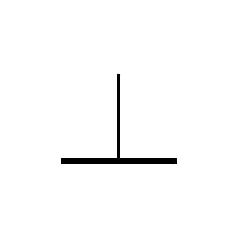

---

## LK0498
### 附图中的电路元器件符号代表的是：
1. 天线
2. 接地
3. 电阻
4. 二极管
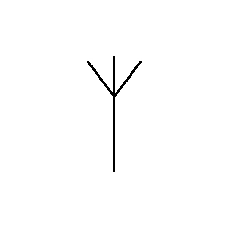

---

## LK0499
### 附图中的电路元器件符号代表的是：
1. 熔断器
2. 电容
3. 电阻
4. 二极管
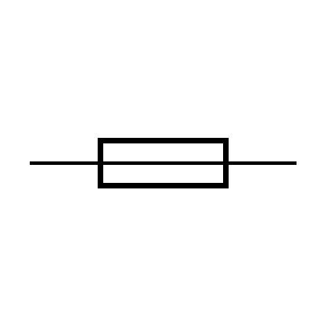

---

## LK0500
### 附图中的电路元器件符号代表的是：
1. 电容器
2. 熔断器
3. 电阻
4. 二极管
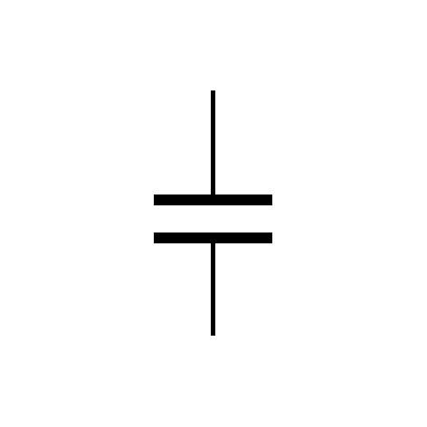

---

## LK0501
### 附图中的电路元器件符号代表的是：
1. 电阻
2. 电容器
3. 熔断器
4. 压电晶体
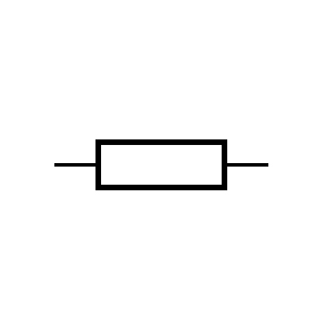

---

## LK0502
### 附图中的电路元器件符号代表的是：
1. 二极管
2. 电容器
3. 线圈
4. 电阻

---

## LK0503
### 附图中的电路元器件符号代表的是：
1. 线圈
2. 二极管
3. 电容器
4. 电阻
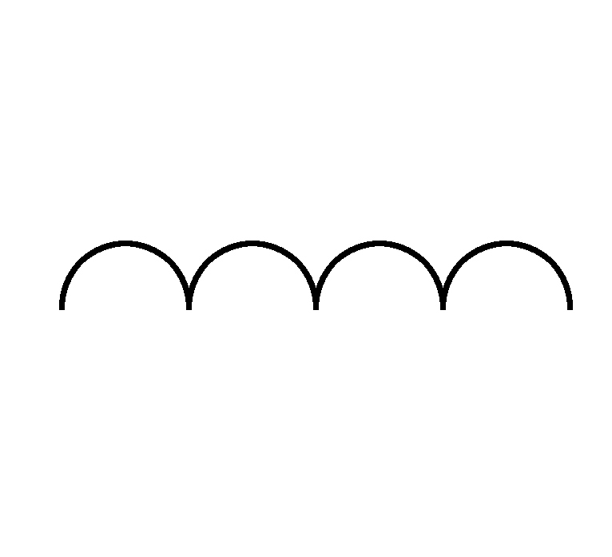

---

## LK0504
### 附图中的电路元器件符号代表的是：
1. 电池
2. 二极管
3. 线圈
4. 电阻
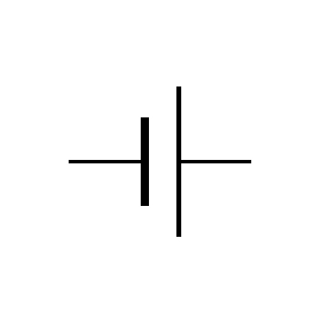

---

## LK0505
### 附图中的电路元器件符号代表的是：
1. 压电晶体
2. 电池
3. 二极管
4. 电阻
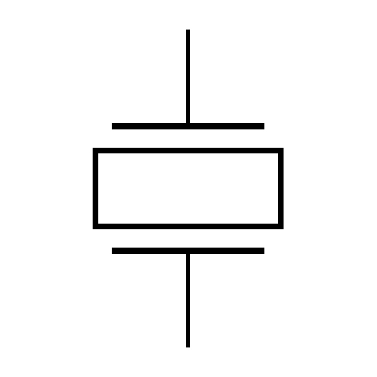

---

## LK0506
### 附图中的电路元器件符号代表的是：
1. 稳压二极管
2. 压电晶体
3. 发光二极管
4. 电阻

---

## LK0507
### 附图中的电路元器件符号代表的是：
1. 发光二极管
2. 稳压二极管
3. 压电晶体
4. 电阻

---

## LK0508
### 附图中的电路元器件符号代表的是：
1. PNP双极型半导体三极管
2. NPN双极型半导体三极管
3. 结型场效应半导体三极管
4. 绝缘栅场效应半导体三极管
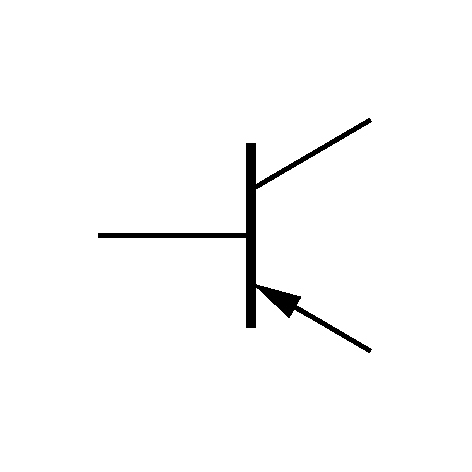

---

## LK0509
### 附图中的电路元器件符号代表的是：
1. NPN双极型半导体三极管
2. PNP双极型半导体三极管
3. 结型场效应半导体三极管
4. 绝缘栅场效应半导体三极管
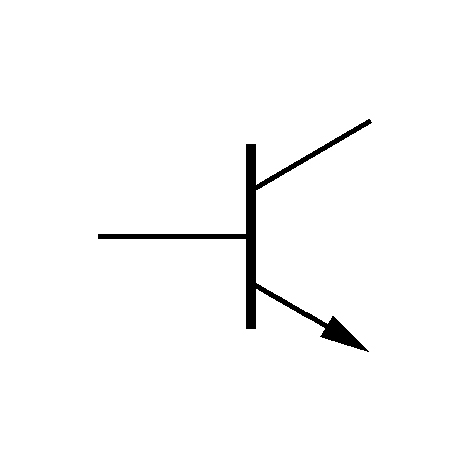

---

## LK0510
### 附图中的电路元器件符号代表的是：
1. 结型场效应半导体三极管
2. PNP双极型半导体三极管
3. NPN双极型半导体三极管
4. 绝缘栅场效应半导体三极管
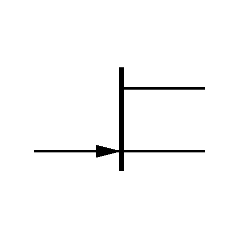

---

## LK0511
### 附图中的电路元器件符号代表的是：
1. 绝缘栅场效应半导体三极管
2. 结型场效应半导体三极管
3. PNP双极型半导体三极管
4. NPN双极型半导体三极管
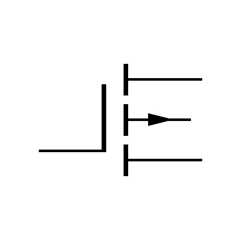

---

## LK0524
### 分别用电压为120V的蓄电池组和电压最大值为120V的交流变压器驱动同样的电阻负载，哪一个电阻每分钟发出的热量多？
1. 蓄电池驱动的电阻所发的热量是交流变压器上的电阻的2倍左右
2. 蓄电池驱动的电阻所发的热量是交流变压器上的电阻的0.7倍左右
3. 蓄电池驱动的电阻所发的热量是交流变压器上的电阻的1.4倍左右
4. 两个电源驱动的电阻发热相同

---

## LK0525
### 分别用电压为120V的蓄电池组和电压有效值为120V的交流变压器驱动同样的电阻负载，哪一个电阻每分钟发出的热量多？
1. 两个电源驱动的电阻发热相同
2. 蓄电池驱动的电阻所发的热量是交流变压器上的电阻的1.4倍左右
3. 蓄电池驱动的电阻所发的热量是交流变压器上的电阻的0.7倍左右
4. 蓄电池驱动的电阻所发的热量是交流变压器上的电阻的2倍左右

---

## LK0526
### 分别用电压为120V的蓄电池组和电压有效值为120V的交流变压器串联二极管后驱动同样的电阻负载，哪一个电阻每分钟发出的热量多？（忽略二极管的电压降）
1. 蓄电池驱动的电阻所发的热量是交流变压器上的电阻的2倍左右
2. 蓄电池驱动的电阻所发的热量是交流变压器上的电阻的1.4倍左右
3. 蓄电池驱动的电阻所发的热量是交流变压器上的电阻的0.7倍左右
4. 两个电源驱动的电阻发热相同

---

## LK0527
### 分别用电压为120V的蓄电池组和电压最大值为120V的交流变压器经过带电容滤波的全波整流电路驱动同样的电阻负载，哪一个电阻每分钟发出的热量多？（忽略整流器的电压降）
1. 两个电源驱动的电阻发热相同
2. 蓄电池驱动的电阻所发的热量是交流变压器上的电阻的2倍左右
3. 蓄电池驱动的电阻所发的热量是交流变压器上的电阻的1.4倍左右
4. 蓄电池驱动的电阻所发的热量是交流变压器上的电阻的0.7倍左右

---

## LK0528
### 分别用电压有效值为120V、频率为50Hz的交流电源和电压有效值为120V、频率为10kHz的方波电源驱动同样的电阻负载，哪一个电阻每分钟发出的热量多？
1. 两个电源驱动的电阻发热相同
2. 10kHz电路电阻所发的热量是50Hz电路电阻的5倍左右
3. 10kHz电路电阻所发的热量是50Hz电路电阻的1/5倍左右
4. 10kHz电路电阻所发的热量是50Hz电路电阻的200倍左右

---

## LK0530
### 把两个幅度相等、相位相差360°的正弦电压信号源相串联，得到的是：
1. 幅度为单个信号源的2倍、相位与原信号源相同的正弦电压
2. 电压为0
3. 幅度与单个信号源的相同、相位与原信号源相差180°的正弦电压
4. 幅度与单个信号源的相同、频率比原信号高一倍的正弦电压

---

## LK0531
### 把两个幅度相等、相位相差180°的正弦电压信号源相串联，得到的是：
1. 电压为0
2. 幅度为单个信号源的2倍、相位与原信号源相同的正弦电压
3. 幅度与单个信号源的相同、相位与原信号源相差90°的正弦电压
4. 幅度与单个信号源的相同、频率比原信号高一倍的正弦电压

---

## LK0532
### 把两个幅度相等、相位相差90°的正弦电压信号源相串联，得到的是：
1. 幅度为单个信号源的1.41倍、相位与原信号源相差45°的正弦电压
2. 幅度与单个信号源的相同、相位与原信号源相差45°的正弦电压
3. 幅度为单个信号源的2倍、相位与原信号源相同的正弦电压
4. 幅度与单个信号源的相同、频率比原信号高一倍的正弦电压

---

## LK0534
### 一个重复频率为F的非正弦周期信号的频谱包含有：
1. 频率为F的整数倍的无穷多个频率分量
2. 频率为F的一个频率分量
3. 频率为F以外的无穷多个频率分量
4. 无穷多个连续的频率分量

---

## LK0538
### 从能量转换的观点，“匹配”是指：
1. 选择电路参数，使负载能够得到最高实际输出功率的状态
2. 选择电路参数，使电源内阻能够达到最小功率损耗的状态
3. 选择电路参数，使负载能够得到最高实际输出电压的状态
4. 选择电路参数，使负载能够得到最高实际输出电流的状态

---

## LK0539
### 信号源和负载达到阻抗“匹配”时，信号源内阻损耗的功率为：
1. 与负载得到的输出功率相等
2. 是负载得到的输出功率的一半
3. 与负载得到的输出功率相比可以忽略不计
4. 损耗功率为零

---

## LK0540
### 一个放大器具有20dB的信号增益，其意义是：
1. 放大器把相当于输入信号的100倍的能量从电源转移到了输出负载
2. 放大器产生了当于输入信号的100倍的能量，供给了输出负载
3. 放大器把相输入信号的能量放大了100倍
4. 放大器把相输入信号的能量放大了99倍

---

## LK0541
### 射频信号通过某电路时产生了20dB的损耗。这部分被损耗的能量：
1. 在电路中被转化为热能等其他形式，或者通过电磁辐射等转移到了其他地方
2. 在电路中消失了
3. 返回了信号源
4. 一部分在电路中消失了，一部分返回了信号源

---

## LK0542
### 某电路输出信号功率是输入信号功率的100倍，该电路的增益为：
1. 20dB
2. 10dB
3. 100dB
4. 1dB

---

## LK0543
### 某电路输出信号功率是输入信号功率的100万倍，该电路的增益为：
1. 60dB
2. 100dB
3. 99万dB
4. 100万dB

---

## LK0544
### 某电路输出信号功率是输入信号功率的5倍，该电路的增益约为：
1. 7dB
2. 3.5dB
3. 5dB
4. 14dB

---

## LK0545
### 某电路输出信号功率是输入信号功率的2倍，该电路的增益约为：
1. 3dB
2. 1dB
3. 2dB
4. 0.5dB

---

## LK0546
### 某电路输出信号电压是输入信号电压的100倍，该电路的增益为：
1. 40dB
2. 10dB
3. 100dB
4. 20dB

---

## LK0547
### 某电路输出信号电压是输入信号电压的1万倍，该电路的增益为：（”x＾m”表示“x的m次方”）
1. 80dB
2. 10,000 dB
3. 9,999 dB
4. 10＾4dB

---

## LK0548
### 某电路输出信号电压是输入信号电压的10倍，该电路的增益约为：
1. 20dB
2. 7dB
3. 14dB
4. 15dB

---

## LK0549
### 某电路输出信号电压是输入信号电压的2倍，该电路的增益约为：
1. 6dB
2. 2dB
3. 4dB
4. 0.5dB

---

## LK0550
### 某电路输出信号功率是输入信号功率的1/100，该电路的增益为：
1. -20dB
2. -10dB
3. -100dB
4. 100dB

---

## LK0551
### 某电路输出信号功率是输入信号功率的百万分之一，该电路的增益为：
1. -60dB
2. -100dB
3. 990000dB
4. -1000000dB

---

## LK0552
### 某电路输出信号功率是输入信号功率的1/5，该电路的增益约为：
1. -7dB
2. 3.5dB
3. -5dB
4. -14dB

---

## LK0553
### 某电路输出信号功率是输入信号功率的1/2，该电路的增益约为：
1. -3dB
2. -1dB
3. -2dB
4. 0.5dB

---

## LK0554
### 某电路输出信号电压是输入信号电压的1/100，该电路的增益为：
1. -40dB
2. -10dB
3. -100dB
4. -20dB

---

## LK0555
### 某电路输出信号电压是输入信号电压的万分之一，该电路的增益为：（”x＾m”表示“x的m次方”）
1. -80dB
2. -10,000 dB
3. 1/10,000 dB
4. 10＾-4dB

---

## LK0556
### 某电路输出信号电压是输入信号电压的1/10倍，该电路的增益约为：
1. -20dB
2. -7dB
3. -14dB
4. 0.143dB

---

## LK0557
### 某电路输出信号电压是输入信号电压的1/2，该电路的增益约为：
1. -6dB
2. -2dB
3. 0.5dB
4. -0.5dB

---

## LK0558
### 信号依次通过增益分别为 x dB、y dB和 z dB的三个电路，总增益为：
1. （x + y + z）dB
2. （x × y × z）dB
3. （x + y + z）倍
4. （x × y × z）倍

---

## LK0559
### 信号依次通过增益分别为 x dB、y dB和 z dB的三个电路，总增益为：（”x＾m”表示“x的m次方”）
1. 10＾(（x + y + z）/10) 倍
2. 10＾（x × y × z） 倍
3. （x + y + z）倍
4. （x × y × z）倍

---

## LK0560
### 接收机的接收信号强度表每两档的信号强度相差6dB。接收某电台信号，发射功率为20dBW时读数为S9。该台减小发射功率后，接收机读数变为S4。此时该台的发射功率约为（以W为单位）：
1. 0.098W
2. 10.24W
3. 0.156W
4. 1.73W

---

## LK0561
### 接收机的接收信号强度表每两档的信号强度相差6dB。接收某电台信号，发射功率为10dBW时读数为S8。该台减小发射功率后，接收机读数变为S5。此时该台的发射功率约为（以W为单位）：
1. 0.156W
2. 0.098W
3. 10.24W
4. 1.73W

---

## LK0562
### 功率为0 dBm的射频信号通过增益为 23 dB的电路后，输出功率为：
1. 0.2W
2. 23mW
3. 23W
4. 0.23W

---

## LK0563
### 功率为0dBμ的射频信号通过增益为 36 dB的电路后，输出功率为：
1. 4mW
2. 3.6W
3. 36mW
4. 360μW

---

## LK0564
### 功率为0 dBW的射频信号通过增益为 -36 dB的电路后，输出功率为：
1. 0.25 mW
2. 3.6mW
3. 25mW
4. 360μW

---

## LK0565
### 功率为0 dBW的射频信号通过衰减量为 40 dB的衰减器后，输出功率为：
1. 100μW
2. 40mW
3. 140μW
4. 0.40 W

---

## LK0569
### “频率失真”是指电路的输出信号波形与输入信号相比，发生了下列变化：
1. 各频率分量的比例发生了改变
2. 信号的幅度发生了改变
3. 产生了新的频率分量
4. 不同频率分量的相位延迟差发生了改变

---

## LK0570
### “非线性失真”是指电路的输出信号波形与输入信号相比，发生了下列变化：
1. 产生了新的频率分量
2. 各频率分量的比例发生了改变
3. 信号的幅度发生了改变
4. 不同频率分量的相位延迟差发生了改变

---

## LK0571
### “相位失真”是指电路的输出信号波形与输入信号相比，发生了下列变化：
1. 不同频率分量的相位延迟差发生了改变
2. 产生了新的频率分量
3. 各频率分量的比例发生了改变
4. 信号的幅度发生了改变

---

## LK0573
### 要防止HF发射机的杂散发射干扰天线附近的VHF电视机，应该发射机和天线之间串联：
1. 截止频率为30MHz左右的低通滤波器
2. 截止频率为30MHz左右的高通滤波器
3. 截止频率为300MHz左右的低通滤波器
4. 中心频率为30MHz左右的带通滤波器

---

## LK0574
### 假设中继台的收、发信机共用天线，上下行频率分别为F1和F2。要防止中继台发射机对接收机产生干扰，应该对中继台设备采取下列措施：
1. 在发信机与天线间串联中心频率为F1的带阻滤波器，在收信机与天线间串接中心频率为F2的带阻滤波器
2. 在发信机与天线间串联中心频率为F1的带通滤波器，在收信机与天线间串接中心频率为F2的带通滤波器
3. 在发信机与天线间串联中心频率为F2的带阻滤波器，在收信机与天线间串接中心频率为F2的带阻滤波器
4. 在发信机与天线间串联中心频率为F1的带阻滤波器，在收信机与天线间串接中心频率为F1的带阻滤波器

---

## LK0575
### 要防止业余HF发射机的杂散发射干扰天线附近的电话机，应该在电话机和电话线之间之间串联：
1. 截止频率不高于1MHz的低通滤波器
2. 截止频率约为3kHz的高通滤波器
3. 截止频率约为3kHz的带阻滤波器
4. 中心频率约为3kHz的带通滤波器

---

## LK0576
### A、B两部HF业余电台相距很近，分别工作在A、B两个频段。为减少B电台受到来自A电台的干扰，可以在B电台与天线之间串联：
1. 中心频率为A的带阻滤波器
2. 中心频率为A的带通滤波器
3. 截止频率为A的高通滤波器
4. 截止频率为B的高通滤波器

---

## LK0585
### 在射频电路分析中，能产生信号频率以外的新频率分量的元器件属于有源元器件，可能成为形成干扰的重要环节。下列元器件中属于有源元器件的有：
1. 半导体二极管
2. 电解电容器
3. 宽带变压器
4. 碱性干电池

---

## LK0586
### 在射频电路分析中，能产生信号频率以外的新频率分量的元器件属于有源元器件，可能成为形成干扰的重要环节。下列元器件中属于有源元器件的有：
1. 半导体三极管
2. 可调电感器
3. 电阻假负载
4. 晶体滤波器

---

## LK0589
### 在业余收发信机的常见元器件中，标有耐压指标的是：
1. 电容
2. 电阻
3. 熔丝
4. 电感

---

## LK0590
### 在业余收发信机的常见元器件中，以额定耗散功率指标分类的是：
1. 电阻
2. 电容
3. 熔丝
4. 电感

---

## LK0591
### 在业余收发信机的常见元器件中，标有额定电流指标的是：
1. 熔丝
2. 电阻
3. 电容
4. 电感

---

## LK0592
### 在业余收发信机电路中，经常用于隔直流或者给交流信号提供旁路的元件是：
1. 电容
2. 电阻
3. 电感
4. 半导体开关器件

---

## LK0593
### 在业余收发信机电路中，经常用谐振回路来筛选一定频率的信号。组成谐振回路的主要元器件是：
1. 电容和电感的组合
2. 电阻和电容的组合
3. 电感和电阻的组合
4. 半导体三极管和电阻的组合

---

## LK0615
### 将电阻R和电容C串联后突然接到直流电压U上，电容C两端的电压会：
1. 从0按指数规律逐渐增加到U
2. 从U按指数规律逐渐减小到0
3. 从0突然跳到U，然后再按指数规律逐渐减小到0
4. 从U突然跳到0，然后再按指数规律逐渐增大到U

---

## LK0617
### 将电阻R和电容C串联后突然接到直流电压U上，电阻R两端的电压会：
1. 从0突然跳到U，然后再按指数规律逐渐减小到0
2. 从0按指数规律逐渐增加到U
3. 从U按直线规律逐渐减小到0
4. 从U突然跳到0，然后再按直线规律逐渐减小到U

---

## LK0619
### 将电阻R和电容C串联后突然接到直流电压U上，流过电阻R的电流会：
1. 从0突然跳到U/R，然后再按指数规律逐渐减小到0
2. 从0突然跳到U/R并保持
3. 从0按指数规律逐渐增加到U/R
4. 从U/R突然跳到0并保持

---

## LK0620
### 将电阻R和电容C串联后突然接到直流电压U上，流过电容C的电流会：
1. 从0突然跳到U/R，然后再按指数规律逐渐减小到0
2. 从0突然跳到U/R并保持
3. 从0按指数规律逐渐增加到U/R
4. 从U/R突然跳到0并保持

---

## LK0621
### 电阻R和电容C并联后接在电压为U的直流电源上。突然断开电源，电容C两端的电压会：
1. 从U按指数规律逐渐减小到0
2. 从0按指数规律逐渐增加到U
3. 从0突然跳到U并保持
4. 从U突然跳到0并保持

---

## LK0622
### 电阻R和电容C并联后接在电压为U的直流电源上。突然断开电源，电阻R两端的电压会：
1. 从U按指数规律逐渐减小到0
2. 从0按指数规律逐渐增加到U
3. 从0突然跳到U并保持
4. 从U突然跳到0并保持

---

## LK0623
### 电阻R和电容C并联后接在电压为U的直流电源上。突然断开电源，流过电阻R的电流会：
1. 从U/R按指数规律逐渐减小到0
2. 从0按指数规律逐渐增加到U/R
3. 从0突然跳到U/R，然后再按指数规律逐渐减小到0
4. 从U突然跳到0，然后再按指数规律逐渐增大到U/R

---

## LK0624
### 电阻R和电容C并联后接在电压为U的直流电源上。突然断开电源，流过电容C的电流会：
1. 从0突然跳到U/R，然后再按指数规律逐渐减小到0
2. 从0突然跳到U/R并保持
3. 从0按指数规律逐渐增加到U/R
4. 从U突然跳到0，然后再按指数规律逐渐增大到U/R

---

## LK0625
### 将电阻R和电感L串联后突然接到直流电压U上，电感L两端的电压会：
1. 从0突然跳到U，然后再按指数规律逐渐减小到0
2. 从0按指数规律逐渐增加到U
3. 从U按指数规律逐渐减小到0
4. 从U突然跳到0并保持

---

## LK0628
### 将电阻R和电感L串联后突然接到直流电压U上，电阻R两端的电压会：
1. 从0按指数规律逐渐增加到U
2. 从U按指数规律逐渐减小到0
3. 从0突然跳到U，然后再按指数规律逐渐减小到0
4. 从U突然跳到0并保持

---

## LK0629
### 将电阻R和电感L串联后突然接到直流电压U上，流过电阻R的电流会：
1. 从0按指数规律逐渐增加到U/R
2. 从0突然跳到U/R，然后再按指数规律逐渐减小到0
3. 从U/R按指数规律逐渐减小到0
4. 从0突然跳到U/R并保持U/R

---

## LK0630
### 将电阻R和电感L串联后突然接到直流电压U上，流过电感L的电流会：
1. 从0按指数规律逐渐增加到U/R
2. 从0突然跳到U/R，然后再按指数规律逐渐减小到0
3. 从U/R按指数规律逐渐减小到0
4. 从0突然跳到U/R并保持

---

## LK0631
### 电阻R和电感L并联后接在电流为I的直流电路中。突然断开电路，电感L两端的电压会：
1. 从I*R按指数规律逐渐减小到0
2. 从0按指数规律逐渐增加到I*R
3. 保持在I*R
4. 保持在0

---

## LK0638
### 用一个电压为4.2伏的低电压电池和一堆无源电子元件做电路实验，但连接电路时感觉手不慎被高电压击了一下。可能产生这个高电压的元件是：
1. 电源变压器的绕组
2. 电解电容器
3. 额定功率为50瓦的大电阻
4. 大电流高反压二极管

---

## LK0650
### 在电容器两端施加一定幅度的正弦交流电压。流过电容器的电流幅度：
1. 与电压和电容量都成正比
2. 与电压和电容量都成反比
3. 与电压成正比，与电容量成反比
4. 与电容量成正比，与电压成反比

---

## LK0653
### 在线圈两端施加一定幅度的正弦交流电压。流过线圈的电流幅度：
1. 与电压成正比，与电感量成反比
2. 与电压和电感量都成正比
3. 与电压和电感量都成反比
4. 与电感量成正比，与电压成反比

---

## LK0663
### 在HF业余频段的数据通信段中，用收信机的SSB挡听到一个由两种音调交替组成的信号，这个信号的调制方式最可能属于下述种类：
1. FSK
2. PSK
3. ASK
4. SSTV或FAX

---

## LK0664
### 在HF业余频段的数据通信段中，用收信机的SSB挡听到一个音调不变但又似乎不断颤动的信号，这个信号的调制方式最可能属于下述种类：
1. PSK
2. FSK
3. ASK
4. SSTV或FAX

---

## LK0665
### 用收信机的SSB挡在业余频段中，听到一个音调大致以约为几分之一秒的重复周期连续变化、并夹有一种规律的“笃、笃”声的信号，。这个信号的调制方式最可能属于下述种类：
1. SSTV或FAX
2. PSK
3. FSK
4. ASK

---

## LK0667
### 同样材料、同样直径、同样长度的实心铜线和空心铜管，在交流电路中的发热损耗情况为：
1. 在低频率下实心铜线损耗较小，在高频率下两者损耗一样
2. 在低频率下实心铜线损耗较大，在高频率下两者损耗一样
3. 在不同频率两者的发热损耗大小不好说，取决于具体散热条件
4. 在各种频率下两者耗差都一样

---

## LK0668
### 把实心导线接到频率为数十兆赫兹的高频率射频电路中，则会有下列现象：
1. 电流集中在导线表层，导线内部没有电流
2. 导线截面各处的电流密度均匀分布
3. 导线外层和内层都有电流，但两者方向相反
4. 表层的电流沿导线方向流动，内层电流形成螺旋状涡流

---

## LK0669
### 工作在高频率下的射频部件积灰或受潮后，即使没有漏电，也可能因绝缘物体的物理变化而带来额外的：
1. 介质损耗
2. 磁滞损耗
3. 涡流损耗
4. 磁阻损耗

---

## LK0677
### 谐振回路的通带宽度BW是指：
1. 回路两端电压信号幅度从中心频率衰减3dB时上、下限频率的间距
2. 回路两端电压信号幅度从中心频率衰减30%时上、下限频率的间距
3. 回路两端电压信号幅度从中心频率衰减80%时上、下限频率的间距
4. 回路两端电压信号幅度从中心频率衰减95%时上、下限频率的间距

---

## LK0678
### 滤波器的“截止频率”是指：
1. 输出频率特性曲线从通带的0dB变化到-3dB的频率
2. 高于该频率的信号将被滤波器完全切除
3. 低于该频率的信号将被滤波器完全切除
4. 高于该频率的信号将会在滤波器中发生非线性失真

---

## LK0679
### 滤波器的“3dB带宽”是指：
1. 输出频率特性曲线从通带的0dB变化到-3dB的频率之间的宽度
2. 输出信号相对于输入信号衰减3dB以上（含3dB）的频率范围宽度
3. 输出信号相对于输入信号衰减3dB以下（含3dB）的频率范围宽度
4. 滤波器维持3dB增益的频率比范围宽度

---

## LK0685
### 为了减少发射设备的谐波干扰近在咫尺的接收机，可以在发射设备和天线之间串联一个LC低通滤波器。正确的说法是：
1. 滤波器的阶数越高，抑制倍频干扰的效果越好
2. 滤波器的阶数越低，抑制倍频干扰的效果越好
3. 滤波器的阶数越高，损耗的功率越小
4. 滤波器的阶数越高，耐受的功率越大

---

## LK0686
### 无线电发射设备参数和业余无线电原理书籍中经常出现缩写为ppm的度量单位。其中文含义和最经常的用处是：
1. “百万分比”，常用于描述频率的相对稳定度
2. “每分钟点数”，常用于描述随机干扰的出现次数
3. “每分钟点数”，常用于描述太阳黑子的发生频度
4. “每分钟平均脉冲数”，常用于描述单个脉冲的出现次数

---

## LK0687
### 用SSB接收机的天线引线靠近一个晶体管LC振荡器电路板，接收其信号。振荡器电路接通电源后，发现收到的信号音调会从低到高或者从高到低变化。这主要因为：
1. 元器件通电发热，引起相关LC参数变化，造成谐振频率漂移
2. 半导体晶体管处于老化过程
3. 随着射频能量泄露，电路的输出功率下降
4. 接收机的声音能量反馈到电路板引起

---

## LK0688
### 在无线电电路中常用于产生基准频率的元件中，按频率稳定度由低到高的排列为：
1. RC定时电路，LC回路，陶瓷谐振器，石英声表面波元件，石英晶体谐振器
2. LC回路，RC定时电路，陶瓷谐振器，石英声表面波元件，石英晶体谐振器
3. RC定时电路，LC回路，石英声表面波元件，石英晶体谐振器，陶瓷谐振器
4. RC定时电路，陶瓷谐振器，LC回路，石英晶体谐振器，石英声表面波元件

---

## LK0690
### 220V.AC/13.8V.DC通信开关电源的一般工作过程是：
1. 将交流输入整流滤波为高压直流，由半导体开关电路变成高压脉冲电流，由变压器变成低压脉冲，整流滤波为低压直流
2. 将交流输入整流滤波为高压直流，由变压器变成低压脉冲，由半导体开关电路变成低压直流，滤波后输出
3. 由变压器将交流输入变为低压交流，由半导体开关电路变成超音频脉冲电流，经整流滤波为低压直流
4. 由大功率半导体三极管将交流输入变为高压直流，由专用集成电路变成超音频脉冲电流，经整流滤波为低压直流

---

## LK0693
### 无线电原理经常用到缩写VFO，它代表：
1. 可变频率振荡器
2. 压控振荡器
3. 石英晶体元件
4. 可变频率石英振荡器

---

## LK0696
### 无线电原理经常用到缩写XTAL，它代表：
1. 石英晶体元件
2. 可变频率振荡器
3. 晶体振荡器
4. 压控振荡器

---

## LK0697
### 构成振荡器的必备元素是：
1. 放大倍数大于1的放大器、正反馈电路
2. 放大倍数大于1的放大器、负反馈电路
3. LC或晶体谐振电路、正反馈电路
4. 任意放大器、LC或晶体谐振电路

---

## LK0704
### 某业余通信接收机的中频滤波器带宽有100Hz、400Hz、2.7kHz和6kHz几挡选择。如果要为接收SSB、AM、PSK31和CW方式的信号分别从中选择合适的挡位，应该依次为：
1. 2.7kHz、6kHz、100Hz、400Hz
2. 6kHz、2.7kHz、400Hz、100Hz
3. 2.7kHz、400Hz、6kHz、100Hz
4. 2.7kHz、100Hz、6kHz、400Hz

---

## LK0705
### 频率为f1、f2的两个正弦交流信号流过一个非线性元件，会发生“混频”。混频产物中属于三阶互调的干扰信号的频率是：
1. 2f1±f2、2f2±f1
2. 2f1、3f1、2f2、3f2
3. f1±f2、2f1±2f2、3f1±3f2
4. 4f1±f2、5f1±2f2、6f1±3f2……

---

## LK0706
### “差拍”现象是指：
1. 两个不同频率信号经过非线性电路得到频率为两者之差的新频率信号
2. 凡是接收机收到的连续音频叫声都叫做“差拍”
3. 发射机用以调制载波的连续音频信号
4. 一个单频率信号经过非线性电路得到一系列谐波信号，相邻信号之间的频率差等于单频信号的频率。这样一族谐波信号的集合总称“差拍”

---

## LK0709
### 一个CW电报信号在频谱仪上显示为：
1. 一条闪动的垂直线
2. 一条固定的直线
3. 两条水平直线
4. 一条正弦波曲线

---

## LK0710
### 一个RTTY信号在频谱仪上显示为：
1. 两条闪动的垂直线
2. 一条垂直线
3. 一条正弦波曲线
4. 一条复杂的周期性曲线

---

## LK0711
### 一个SSB话音信号在频谱仪上显示为：
1. 一组随语音出现和变化的非对称垂直线
2. 一条随语音闪烁的直线
3. 一条固定的直线
4. 一条复杂的周期性曲线

---

## LK0712
### 一个AM话音信号在频谱仪上显示为：
1. 一条固定的垂直线，左右伴随一组对称的随语音出现和变化的垂直线
2. 一条随语音闪烁的直线
3. 多条固定的直线
4. 一条复杂的周期性曲线

---

## LK0722
### 下列几种图表中，最容易用来表达和解释LC振荡器温度漂移程度的是：
1. 频谱瀑布图
2. 频谱图
3. 相位矢量图
4. 波形图

---

## LK0748
### 在无线电技术中，通常把放大器分为A、B、C、D等类别，这种分类是依据：
1. 放大器件的工作点所处的范围
2. 放大器件的质量等级
3. 放大器件的最高工作频率
4. 放大器件的最大输出功率

---

## LK0749
### 根据放大器的工作状态，通常把放大器分为A、B、C、D等类别。A类放大器是指：
1. 放大器件在整个信号周期内始终工作在线性区的放大器
2. 放大器件在半个信号周期内工作点处于线性区、另半个信号周期内处于截止区的放大器
3. 放大器件在半个信号周期内处于截止区，另半个周期的部分时间候处于饱和区的放大器
4. 放大器件在半个信号周期内处于截止区，另半个周期处于饱和区的放大器

---

## LK0750
### 根据放大器的工作状态，通常把放大器分为A、B、C、D等类别。B类放大器是指：
1. 放大器件在半个信号周期内工作点处于线性区、另半个信号周期内处于截止区的放大器
2. 放大器件在整个信号周期内始终工作在线性区的放大器
3. 放大器件在半个信号周期内处于截止区，另半个周期的部分时间候处于饱和区的放大器
4. 放大器件在半个信号周期内处于截止区，另半个周期处于饱和区的放大器

---

## LK0751
### 根据放大器的工作状态，通常把放大器分为A、B、C、D等类别。C类放大器是指：
1. 放大器件在多于半个信号周期的时间内处于截止区，另半个周期的部分时间候处于线性区的放大器
2. 放大器件在整个信号周期内始终工作在线性区的放大器
3. 放大器件在半个信号周期内工作点处于线性区、另半个信号周期内处于截止区的放大器
4. 放大器件在半个信号周期内处于截止区，另半个周期处于饱和区的放大器

---

## LK0752
### 根据放大器的工作状态，通常把放大器分为A、B、C、D等类别。D类放大器是指：
1. 放大器件在半个信号周期内处于截止区，另半个周期处于饱和区的放大器
2. 放大器件在整个信号周期内始终工作在线性区的放大器
3. 放大器件在半个信号周期内工作点处于线性区、另半个信号周期内处于截止区的放大器
4. 放大器件在半个信号周期内处于截止区，另半个周期的部分时间候处于饱和区的放大器

---

## LK0753
### A、B、C、D四类放大器按输出波形失真由小到大的排列顺序是：
1. A、B、C、D
2. D、C、B、A
3. A、C、B、D
4. B、A、D、C

---

## LK0754
### A、B、C、D四类放大器用作射频功率放大时，按电源效率由高到低的排列顺序是：
1. D、C、B、A
2. A、B、C、D
3. D、C、A、B
4. B、A、D、C

---

## LK0759
### A、B、C、D四类放大器中，适宜于做小信号放大器的是：
1. A
2. B
3. C
4. D

---

## LK0760
### A、B、C、D四类放大器中，属于大信号放大器的全部类别有：
1. B、C、D
2. A、B、C、D
3. A、C、D
4. C、D

---

## LK0761
### 很多业余电台的末级和末前级射频输出放大器中采用两个并联的输出半导体功率管，这是为了：
1. 双管并联，得到双倍的输出电流和输出功率
2. 构成推挽电路，减小输出波形的失真
3. 双管并联，得到双倍的器件耐压，减少损坏几率
4. 双管并联，使每个功率管的失真互相补偿，减少失真，降低杂散发射

---

## LK0762
### 很多现代无线电设备的音频功率放大电路采用两个串联的输出半导体功率管，分别负责信号正、负半周的放大。这种电路的通用名称和作用是：
1. 推挽放大电路，实现极小静态工作点下的高电源效率的线性功率放大
2. 双管串联电路，得到双倍的输出电流和输出功率
3. 双管串联电路，得到较高的输出阻抗以改善与负载的阻抗匹配
4. 双管串联电路，得到较高的输入阻抗以改善与推动级之间的阻抗匹配

---

## LK0763
### 放大器的负反馈是指这样的电路：
1. 将放大器输出信号的一部分回输到放大器的输入端，起到抵消输入信号的作用
2. 将放大器输出信号的一部分回输到放大器的输入端，起到加强输入信号的作用
3. 将放大器输入信号的一部分直通到放大器的输出端，起到抵消输出信号的作用
4. 将放大器输入信号的一部分直通到放大器的输出端，起到加强输出信号的作用

---

## LK0770
### 具有两个输入的与门（AND）是最简单的数字逻辑电路之一。如果两个输入信号的组合分别为00、01、10、11，对应的输出信号应为：
1. 0、0、0、1
2. 0、1、1、1
3. 0、1、0、1
4. 1、0、1、0

---

## LK0771
### 具有两个输入的或门（OR）是最简单的数字逻辑电路之一。如果两个输入信号组合分别为00、01、10、11，对应的输出信号应为：
1. 0、1、1、1
2. 0、1、1、0
3. 0、1、0、1
4. 1、0、1、0

---

## LK0772
### 具有两个输入的异或门（XOR）是最简单的数字逻辑电路之一。如果两个输入信号组合分别为00、01、10、11，对应的输出信号应为：
1. 0、1、1、0
2. 0、1、0、1
3. 0、1、1、1
4. 1、0、1、0

---

## LK0773
### 具有两个输入的与非门（NAND）是最简单的数字逻辑电路之一。如果两个输入信号组合分别为00、01、10、11，对应的输出信号应为：
1. 1、1、1、0
2. 0、1、1、1
3. 0、1、0、1
4. 1、0、1、0

---

## LK0774
### 具有两个输入的或非门（NOR）是最简单的数字逻辑电路之一。如果两个输入信号组合分别为00、01、10、11，对应的输出信号应为：
1. 1、0、0、0
2. 0、1、1、1
3. 0、1、0、1
4. 1、0、1、0

---

## LK0775
### 具有两个输入的异或非门（NXOR）是最简单的数字逻辑电路之一。如果两个输入信号组合分别为00、01、10、11，对应的输出信号应为：
1. 1、0、0、1
2. 0、1、1、1
3. 1、1、0、0
4. 0、1、1、0

---

## LK0781
### 很多现代业余无线电收发信机的本机振荡电路采用了直接数字频率合成（DDS）方式。它的主要特点是：
1. 电路结构简洁，无锁相捕捉范围限制，不产生相位噪声，跳换频率快
2. 采用同样的频率源振荡器时频率稳定度优于锁相环频率合成方式
3. 与锁相环频率合成方式相比，可以使用速度较低的数字元器件
4. 直接产生纯净的正弦波信号，不需要采用任何滤波器

---

## LK0783
### 关于是否可以在FM话音通信时单凭接收机听到对方语音的音量大小来准确判断对方信号的强弱，正确答案及其理由是：
1. 不能。因为鉴频输出大小只取决于射频信号的频偏，而且正常信号的幅度会被限幅电路切齐到同样大小
2. 不能。因为信号越强，自动增益控制作用也越强，增益的急剧减小使声音反而被压低
3. 能。最后的信号是接收到的射频信号经过放大处理得到的，当然信号强声音越大
4. 能。调频信号越强，频偏也必然越大，解调后的声音也越大

---

## LK0785
### 业余无线电通信方式缩写CW的英文原词意义是：
1. 等幅电报
2. 莫尔斯编码
3. 幅度键控
4. 移频键控

---

## LK0787
### 对于给定的SSB发射设备，决定其输出信号实际占用带宽的因素是：
1. 所传输信号的带宽越宽，射频输出占用带宽越宽，但与其幅度和最高频率无关
2. 所传输信号的最高频率越高，射频输出占用带宽越宽，但与其幅度和带宽无关
3. 所传输信号的幅度越大，射频输出占用带宽越宽，但与其频率和带宽无关
4. 射频输出实际占用带宽为由电路决定的固定值，通信常用的是2.7kHz

---

## LK0788
### 用设置在NFM方式的对讲机接收WFM信号，其效果为：
1. 可以听到信号，但当调制信号幅度较大、音调较高时会发生明显非线性失真
2. 听不到信号，但接收到信号时调频噪声会变得寂静
3. 可以正常听到信号，但声音的高音频部分衰减较大，缺乏高音
4. 可以正常听到信号，但声音比较小

---

## LK0789
### 用设置在WFM方式的对讲机接收NFM信号，其效果为：
1. 可以正常听到信号，但声音比较小
2. 可以听到信号，但当调制信号幅度较大、音调较高时会发生明显非线性失真
3. 听不到信号，但接收到信号时调频噪声会变得寂静
4. 可以正常听到信号，但声音的高音频部分衰减较大，缺乏高音

---

## LK0790
### 调频接收机没有接收到信号时，会输出强烈的噪声。关于这种噪声的描述是：
1. 由天线背景噪声和机内电路噪声的随机频率变化经鉴频形成，其大小与天线接收到的背景噪声幅度无关
2. 由天线接收到的背景噪声的随机幅度变化经放大形成，其大小与天线背景噪声电压成正比
3. 由天线接收到的背景噪声的随机幅度变化经放大形成，其大小与天线背景噪声电压的平方成正比
4. 由天线接收到的背景噪声的随机幅度变化经放大形成，其大小与天线背景噪声电压的平方根成正比

---

## LK0799
### 业余无线电慢扫描电视传送的是：
1. 逐行扫描的静止图像
2. 交叉扫描的静止图像
3. 逐行扫描的活动图像
4. 交叉扫描的活动图像

---

## LK0804
### 业余模拟ATV和SSTV通信方式的图像信号大多采用调频方式而不是广播电视图像的调幅方式，原因是：
1. 业余电台信号较弱，调频解调可以更好地抗拒叠加在信号上的外界噪声所引起的幅度变化
2. 调频方式占用的频带比调幅方式窄
3. 便于与调频通话方式所使用的设备兼容
4. 调频收信设备的灵敏度比调幅的高一个数量级

---

## LK0808
### 根据数据串行通信收发两端的时钟只需要在传送一个字节的时间内保持同步还是需要在传送一整块数据的时间内保持同步，可以分为“异步”和“同步”两种方式。下列业余无线电数字通信方式中属于异步方式的例子是：
1. RTTY
2. QPSK31
3. PACKET
4. PACTOR-II

---

## LK0809
### 根据数据串行通信收发两端的时钟只需要在传送一个字节的时间内保持同步还是需要在传送一整块数据的时间内保持同步，可以分为“异步”和“同步”两种方式。下列业余无线电数字通信方式中不属于同步方式的例子是：
1. RTTY
2. PACKET
3. BPSK31
4. AMTOR-FEC

---

## LK0810
### 在进行串行异步数字通信时，双方需要设置相同的波特率，数据位数，校验位数，停止位数。RTTY最常用的设置为：
1. 50（或45.45），5，N，1
2. 50（或45.45），8，2，3
3. 31.25，7，170，0.3
4. 2295，2125，170，5

---

## LK0815
### 自制业余无线电发射设备，在经无线电检测机构检测合格并取得电台执照之前，调试时天线输出端应连接（或串联必要的仪表后连接）：
1. 假负载
2. VSWR严格等于1:1的驻波天线
3. VSWR严格等于1:1的行波天线
4. 测试专用的标准环形天线

---

## LK0820
### 甲乙两种业余无线电台设备资料列出接收机灵敏度指标分别为0.1μV和0.15μV。正确的推论为：
1. 凭此指标还无法比较两者接收微弱信号的能力，因没有给出测量灵敏度时的输出信号质量条件
2. 可以推断甲机接收微弱信号的能力比乙机的低，因为灵敏度数值比较小
3. 可以推断甲机接收微弱信号的能力比乙机的高，因为可以接收的信号更微弱
4. 可以推断甲机承受强信号的能力比乙机的低，因为灵敏度数值比较小

---

## LK0831
### 决定接收机抗拒与工作频率相距较远的强信号干扰的主要选择性指标是：
1. 前端带宽
2. 带内波动和信道带宽
3. 信道带宽、信道选择性和信道滤波器特性矩形系数
4. 镜像抑制比

---

## LK0832
### 决定接收机抗拒与工作频率相距两倍于中频的频率上强信号干扰的主要选择性指标是：
1. 镜像抑制比
2. 前端带宽
3. 带内波动和信道带宽
4. 信道带宽、信道选择性和信道滤波器特性矩形系数

---

## LK0838
### 制约现代无线电接收机灵敏度的主要因素是：
1. 机内噪声
2. 放大电路的增益
3. 放大电路的稳定性
4. 电源噪声

---

## LK0839
### 业余通信接收机大多带有接收信号强度指示。VHF/UHF频段的最小刻度S1对应于输入信号功率电平-141dBm（50Ω输入电压0.02μV）标为S1，而HF频段的S1则对应于输入信号功率电平-121dBm（0.2μV）。这是因为：
1. V/UHF频段较寂静而HF频段外界背景噪声电平较高，前者可感知的最小信号电平比后者低约20dB
2. 由于电路技术的原因，HF频段接收机的灵敏度只能做到比VHF/UHF频段低大约20dB
3. HF业余电台功率一般比较大，VHF/UHF电台功率比较小，因此需要不同的刻度标准
4. HF业余电台主要用于DX通信，VHF/UHF电台主要做本地通信，因此需要不同的刻度标准

---

## LK0841
### 在超外差式收信机电路中，信号通道的有用信号频率比夲振频率低（或者高）一个中频频率。但比夲振频率高（或者低）一个中频频率的信号也可能窜入信号通道，称为“镜像频率干扰”或“镜频干扰”。某VHF对讲机使用说明书的技术指标部分给出了第一中频（IF）为45.05MHz，但没有更多的资料。由此可推测当接収145.00MHz信号时下述频率之一的强信号可能造成镜频干扰：
1. 235.10MHz或54.90MHz
2. 190.05MHz或99.95MHz
3. 45.05MHz或90.10MHz
4. 90.10MHz或.180.20MHz

---

## LK0842
### 在超外差式收信机电路中，信号通道的有用信号频率比夲振频率低（或者高）一个中频频率。但比夲振频率高（或者低）一个中频频率的信号也可能窜入信号通道，称为“镜像频率干扰”或“镜频干扰”。某对讲机使用说明书的技术指标部分给出了在NFM方式时第一中频（IF）为47.25MHz，但没有更多的资料。由此可推测当接収145.00MHz信号时下述频率之一的强信号可能造成镜频干扰：：
1. 239.50MHz或50.50MHz
2. 192.25MHz或97.75MHz
3. 50.50MHz或101.00MHz
4. 151.50MHz或.202.00MHz

---

## LK0843
### 在超外差式收信机电路中，信号通道的有用信号频率比夲振频率低（或者高）一个中频频率。但比夲振频率高（或者低）一个中频频率的信号也可能窜入信号通道，称为“镜像频率干扰”或“镜频干扰”。某对讲机使用说明书的技术指标部分给出了接收NFM信号时第一中频（IF）为47.25MHz，但没有更多的资料。由此可推测当接収435.00MHz信号时下述频率之一的强信号可能造成镜频干扰：
1. 340.50MHz或529.50MHz
2. 387.75MHz或482.25MHz
3. 47.25MHz或94.50MHz
4. 141.70MHz或.236.25MHz

---

## LK0844
### 在超外差式收信机电路中，信号通道的有用信号频率比夲振频率低（或者高）一个中频频率。但比夲振频率高（或者低）一个中频频率的信号也可能窜入信号通道，称为“镜像频率干扰”或“镜频干扰”。某UHF对讲机的使用说明书技术指标部分给出了第一中频（IF）为58.525MHz，但没有更多的资料。由此可推测当接収435.00MHz信号时下述频率之一的强信号可能造成镜频干扰：
1. 317.95MHz或552.05MHz
2. 376.475MHz或493.525MHz
3. 58.525MHz或117.05MHz
4. 234.10.05MHz或.468.20MHz

---

## LK0845
### 现代超外差式业余收发信机面板上常设有选择中频滤波器带宽的控制部件。这些中频滤波器负责抑制的干扰种类为：
1. 邻近频率干扰
2. 镜像频率干扰
3. 中频频率干扰
4. 突发脉冲干扰

---

## LK0846
### 超外差式业余收发信机中负责抑制镜像频率干扰的部件是：
1. 变频级之前的预选滤波器
2. 变频级之后的中频滤波器
3. 中频放大级中的限幅电路
4. 带有音调控制的音频滤波器

---

## LK0848
### 很多具有静噪功能的FM通信接收机在对方松开话筒PTT键后，会听到一声很明显的“嘶啦”或“喀拉”噪声拖尾，其原因是：
1. 此类电路根据鉴频输出中的强高音频噪声分量判断电台信号是否消失，从而关断音频输出。该项检测需占用一定时间，造成静噪的延迟，短时间漏出鉴频噪声
2. 该噪声由发射台话筒PTT接点跳动造成，发射到接收端
3. 该噪声是发射设备有目的地发射，作为结束发射的一种标志
4. 接收机自动增益电路的时间常数造成

---

## LK0849
### 无线电通信和测试设备、电视设备和音频设备常用的传输接口标准阻抗分别为：
1. 50欧、75欧和600欧
2. 50欧、600欧和75欧
3. 50欧、50欧和75欧
4. 75欧、50欧和16欧

---

## LK0855
### 如果业余中继台发射机被断断续续的干扰信号所启动，夹杂着不清楚的语音，根据覆盖区内其他业余电台的监听，确定中继台上行频率并没有电台工作。则：
1. 可能是中继台附近的两个其他发射机的强信号在中继台上行频率造成了互调干扰
2. 肯定是中继台接收机受到了人为恶意干扰
3. 可能是中继台接收机发生了寄生振荡
4. 可能是中继台发射机发生了寄生振荡

---

## LK0856
### 业余调频中继台发射机只要被上行信号正常启动，就会一直继续发射载波，上行信号消失不能使其停止。可能的原因是：
1. 中继台上下行隔离不良，中继台发射的载波窜入中继台接收机造成自锁
2. 肯定受到人为恶意干扰
3. 中继台接收机电源电压不稳
4. 中继台发射机电源电压不稳

---

## LK0857
### 业余调频中继台发射机被上行信号正常启动，但上行信号消失后经常会继续发射一段或长或短的时间并夹杂有一些不清楚的语音。可能的原因是：
1. 中继台下行信号与附近的其他通信发射机形成对中继台上行频率的互调干扰
2. 肯定受到人为恶意干扰
3. 中继台接收机电源电压不稳
4. 中继台发射机电源电压不稳

---

## LK0858
### 业余中继台上下行共用一副天线时，需要在接收机、发信机和天线之间插入一个：
1. 双工器（duplexer）
2. 收发信转换开关
3. 功率分配器（power divider）
4. 环形器（circulator）

---

## LK0859
### 业余中继台上下行共用一副天线时，需要在接收机、发信机和天线之间插入一个双工器，其基本构造和作用为：
1. 一组滤波器，阻止中继台发射信号反馈进入中继台接收机
2. 一组半导体开关，在中继台发射时关断中继台接收机
3. 一个匹配网络，使天线、中继发射机、中继接收机三者之间都满足阻抗匹配条件
4. 一个环形器，使信号只能沿中继发射机-天线-中继接收机的方向前进

---

## LK0860
### 架设业余中继台前应确定台址附近没有能与中继台下行频率形成三阶互调的发射台。如果中继台的上、下行频率分别为fR和fT，可能造成这种三阶互调的干扰频率fX是：
1. 2fT – fR 或 (fT + fR ) / 2
2. fT – fR 或 fT + fR
3. 2（fT – fR） 或 2(fT + fR )
4. 2fT 或 2fR

---

## LK0862
### 业余无线电通信梅登海德网格定位系统（Maidenhead Grid Square Locator）是一种：
1. 根据经纬度坐标对地球表面进行网格划分和命名，用以标示地理位置的系统
2. 卫星定位系统
3. 根据国际呼号系列对地球表面进行网格划分和命名，用以标示地理位置的系统
4. 根据国际政治行政区划对地球表面进行网格划分和命名，用以标示地理位置的系统

---

## LK0863
### 业余无线电通信常用的梅登海德网格定位系统网格名称的格式为：
1. 2个字母和2位数字、2个字母和2位数字再加2个字母
2. 4位数字或者6位数字
3. 4个字母或者6个字母
4. 呼号前缀字母加2位数字和2个字母

---

## LK0864
### 业余无线电通信常用的梅登海德网格定位系统网格名称的长度是4字符或6字符，两者定位精度不同，差别为：
1. 两者网格大小不同，4字符网格为经度2度和纬度1度，6字符网格为经度5分和纬度2.5分
2. 4字符网格精确到国家分区，6字符网格精确到国家的城市或县乡
3. 4字符网格根据国际呼号系列区分，6字符网格在4字符基础上加以经纬度细分
4. 4字符网格名称用于HF频段通信，6字符网格名称用于VHF/UHF通信

---

## LK0867
### PACKET是业余无线电爱好者利用X.25数据分组通信协议开发的业余无线电通信方式，用于HF频段、VHF频段和卫星通信时通常采用的信号速率分别为：
1. 300波特、1200波特、9600波特
2. 1200波特、9600波特、19200波特
3. 300波特、2400波特、19200波特
4. 600波特、1200波特、2400波特

---

## LK0871
### 国际2号电报码（ITA2）的俗称、在业余无线电通信中应用场合及其与计算机常用的数据交换代码相比的主要特点是：
1. 博多码（Baudot code），用于RTTY通信，每字节仅包含5位二进制数据
2. ASCII码，用于PSK31通信，每字节仅包含7位二进制数据
3. GB2312编码，用于传输汉字，由两个字节连用代表一个汉字
4. 莫尔斯电码，用于CW通信，每个字符包含的信号数量不等（非对称码）

---

## LK0880
### 某业余电台以100瓦功率发射时，对方接收机的信号强度指示为S8。现双方天线不变，将发射功率降到25瓦，对方接收的信号强度指示将变为：【提示：收信机信号强度指示S1至S9每档相差6dB】
1. S7
2. S6
3. S5
4. S4

---

## LK0881
### 某业余电台以80瓦功率发射时，对方接收机的信号强度指示为S8。现双方天线不变，将发射功率降为5瓦QRP，对方接收的信号强度指示将变为：【提示：收信机信号强度指示S1至S9每档相差6dB】
1. S6
2. S7
3. S4
4. S2

---

## LK0884
### 地球同步（geosynchronous）卫星是指：
1. 运行周期等于地球自转周期的地球卫星
2. 所经过地点的地方时基本相同的卫星
3. 其轨道平面通过地球北极和南极地区的卫星
4. 瞬时轨道平面与太阳始终保持固定取向的卫星

---

## LK0885
### 太阳同步（轨道）（Sun-synchronousorbit）卫星是指：
1. 瞬时轨道平面与太阳始终保持固定取向的卫星
2. 对地球保持大致相对静止的卫星
3. 圆形及顺行轨道位于地球赤道平面上，并对地球保持相对静止的卫星
4. 运行周期等于地球自转周期的地球卫星

---

## LK0886
### 地球(geostationary)静止卫星是指：
1. 对地球保持大致相对静止的卫星
2. 所经过地点的地方时基本相同的卫星
3. 其轨道平面通过地球北极和南极地区的卫星
4. 所有的地球同步卫星

---

## LK0889
### 卫星的周期是指：
1. 卫星沿轨道绕地球一周所需的时间
2. 卫星绕质心自旋一周所需的时间
3. 卫星两次正好从地面某一点的正上方通过的间隔时间
4. 卫星随地球绕太阳一周所需的时间

---

## LK0894
### 业余低轨卫星的转发器覆盖范围有限。利用这类卫星进行全球性业余无线电通信的解决方法是：
1. 由卫星对上行数据进行存贮和转发
2. 由地面站进行地面中继
3. 地面业余电台换用更大功率的发射机
4. 增加地面业余电台的天线高度

---

## LK0897
### 我国发射的第一颗业余卫星的发射年份、名称、国际OSCAR系列号和转发器模式分别为：
1. 2009年，希望一号（XW-1），HO68，V/U（J）
2. 2008年，希望一号（XW-1），HO68，V/U（J）
3. 2010年，希望一号（XW-1），HO68，V/U（J）
4. 2008年，希望一号（XW-1），无OSCAR编号，B

---

## LK0898
### 业余电台在进行业余卫星通信时使用超过常规要求的发射功率，造成的结果以及对这种做法的态度是：
1. 过强的上行信号会使卫星转发器压低对其他信道的转发功率，严重影响别人通信；必须反对
2. 上行功率越大，转发的效果越好，通信范围越大；可提倡
3. 上行功率超过一定值对通信效果改善不大，但并无明显坏处；无所谓
4. 上行功率太大造成浪费和电磁污染；不提倡

---

## LK0903
### 在特定方向上具有主辐射瓣的水平偶极天线，其振子的总长度应为：
1. 1/2波长的奇数倍
2. 1/2波长的任意整数倍
3. 1/2波长的偶数倍
4. 1/4波长的奇数倍

---

## LK0905
### 偶极天线与工作频率发生谐振的充分和必要条件是：
1. 两臂总电气长度为1/2工作波长的整数倍
2. 两臂总电气长度为1/4工作波长的整数倍
3. 两臂总电气长度为1/2工作波长的奇数倍
4. 两臂总电气长度为工作波长的整数倍

---

## LK0906
### 偶极天线两臂总长度选取下列电气长度时，在垂直于天线轴线方向的增益达到峰值：
1. 1/2工作波长的奇数倍
2. 1/2工作波长的偶数倍
3. 1/2工作波长的整数倍
4. 1/4工作波长的奇数倍

---

## LK0908
### 天线和馈线之间经常接一个俗称“巴伦（BALUN）”的部件。“巴伦”的由来是：
1. 平衡和不平衡两个英文字头的组合
2. 发明平衡不平衡转换器的人的名字
3. 著名天线阻抗匹配理论家的名字
4. 宽带阻抗变压器的英文缩写

---

## LK0909
### 天线和馈线之间经常接一个俗称“巴伦（BALUN）”的部件。它的主要功能是：
1. 在平衡电路和不平衡电路之间传递射频能量，并阻断两者之间的任何寄生耦合
2. 实现天线和馈线之间的自动阻抗匹配
3. 展宽天线的工作频带
4. 降低天线的驻波比

---

## LK0911
### 同轴电缆的绝缘介质相同时，影响特性阻抗的因素是：
1. 外导体内径和内导体外径的比越大，特性阻抗越高
2. 外导体内径越大，特性阻抗越高
3. 内导体外径越大，特性阻抗越高
4. 电缆的长度越长，特性阻抗越高

---

## LK0916
### 制作工作频率为f（单位：兆赫兹）的某相控天线阵列需要长度为1/4波长的同轴电缆。其大致长度（单位：米）为：
1. 48.8 / f
2. 149.8 / f
3. 75 / f
4. 71.3 / f

---

## LK0917
### 制作工作频率为f（单位：兆赫兹）的半波长偶极天线。每个振子的大致长度（单位：米）为：
1. 71.3 / f
2. 48.8 / f
3. 142.6 / f
4. 150 / f

---

## LK0920
### 短波水平偶极类天线（如偶极天线和八木天线等）的发射仰角主要由下列因素决定：
1. 由天线的辐射和大地的反射叠加造成，仰角高低与天线离地高度与波长的比值有关
2. 由天线振子导体所指的方向决定
3. 由八木天线主梁所指的方向决定
4. 由天线振子的长度所决定

---

## LK0921
### 架设短波天线时，天线发射仰角的大致选择原则是：
1. 远距离通信选择低发射仰角，近距离通信选择高发射仰角
2. 近距离通信选择低发射仰角，远距离通信选择高发射仰角
3. 近处开阔时选择低发射仰角，近处有建筑物时选择高发射仰角
4. 较低频率通信选择低发射仰角，较高频率通信选择高发射仰角

---

## LK0922
### 架设短波天线时，天线高度的大致选择原则是：
1. 远距离通信选择较高的高度，近距离通信选择较低的高度
2. 远距离通信选择较低的高度，近距离通信选择较高的高度
3. 近处有建筑物时选择较低的高度，近处开阔时选择较高的高度
4. 较低频率通信选择较高的高度，较高频率通信选择较低的高度

---

## LK0923
### 在针对特定对象的DX通信中，计算天线最佳发射仰角的基本方法是：
1. 根据所使用电离层的大致高度、通信对象的大致距离、电波在传播途经中经电离层反射的次数，用简单几何方法计算
2. 根据通信对象所在的方位、地球半径、对方天线高度、实际工作频率、太阳平均黑子数，查表计算
3. 根据通信对象所在的方位、通信方向上障碍物所遮挡的仰角、本台周围的大地导电率、实际工作频率，找公式计算
4. 根据通信双方的发射功率、天线极化方向、通信方向上障碍物所遮挡的仰角、太阳10.7 cm 射电流量，找公式计算

---

## LK0927
### 业余条件测试天线增益的典型方法如图。用场强表或接收机接收设置在远处同一地点、最大辐射方向朝向自己的半波偶极天线（上）和待测天线（下）。调整送到两副天线的射频功率Po和P，使接收到的场强相同。待测天线的增益dBd值为：
1. 10 lg(Po/P)
2. 10 lg(P/Po)
3. P - Po
4. 10 lg(P-Po)
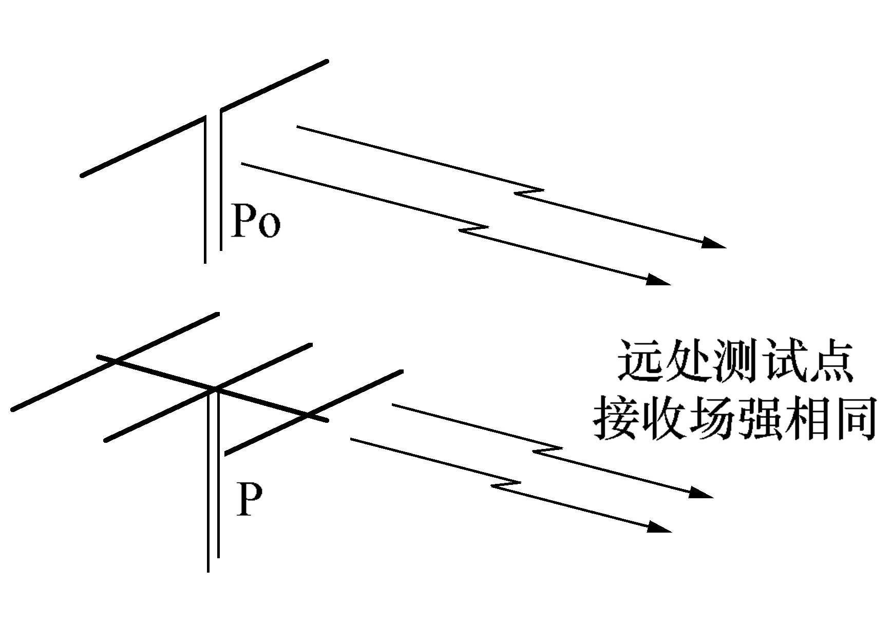

---

## LK0928
### 业余条件测试天线增益的典型方法如图。用场强表或接收机接收设置在远处同一地点、最大辐射方向朝向自己的半波偶极天线（上）和待测天线（下）。调整送到两副天线的射频功率Po和P，使接收到的场强相同。待测天线的增益dBi值为：
1. 10 lg(Po/P) + 2.15
2. 10 lg(P/Po) + 2.15
3. 20 lg(P/Po) + 2.15
4. 10 lg(P-Po) + 2.15
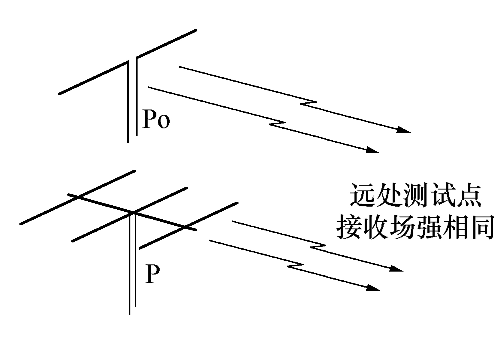

---

## LK0934
### 通过目视判断全尺寸八木天线发射方向的办法是：
1. 比主振子短者为引向振子，比主振子长者为反射振子，引向振子朝向最大辐射方向
2. 比主振子长者为引向振子，比主振子短者为反射振子，引向振子朝向最大辐射方向
3. 比主振子短者为引向振子，比主振子长者为反射振子，反射振子朝向最大辐射方向
4. 主振子两端所指方向为最大辐射方向

---

## LK0936
### 天线调谐器（俗称“天调”）的作用是：
1. 补偿不匹配系统，向收发信机提供谐振的、阻抗匹配的负载，但不能改善天线本身的辐射效率
2. 对不匹配的天馈系统进行补偿，使整个天馈系统的传输和辐射效率达到匹配天线的水平
3. 对天馈系统进行优化调谐，使整个系统的辐射功率获得一个附加的增益
4. 对不匹配的天馈系统进行补偿，虽然不能改善馈线的损耗，但能使天线本身的辐射效率达到匹配天线的水平

---

## LK0937
### 天线通过50欧同轴馈线与输出阻抗为50欧的收发信机相连接，并打算在天线电路中串入天线调谐器和通过式驻波功率计来监测和补偿天线的失配。理论上最理想的连接顺序为：
1. 天线-天线调谐器-驻波功率计-馈线-收发信机
2. 天线-馈线-天线调谐器-驻波功率计-收发信机
3. 天线-天线调谐器-馈线-驻波功率计-收发信机
4. 天线-驻波功率计-天线调谐器-馈线-收发信机

---

## LK0938
### 塔上的天线通过50欧同轴馈线与输出阻抗为50欧的收发信机相连接，在天线电路中串入天线调谐器ATU和通过式驻波功率计M来监测和补偿天线的失配。有四种方案：1、ATU和M均在塔顶，2、ATU和M均在塔底，3、ATU在塔底、M在机房，4、ATU和M均在机房。当ATU调到最佳状态时，各方案按天线系统发射效率由高到低的排序为：
1. 方案1最好，方案2、3其次，方案4最差
2. 方案4最好，方案2、3其次，方案1最差
3. 方案3最好，方案4其次，方案2再其次，方案1最差
4. 方案2最好，方案1其次，方案4再其次，方案3最差

---

## LK0946
### 某业余电台使用半波长偶极天线发射时，对方接收机的信号强度指示为S4。现发射功率不变，发信端改用增益为 8.15 dBi的八木天线（最大辐射方向不变），对方接收的信号强度指示将变为：【提示：收信机信号强度指示S1至S9每档相差6dB】
1. S5
2. S6
3. S7
4. S8

---

## LK0947
### 某业余电台使用半波长偶极天线发射时，对方接收机的信号强度指示为S4。现发射功率不变，发信端改用增益为 12 dBd的八木天线（最大辐射方向不变），对方接收的信号强度指示将变为：【提示：收信机信号强度指示S1至S9每档相差6dB】
1. S6
2. S5
3. S7
4. S8

---

## LK0948
### 某业余电台使用半波长偶极天线发射时，对方亦使用半波长偶极天线接收，接收机的信号强度指示为S4。现发射功率不变，收发双方都改用增益为 8.15 dBi的八木天线（最大辐射方向不变），对方接收的信号强度指示将变为：【提示：收信机信号强度指示S1至S9每档相差6dB】
1. S6
2. S4
3. S5
4. S7

---

## LK0949
### 甲、乙业余电台相距2000公里，均使用1/2波长水平偶极天线，正在HF频段进行稳定的通信。现其中一方改用1/2波长垂直偶极天线，改变前后的通信效果的比较将是：
1. 通信效果的变化不确定，取决于当时天波反射途中极化方向的旋转情况
2. 通信效果变差
3. 通信效果变好
4. 通信效果没有改变

---

## LK0960
### 影响短波电离层传播的主要因素有：
1. 太阳黑子活动、太阳耀斑活动和地磁活动
2. 当地天气
3. 地表温度
4. 发射机功率

---

## LK0961
### 影响短波电离层传播的主要因素有：
1. 季节和昼夜
2. 当地地面气压
3. 发射机功率
4. 接收天线增益

---

## LK0962
### 影响短波电离层传播的主要因素有：
1. 工作频率和通信距离
2. 发射机功率
3. 高空云量
4. 对流层气压

---

## LK0964
### 对短波电离层传播发生主要影响的各电离层按高度自低到高分别称为：
1. D、E、F1、F2
2. A、B、C、D
3. F、E2、E1、D
4. F2、F1、E2、E1

---

## LK0966
### 各电离层对短波电离层传播所起的主要影响为：
1. F2、F1、E层可反射电波，D层不能反射但衰减电波
2. D、E层可反射电波，F1、F2层不能反射但衰减电波
3. F2、D层可反射电波，E、F1层不能反射但衰减电波
4. F1、E层可反射电波，D、F2层不能反射但衰减电波

---

## LK0967
### 太阳黑子活动的平均周期约为：
1. 11.2年
2. 38年
3. 6.7年
4. 5.7年

---

## LK0968
### 太阳黑子活动的强弱用“太阳黑子平均数（SSN）”来描述。一般说来：
1. SSN大,有利于短波远程通信
2. SSN小,有利于短波远程通信
3. SSN与短波远程通信效果无直接关系
4. 只有在发生太阳耀斑的情况下SSN 才会影响短波远程通信效果

---

## LK0971
### 即使在空旷平地，接收到的本地VHF/UHF信号强度也可能会随着接收位置的移动而发生变化，最主要的可能原因是：
1. 直射和经地面反射等多条路径到达的电波相位不同，互相叠加或抵消造成衰落（多径效应）
2. 收发位置之间的空气流动造成电波折射不均匀而飘移
3. 不同接收位置大地导电率有差异
4. 移动过程中设备与大地之间的分布电容发生微小的变动

---

## LK0988
### 垂直偶极天线所发射的无线电波的极化方式为：
1. 垂直极化波
2. 水平极化波
3. 右旋圆极化波
4. 左旋圆极化波

---

## LK0989
### 水平偶极天线所发射的无线电波的极化方式为：
1. 水平极化波
2. 垂直极化波
3. 右旋圆极化波
4. 左旋圆极化波

---

## LK0991
### 假设收发天线均采用半波长偶极天线。在依靠电离层反射的远距离通信中，发射天线和接收天线的最佳极化方式为：
1. 不确定，根据具体传播情况而经常变化
2. 收发天线都处于垂直于两台连线的平面内并且极化方向互相一致
3. 收发天线都处于垂直于两台连线的平面内收发天线极化方向互相垂直
4. 收发天线的极化方向都平行于两台之间的连线

---

## LK0996
### 防雷装置的作用是防止雷电危害。传统防雷装置的主要组成部分是：
1. 接闪器（避雷针）、引下线、接地体
2. 天线、限流器、地线
3. 避雷针、高压指示灯、过流保护器
4. 避雷针、过压保护器、熔丝

---

## LK0997
### 防雷接地的作用是：
1. 把接闪器引入的雷击电流有效地泄入大地
2. 用接闪器感应到的雷电高压启动过压保护电路
3. 有效地阻断接闪器引入的雷击电流使其不致流入大地
4. 当接闪器引入雷击电流时迅速烧断熔丝，阻断其流动

---

## LK0998
### 关于对防雷接地基本要求的正确说法：
1. 要有单独的接地体，接地电阻要小，接闪器到接地体之间的引下线应尽量短而粗
2. 可以利用与埋地金属管线相连的自来水管作为接地体
3. 交流电网的“零线”在配电系统中已经接地，因此可代替防雷接地体及其引下线
4. 接闪器到接地体之间的引下线平时没有电流流过，采用直径0.5毫米的导线为好

---

## LK0999
### 单支避雷针的保护范围大致有多大：
1. 以避雷针为顶点的45度圆锥体以内空间
2. 避雷针周围水平方圆30米内的任何物体
3. 避雷针周围所有比避雷针低的空间
4. 以避雷针为顶点、避雷针高度为半径的半球体以内空间

---

## LK1000
### 安全电压是指不致使人直接致死或致残的电压。标准国家标准GB3805－83《安全电压》，一般环境条件下允许持续接触的“安全特低电压”为：
1. 24V
2. 48V
3. 72V
4. 6V

---

## LK1001
### 触及裸露的射频导线时，与触及相同电压的直流或50Hz交流导线相比，对人身安全危险的大致差别为：
1. 致死危险性下降，但皮肤容易灼伤
2. 更容易出现呼吸或心脏麻痹、更易致死
3. 射频电流对人体没有危险
4. 触及不同频率、相同电压的导线时，对人体的危害没有差别

---

## LK1002
### 我国业余电台应该遵守的关于电磁辐射污染的具体管理规定文件为：
1. 国家标准《电磁辐射防护规定》
2. 《业余电台管理办法》
3. 国际非电离辐射防护委员会《限制时变电场和磁场暴露的导则》
4. 美国FCC《射频电磁场人员暴露准则的测评方法规》

---

## LK1003
### 按照我国国家标准《电磁辐射防护规定》，可以免于管理的电磁辐射体为 ：
1. 输出功率不大于15W的移动式无线电通信设备，以及等效辐射功率在0.1-3MHz不大于300W、在3MHz-300GHz不大于100瓦的辐射体
2. 所有业余电台
3. 发射频率30MHz以下的所有业余电台
4. 发射频率30MHz以上的所有业余电台

---

## LK1004
### 按照我国国家标准《电磁辐射防护规定》，凡其功率大于豁免水平（3MHz以上等效辐射功率100瓦）的一切电磁波辐射体的所有者，必须：
1. 向所在地区的环境保护部门申报、登记，并接受监督
2. 向所在地区的环境保护部门缴纳环境保护费
3. 向所在地区的无线电管理机构交纳环境电磁辐射监测报告
4. 业余电台可不受环境保护部门的监督管理

---

## LK1005
### 按照我国国家标准《电磁辐射防护规定》，负责对超过豁免水平（3MHz以上等效辐射功率100瓦）电磁波辐射体所在的场所以及周围环境的电磁辐射水平进行监测的是：
1. 其拥有者
2. 所在地区环境保护部门
3. 所在地区无线电管理机构
4. 所在地区业余无线电协会

---

## LK1006
### 按照我国国家标准《电磁辐射防护规定》，当监测到超过豁免水平的电磁辐射体使环境电磁辐射水平超过规定的限值时，必须：
1. 尽快采取措施降低辐射水平，同时向环境保护部门报告
2. 立即到环境保护部门缴纳电磁污染治理费
3. 立即向无线电管理机构报告
4. 立即向当地城管机构报告

---

## LK1007
### 按照我国国家标准《电磁辐射防护规定》，对超过豁免水平的电磁辐射体的环境电磁辐射水平监测应在下列地点进行：
1. 在距辐射体天线2000米以内最大辐射方向上选点测量
2. 在发射机射频输出端口进行测量
3. 在距辐射体天线2000米以内选择任意位置测量
4. 在距辐射体天线100米以内最小辐射方向上选点测量

---

## LK1008
### 我国国家标准《电磁辐射防护规定》所规定的电磁辐射防护限值的公众照射基本限值，其基本计量方法规是：
1. 一天24小时内任意6分钟内全身平均的比吸收率（SAR）应小于每公斤体重限值
2. 任何时刻的全身平均的比吸收率（SAR）都应小于每公斤体重限值
3. 任何时刻的瞬时辐射场强都应小于与频率无关的固定限值
4. 任何时刻的瞬时辐射场强都应小于与频率有关的限值

---

## LK1009
### 我国国家标准《电磁辐射防护规定》规定电磁辐射公众照射导出限值中，对环境电磁辐射场强一天24小时内任意6分钟内的平均值要求最严格的频率范围为：
1. 30MHz- 3GHz
2. 3MHz- 30MHz
3. 300kHz-30MHz
4. 1200MHz-30GHz

---

## LK1010
### 按照我国规定，购置使用公众对讲机不需取得批准。业余无线电爱好者需要与公众对讲机用户通信时应该：
1. 业余无线电台不能用于与公众对讲机通信
2. 将业余无线电台设置到公众对讲机的频率，以不大于业余无线电台执照核定的发射功率与之通信
3. 将业余无线电台设置到公众对讲机的频率，以不大于0.5W的发射功率与之通信
4. 将业余无线电台设置到公众对讲机的频率，但只能进行由业余无线电台到公众对讲机的单向发信

---

## LK1011
### 填写和邮寄QSL卡片时的正确做法有：
1. 迫切需要方卡回寄卡片时，应直接向对方地址邮寄卡片并附加SASE
2. 填写错误时应划去或使用涂改液覆盖错误内容并加以改正
3. 自己的邮寄地址与电台的发射地点不同时，应在QTH栏目内填明详细邮寄地址
4. 通过卡片管理局寄出卡片并希望对方回卡时，应在卡片上注明PSE QSL DIRECT

---

## LK1015
### 正弦交流信号通过下列电路时会产生高次谐波：
1. 二极管整流器或三极管开关放大器
2. 复杂电阻网络
3. 复杂电容电感网络
4. 调谐在信号的整倍频上的谐振电路

---

## LK1029
### 单边带发信机中发信自动电平控制ALC的主要作用是：
1. 防止过驱动带来的调制失真
2. 改善发信频率的稳定度
3. 实现天线电路阻抗的自动匹配
4. 防止话筒过于灵敏造成的背景噪音

---

## LK1030
### 业余电台发射单边带语音信号中，语音虽然基本正常，但操作员周围噪杂的声音很响，应该：
1. 调低发射机的话筒增益
2. 调低发射机的射频输出功率
3. 重新调整发射机天线电路的匹配
4. 重新调整发信机的自动电平控制（ALC）

---

## LK1031
### 430MHz业余频段中留给业余卫星通信使用，话音及其他通信方式不应占用的频率段为：
1. 435MHz至438MHz
2. 432MHz至434MHz
3. 438MHz至439MHz
4. 433MHz至435MHz

---

## LK1032
### 144MHz业余频段中留给业余卫星通信使用，话音及其他通信方式不应占用的频率段为：
1. 145.8MHz至146MHz
2. 144.8MHz至145MHz
3. 144.2MHz至144.5MHz
4. 145.4MHz至144.6MHz

---

## LK1033
### 28MHz业余频段中留给业余卫星通信、话音及其他通信方式不应占用的频率段为：
1. 29.3MMz至29.51MHz
2. 28.3MHz至28.61MHz
3. 28.7MHz至28.95MHz
4. 29.15MHz至29.35MHz

---

## LK1034
### 南北走向的水平极化偶极天线，中点馈电，通过特性阻抗为50欧的电缆连接到输入/输出阻抗为50欧的收发信机，通信对象在东西方向。选择天线长度的原则是：
1. 天线臂长为四分之一波长的奇数倍时，通信效果肯定最好
2. 天线臂长为四分之一波长的偶数倍时，通信效果肯定最好
3. 只要天线与工作频率谐振，通信效果一定好
4. 只要电压驻波比达到最低，通信效果一定好

---

## LK1035
### 北京的水平极化半波长偶极天线，通信对象为纽约的业余电台。按电波的最短传输途径考虑，天线的最佳走向应大致为：
1. 东-西
2. 南-北
3. 东偏南30度-西偏北30度
4. 西偏南30度-东偏北30度

---

## LK1036
### 14022KHz有很多电台争相报出自己的呼号，原来是想呼叫发射频率为14020KHz的某稀有台。如要加入对该稀有台的呼叫，应该：
1. 守听14020KHz，在稀有台结束和其他电台联络或者呼叫CQ和QRZ时，在14022KHz快速准确地发送自己的呼号
2. 守听14020KHz，在稀有台结束和其他电台联络或者呼叫CQ和QRZ时，在14020KHz快速准确地发送自己的呼号
3. 在14022KHz不断发送自己的呼号
4. 在14020KHz呼叫该稀有台

---

## LK1039
### 如遇设备、电线或者电源引起失火，正确的处置为：
1. 立即切断电源，使用二氧化碳灭火器灭火
2. 立即切断电源，使用化学泡沫灭火器灭火
3. 立即切断电源，用水灭火
4. 迅速起身逃离火场

---

## LK1040
### 必须带电检修由市电供电的无线电设备时，应做到：
1. 双脚与地绝缘，单手操作，另一只手不触摸机壳等任何与电路设备有关的金属物品
2. 双脚与地绝缘，单手操作，另一只手通过触摸机壳或水管等途径良好接地
3. 只要设备外壳良好接地，双脚是否与地绝缘、双手是否同时操作都没有关系
4. 只要确保设备外壳与地绝缘，双脚是否与地绝缘、双手是否同时操作都没有关系

---

## LK1041
### 如果收到国外寄来的QSL卡片中夹带有一张或多张IRC，应该：
1. 尽快检查电台日志确认联络的真实性，并通过邮局直接向对方地址寄出自己的QSL卡片
2. 不必确认联络的真实性，尽快通过邮局直接向对方地址寄出自己的QSL卡片
3. 尽快检查电台日志确认联络的真实性，并通过国内的QSL卡片管理局寄出自己的QSL卡片
4. 不必理会

---

## LK1042
### 关于QSL卡片的正确用法是：
1. 不是作为联络或收听证明而交换QSL卡片时，应填上“Eye ball QSO”等有关说明，不应赠送空白卡片
2. 空白QSL卡片可以当做照片或者名片，任意赠送、交换、散发
3. 出于火腿互相帮助的目的，虽然对方没有联络到自己，也可以发去确认联络的QSL卡片
4. 如果在联络中没有听清对方呼号，可以在寄发QSL卡片的对方台名栏中填写对方操作员姓名

---

## LK1043
### 两手分别接触电压有效值相同但频率不同的电路两端时，对人体生命安全威胁由大到小的排序为：
1. 工频交流电、HF射频交流电、UHF射频交流电
2. UHF射频交流电、HF射频交流电、工频交流电
3. HF射频交流电、工频交流电、UHF射频交流电
4. HF射频交流电、UHF射频交流电、工频交流电

---

## LK1045
### 如果发射机在不同工作模式时最大射频输出功率相同，无语音调制时，实际射频输出由大到小的排序为：
1. FM，AM，SSB
2. AM，SSB，FM
3. SSB，FM，AM
4. SSB，AM，FM

---

## LK1046
### 业余电台之间进行通信，必须相互正确发送和接收的信息为：
1. 本台呼号、对方呼号、信号报告
2. 本台呼号、对方呼号、QTH
3. 本台呼号、信号报告、QTH
4. 对方呼号、信号报告、设备情况

---

## LK1048
### 当最高可用频率（MUF）为20MHz时，具有较大DX通联机会的业余频段是：
1. 18MHz
2. 14MHz
3. 21MHz
4. 24MHz

---

## LK1049
### 太阳耀斑引起的电离层扰动（SID）对短波通信的影响是：
1. 低频率受到的影响超过高频率
2. 高纬度的传播路径影响会超过低纬度
3. 卫星通信受到的影响会超过地面直射波通信
4. 地球黑夜一面受到的影响会超过白昼面

---

## LK1050
### 下列调制得到的信号幅度恒定不变：
1. 移频键控FSK
2. 幅度调制AM
3. 单边带幅度调制SSB
4. 幅度键控调制ASK

---

## LK1051
### 下列调制得到的信号幅度恒定不变：
1. 频率调制FM
2. 幅度调制AM
3. 单边带幅度调制SSB
4. 幅度键控调制ASK

---

## LK1052
### 下列调制得到的信号幅度恒定不变：
1. 相位调制PM
2. 幅度调制AM
3. 单边带幅度调制SSB
4. 幅度键控调制ASK

---

## LK1053
### 下列调制得到的信号幅度恒定不变：
1. 移相键控调制PSK
2. 幅度调制AM
3. 单边带幅度调制SSB
4. 幅度键控调制ASK

---

## LK1054
### 下列调制得到的信号周期恒定不变：
1. 相位调制PM
2. 频率调制FM
3. 单边带幅度调制SSB
4. 频率键控调制FSK

---

## LK1055
### 下列调制得到的信号中载频分量幅度恒定不变：
1. 幅度调制AM
2. 频率调制FM
3. 载波抑制单边带幅度调制SSB
4. 频率键控调制FSK

---

## LK1056
### 信号经过下列调制后，频带宽度可能会大于原有值：
1. 频率调制FM
2. 幅度调制AM
3. 单边带幅度调制SSB
4. 幅度键控调制ASK

---

## LK1057
### 对称半波振子每一臂的长度为波长的：
1. 1/4倍
2. 1/2倍
3. 2倍
4. 4倍

---

## LK1059
### HF频段远距离通信主要依靠下列传播方式：
1. 电离层反射
2. 中继台网转发
3. 业余卫星转发
4. 对流层散射传播

---

## LK1061
### “静寂区”或者“越距”是指：
1. HF频段天波和地波都传播不到的中间区域
2. VHF/UHF频段超过视距电波传播不到的区域
3. VHF/UHF频段视距范围内但受障碍物阻挡电波传播不到的区域
4. 卫星通信中覆盖区以外电波传播不到的区域

---

## LK1065
### 在相距不远的两点接收同一个远方信号，信号强度发生很大差别，且差别随两点间距离的增大呈周期性变化。这是因为：
1. 多径传播，各路径到达的信号相位延迟不同而互相干涉
2. 发射机到两接收点传播距离不同造成传播路径衰耗不同
3. 大气扰动影响
4. 地磁影响影响

---

## LK1066
### 无线电接收机的灵敏度是指：
1. 接收机正常工作所需的最小输入信号强度
2. 接收机正常工作所需的最大输入信号强度
3. 接收机正常工作所需的最大电源电压
4. 接收机正常工作所需的最小电源功率

---

## LK1069
### 在导电良好的地面上，决定短波天线辐射仰角的主要参数是：
1. 天线离地面的相对于波长的高度，即离地高度除以波长
2. 天线的绝对高度，与波长无关
3. 天线离海平面的绝对高度
4. 天线导线或者八木天线主梁与地面之间的夹角

---

## LK1071
### 法规要求业余电台在通信建立及结束时主动发送本台呼号。允许用发送呼号的一部分来代替发送完整呼号的情况是：
1. 在任何情况下都必须用完整呼号作为电台标识
2. 在熟悉的友台之间呼叫可以仅使用呼号后缀作为电台标识
3. 在VHF/UHF频段进行本地呼叫时可以仅使用呼号后缀作为电台标识
4. 在HF频段进行国内呼叫时可以仅使用呼号后缀作为电台标识

---

## LK1072
### 在实际通信中，是否可以把本台呼号的地区号码加后缀视作《业余电台管理办法》所说的“本台呼号”？
1. 不可以。不完整呼号不具有呼号的属性，不能视作呼号
2. 在熟悉的友台之间呼叫和联络中可以把不完整呼号视作“呼号”
3. 在VHF/UHF频段进行本地呼叫和联络时可以把不完整呼号视作“呼号”
4. 在HF频段进行国内呼叫和联络时可以把不完整呼号视作“呼号”

---

## LK1073
### 以下呼号前缀中，所属CQ分区与埃及相同的是：
1. 5A
2. 	5W
3. 	5T
4. 	5X

---

## LK1076
### 对于中国HAM来说，属于既稀有又困难的是：
1. KP5A
2. VK0HR
3. P5/4L4FN
4. KP1A

---

## LK1089
### 3V、4X、5A、6Y字头所代表的国家是：
1. Tunis、Israel、Libya、Jamaica
2. Guinea、Israel、Fiji Islands、Senegal
3. Libya、Israel、Jamaica、Guinea
4. Jamaica、Israel、Libya、Senegal

---

## LK1096
### 如果你知道另一个电台的呼号，想要在中继上呼叫他，你应该怎么做？
1. 呼叫对方的呼号，并报出自己的呼号
2. 呼叫“break break”，然后说出对方的呼号
3. 呼叫“CQ”三次，然后说出对方的呼号
4. 等待，直到你要呼叫的电台呼叫CQ后，立刻回答他

---

## LK1097
### 如何回答一个CQ呼叫？
1. 先报出对方的呼号，再报出自己的呼号
2. 先报出自己的呼号，再报出对方的呼号
3. 说：“CQ”，并报出对方的呼号
4. 先给出信号报告，再报出自己的呼号

---

## LK1098
### 当一部电台在呼叫CQ时，他的意思是？
1. 非特指地呼叫任何一部电台
2. 此电台正在测试天线，不需要任何电台回答这个呼叫
3. 只有被呼叫的电台可以回答，其他人不能回答
4. 呼叫重庆的电台

---

## LK1101
### 如果别人报告说你的发射干扰了相邻频率的通信，此时你应当做的是：
1. 检查发射机的频率指示是否准确、发射机的杂散发射指标是否合格
2. 换用另一种调制模式工作
3. 将这种情况通知你的设备制造商
4. 加大发射功率

---

## LK1102
### 如果其他电台报告你在2米波段的信号刚才非常强，但是突然变弱或不可辨，这时你应当怎么做？
1. 稍稍移动一下自己的位置，有时信号无规律反射造成的多径效应可能导致失真
2. 打开哑音发射功能
3. 请对方电台调整自己的静噪设置
4. 将你电台中的镍氢电池换成锂电池

---

## LK1105
### 大气层中的哪一部分使得无线电信号可以在全世界范围内传播？
1. 电离层
2. 对流层
3. 平流层
4. 磁层

---

## LK1122
### 下列哪种设备可以用来代替普通的扬声器，可在嘈杂的环境中更好地抄收语音信号？
1. 耳机
2. 低通滤波器
3. 视频显示器
4. 吊杆话筒

---

## LK1123
### 滤去杂散发射的滤波器应该安装在什么地方？
1. 发信机和天线之间
2. 收信机和发信机之间
3. 电台的电源处
4. 话筒上

---

## LK1124
### 在解决电视接收机被附近的144MHz业余电台的过载干扰问题的时候，应当先尝试什么措施？
1. 在电视接收机的天线端子前安装144MHz带阻滤波器
2. 在电视接收机的天线端子前安装144MHz带通波器
3. 在业余电台的射频输出端安装144MHz带通滤波器
4. 在业余电台的射频输出端安装144MHz带阻滤波器

---

## LK1125
### 下列哪一种导体最适合射频接地使用？
1. 镀银软铜丝编织扁带
2. 圆形铜包钢单股线
3. 双绞线
4. 圆形多股线

---

## LK1127
### 在汽车上安装的移动电台中能听到的随着引擎转速变化的高频啸叫声的来源是？
1. 发电机
2. 火花塞系统
3. 电动油泵
4. 防抱死刹车装置的控制器

---

## LK1128
### 移动车载台的直流电源负极应当接在哪里？
1. 连接在电池的负极或发动机的接地带
2. 连接在天线座上
3. 可以连接在汽车的任意的金属部分
4. 连接在固定住电台的挂置架上

---

## LK1129
### 如果将发射机的话筒增益设置得过高会导致什么问题？
1. 发射机发射的信号可能会失真
2. 发射机的输出功率将会特别高
3. 发射机的频率会变得不稳定
4. 驻波比会增加

---

## LK1130
### 收发信机中的静噪控制的目的是什么？
1. 在没有信号的情况下，关闭音频输出，使其不会输出噪音。
2. 控制发射机的输出功率
3. 可以进行自动增益控制
4. 使接收机的输出音量调到最大

---

## LK1131
### 下列哪种方式可以让你快速切换到一个你经常使用的频率？
1. 将这个频率作为一个频道存储在电台中
2. 打开哑音输出
3. 关闭哑音输出
4. 使用快速扫描模式来切换到那个频率

---

## LK1132
### 下列哪一项可以有效减小火花塞干扰？
1. 打开电台的抑噪（NB）功能
2. 降低静噪（SQL）阀值
3. 将频率稍稍偏离一些
4. 调节电台的RIT旋钮

---

## LK1133
### 电台的下列哪一项控制功能可以使听起来音调偏高或偏低的SSB语音信号变得正常？
1. RIT功能
2. 带宽选择
3. 哑音静噪
4. 自动增益控制或限幅器

---

## LK1145
### 在直流电路中，用来阻碍电流流动的元件是？
1. 电阻
2. 电感
3. 电压表
4. 变压器

---

## LK1146
### 下列哪一个元件经常用来实现音量调节的功能？
1. 电位器
2. 功率电阻
3. 定值电阻
4. 变压器

---

## LK1147
### 电位器控制什么电学物理量？
1. 电阻
2. 电感
3. 电容
4. 场强

---

## LK1148
### 哪一种电子元件由两个或多个使用绝缘材料分离开的片状导体组成？
1. 电容
2. 电位器
3. 振荡器
4. 电阻

---

## LK1149
### 哪一种电子元件一般由线圈组成？
1. 电感
2. 电容
3. 二极管
4. 开关

---

## LK1150
### 哪一种电子元件用来接通或切断电路？
1. 开关
2. 齐纳二极管
3. 电感
4. 可变电阻

---

## LK1152
### 一个充满电的镍镉电池的标称电压是多少？
1. 1.2伏
2. 1.0伏
3. 1.5伏
4. 2.2伏

---

## LK1155
### 下列哪一种元器件可以用一个较小的电流来控制较大的电流？
1. 晶体管
2. 电感
3. 电阻
4. 电容

---

## LK1156
### 下列哪一种元器件只允许单方向的电流流动？
1. 二极管
2. 熔断器
3. 电阻
4. 稳压元件

---

## LK1157
### 下列哪一种元器件既可以当作电子开关又可以当作放大器使用？
1. 晶体管
2. 电位器
3. 单刀双掷开关
4. 电压表

---

## LK1159
### 下列哪一种元器件可以放大信号？
1. 晶体管
2. 可变电阻
3. 电解电容
4. 多芯电池

---

## LK1168
### 继电器的功能可以描述为：
1. 由电磁铁控制的开关
2. 由电流控制的放大器
3. 一个光学传感器
4. 无线电转发设备

---

## LK1171
### 下列哪一项和电感一起使用，可以制作一个谐振电路？
1. 电容
2. 齐纳二极管
3. 电位器
4. 电阻

---

## LK1172
### 集成电路是指：
1. 将一个电路的大量元器件集合于一个单晶片上所制成的器件
2. 多极继电器
3. 把多个电阻或电容元件堆积在一起
4. 变压器

---

## LK1181
### 一般来说，如果要解决发射机对附近有线电话的干扰，最先做的应当是：
1. 在有线电话进线处安装射频滤波器
2. 在发射机射频输出端安装高通滤波器
3. 在发射机射频输出端安装低通滤波器
4. 改善发射机的接地情况

---

## LK1182
### 如果对方报告你的调频电台发射的信号听起来失真严重、可辨度差，可能的原因是：
1. 三项都可能
2. 电台的电源电压不足
3. 电台所处的位置不好
4. 电台的发射频率不准确

---

## LK1187
### 如果在驻波表上读到了4:1，这意味着？
1. 阻抗匹配得不好
2. 良好的阻抗匹配
3. 天线的增益是4dB
4. 天线有4dB的损失

---

## LK1199
### 在使用欧姆表测量一个电路的某两个端点间电阻值之前，要先注意什么？
1. 确保电路没有连接至电源
2. 确保电路已接通了正常工作时需要的电源
3. 确保电路已经正常接地
4. 确保电路在正常的频率下工作

---

## LK1204
### 下列发射模式中拥有最窄带宽的是：
1. CW
2. 单边带话音
3. 调频话音
4. 慢扫描电视

---

## LK1206
### 下列哪一种方法可以用来定位无线电噪音源或者恶意干扰源？
1. 无线电测向
2. 多普勒雷达
3. 回波定位
4. 相位锁定

---

## LK1208
### 业余无线电通信所说的“网格定位”是什么意思？
1. 一个由一串字母和数字确定的地理位置
2. 一个由一串字母和数字确定的方位角和仰角
3. 用来调谐末级功放的设备
4. 用于无线电测向运动的设备

---

## LK1209
### 什么是PSK31？
1. 一种低速率的数据通信模式
2. 一种可以减少噪音对FM信号干扰的方法
3. 一种压缩数字电视信号的方法
4. 一种高速率的数据通信模式

---

## LK1210
### 什么是八木天线？
1. 一种可以集中聚集某一方向信号的天线
2. 一种由日本八木秀次发明的全向天线
3. 用八根木头制作的天线
4. 一种可以将接收到的信号反向的天线

---

## LK1214
### 对一个偶极子天线怎么做，才能让它的谐振频率升高一些？
1. 将振子截短一些
2. 在振子某部位串联一个线圈
3. 将振子加长一些
4. 在振子的两端加上电容帽

---

## LK1215
### 在自由空间中的半波偶极子天线，哪个方向的辐射强度最大？
1. 垂直于导体的方向
2. 沿着导体的方向
3. 各个方向强度相同
4. 沿着馈线的方向

---

## LK1220
### 收发信机天线调谐器（天调）的作用是什么？
1. 它将发射机的输出阻抗和天线的输入阻抗进行良好的匹配
2. 它帮助接收机在遇到弱信号时能自动调准频率
3. 它可以使一部天线既能作为发射天线，又能作为接收天线
4. 它能够依照发射机当前工作的波段自动连接合适的天线

---

## LK1225
### 电路中的保险丝起到什么作用？
1. 过载时切断电路
2. 防止电源纹波损害电路
3. 限制电流，防止触电
4. 以上三项全部正确

---

## LK1226
### 为什么在需要安装5安培保险丝的地方安装一个20安培的保险丝是不可取的？
1. 过大的电流可能导致火灾
2. 电源的纹波会显著增大
3. 因为20安培的保险丝电流更大，所以它更容易熔断
4. 其他三项全部正确

---

## LK1227
### 防止设备外壳带电危险的措施包括：
1. 其他三项全部正确
2. 将所有的交流供电设备全部连接至一个安全地线
3. 安装漏电保护断路器
4. 所有使用交流供电的设备的电源线都使用带有单独保护地线端的三线插头

---

## LK1228
### 在为同轴电缆馈线安装避雷器时应当注意什么？
1. 将所有避雷器的地线接到同一个金属板上，然后将这个金属板接到室外的接地极
2. 在每一个避雷器的接地线上安装开关，以防止射频过载损伤避雷器
3. 将每一个避雷器单独引出接地线，并且将它们都连接至电台的地线
4. 要在每一个避雷器处两端并联一个开关，以便在使用大功率输出的时候可以将避雷器旁路掉

---

## LK1230
### 常规的12伏酸铅蓄电池通常有什么潜在的危险？
1. 如果通风不良，有爆炸风险的气体会聚集
2. 有高电压，存在触电的风险
3. 它会释放臭氧，进而污染大气层
4. 长时间不使用可能会引起自燃

---

## LK1232
### 以下哪一项是天线铁塔安装防雷接地的良好措施？
1. 接地连接要尽可能地短而直接
2. 确保接地线的所有需要弯折的地方都是干净的直角弯
3. 为接地系统做好防水处理
4. 打入地面的接地极要尽量远离天线塔

---

## LK1233
### 设备电源拔掉电源线以后，检修时还有什么安全风险？
1. 充满高电压的电容器可能造成电击
2. 地磁场可能在变压器中激起感应电流导致电源损坏
3. 打开电源外壳可能引起保险丝烧断
4. 静电可能损坏接地系统

---

## LK1234
### 自制一台由220伏交流供电的设备，推荐采用的安全措施是：
1. 交流电源入口火线端串联安装保险丝
2. 在交流供电入口处并联安装一个交流电压表
3. 在交流供电入口处串联安装一个电感
4. 在交流供电入口处并联安装一个电容

---

## LK1236
### 为什么电磁辐射防护规定国家标准中的照射限值随着频率的变化而不同？
1. 人体会对某些特定频率的电磁波吸收量更大
2. 较低频率的无线电波不会穿透人体
3. 在自然中高频电磁波不常见
4. 较低频率的无线电波相对高频率的无线电波拥有更高的能量

---

## LK1237
### 一些VHF/UHF业余无线电调频手持对讲机或车载台的设置菜单中有“全频偏”和“半频偏”的选择，其表示的意义是：
1. 分别表示信道间隔为25kHz或者12.5kHz
2. 全频偏方式下发射频率的误差比半频偏方式大一倍
3. 全频偏方式适用于收发异频的中继台通信，半频偏方式适用于同频对讲通信
4. 全频偏方式语音信号经过压缩，半频偏方式语音信号只压缩低音频分量

---

